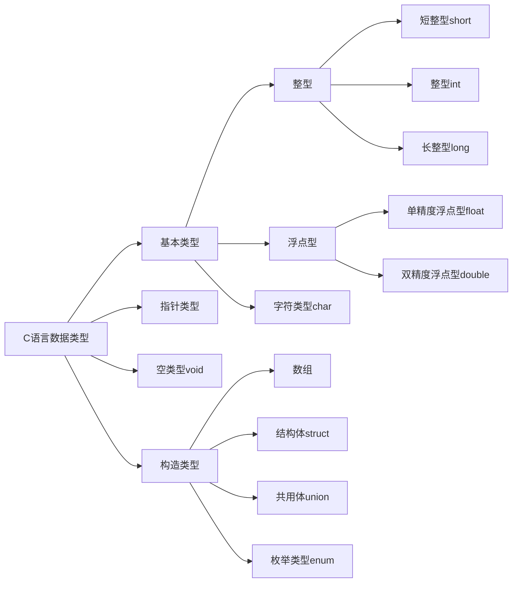

# C程序设计语言总结

[[toc]]

- 注：实验环境MacOS系统。

MacOS系统：

```sh
[mzh@MacBookPro ~ ]$ sw_vers
ProductName:	Mac OS X
ProductVersion:	10.15.5
BuildVersion:	19F101
```

- 学习一门新程序设计语言的唯一途径就是使用它编写程序。
- 总结主要基于《C程序设计语言 第2版新版 徐宝文译》一书。

## 第1章 导言
### 第一个程序hello world

helloworld.c文件内容如下：

```c
#include <stdio.h>

int main()
{
    printf("Hello,world\n");
}
```

编译：

```sh
cc helloworld.c
```

此时默认输出a.out。

通过下面的方式可以指定输出文件的名称：

```sh
cc helloworld.c -o helloworld.out
```

运行：

```sh
$ ./a.out 
Hello,world
$ ./helloworld.out 
Hello,world
```

- 一个C语言程序，无论其大小如何，都是由**函数**和**变量**组成的。
- 每个程序都从`main`函数的起点开始执行，每个程序必须在某个位置包含一个`main`函数。
- 函数之间进行数据交换的一种方法是调用函数向被调用函数提供参数列表。函数名后面的圆括号`()`将参数包裹起来，括号中没有内容时表示没有参数。函数体由`{}`花括号包裹起来。
- `main`函数通常会调用其他函数来帮助完成某些工作，被调用的函数可以是程序设计人员自己编写的，也可以来自于函数库。
- `#include <stdio.h>`用于告诉编译器在本程序中包含标准输入、输出库的信息。
- **printf**函数用于打印输出。**printf**永远不会自动换行。
- 用双引号括起来的字符序列称为**字符串**或**字符常量**。
- **\n**转义字符表示换行。
- **\t**转义字符表示制表符tab。
- **\b**转义字符表示回退符。
- \\"转义字符表示双引号。
- \\\\转义字符表示反斜杠本身。

### 变量与算术表达式

打印华氏温度与摄氏温度对照表，对应关系为 `C=(5/9)(F-32)`。

```c
$ cat fahrenheit2celsius.c
/**
*@file fahrenheit2celsius.c
*@brief 打印华氏温度与摄氏温度对照表
*@author Zhaohui Mei<mzh.whut@gmail.com>
*@date 2019-07-24
*@return 0
*/

#include <stdio.h>

int main()
{
    int fahr, cels;  // 声明变量
    int lower, upper, step;  // 声明变量

    lower = 0;  // 温度的下限
    upper = 300;  // 温度的上限
    step = 20;  // 步长

    fahr = lower;
    while (fahr <= upper)
    {
        cels = 5 * (fahr - 32) / 9;
        printf("%d\t%d\n", fahr, cels);
        fahr = fahr + step;
    }
    return 0;
}
```

生成输出文件`fahrenheit2celsius.out`并运行：

```sh
$ ./fahrenheit2celsius.out 
0	-17
20	-6
40	4
60	15
80	26
100	37
120	48
140	60
160	71
180	82
200	93
220	104
240	115
260	126
280	137
300	148
```

- 注释：包含在`/*`和`*/`之间的字符序列将被编译器忽略。注释可以自由地运用在程序中，使得程序更易于理解。也可以使用`//`来表示单行注释。
- 所有变量必须先声明后使用。声明通常放在函数起始处，在任何可执行语句之前。声明用于说明变量的属性，它由一个类型名和一个变量名组成。
- 赋值语句：类似`lower = 0`这样使用等号对变量进行赋值。

### alias重命名设置

为了快速编译出out文件，设置一下`alias`重命名。在`~/.zshrc`中添加以下内容：

```sh
alias cc='compile_c'
function compile_c()
{
    filename=$1
    outfile=$( echo "$filename"|sed 's/\.c$/\.out/g' )
    clang $filename -o $outfile
}
```

使用`source ~/.zshrc`重新加载配置后，即可以使用`cc helloworld.c`命令自动生成`helloworld.out`文件，不用手动指定输出文件！

### `while`语句

- `while`循环语句中，首先测试圆括号中的条件 ，如果条件为真，则执行循环体，然后再重复测试圆括号中的条件，如果为真，则再次执行循环体；当圆括号中的条件测试为假时，循环结束。
- `printf`函数不是C语言本身的一部分，C语言本身并没有定义输入/输出功能。`printf`是标准库中定义的一个函数。

上面温度转换存在两个问题，输出不是右对齐，不够美观；摄氏温度的精确度不够。我们进行优化：

```c
$ cat fahrenheit2celsius.c
/**
*@file fahrenheit2celsius.c
*@brief 打印华氏温度与摄氏温度对照表
*@author Zhaohui Mei<mzh.whut@gmail.com>
*@date 2019-07-24
*@return 0
*/

#include <stdio.h>

int main()
{
    float fahr, cels;  // 声明变量
    int lower, upper, step;  // 声明变量

    lower = 0;
    upper = 300;
    step = 20;
    
    printf("  F      C\n");
    fahr = lower;
    while (fahr <= upper)
    {
        cels = 5.0 * (fahr - 32.0) / 9.0;
        printf("%3.0f %6.1f\n", fahr, cels);  // 华氏温度取三位字符宽，不带小数点和小数部分，摄氏温度取六位字符宽，且小数点后面取1位小数
        fahr = fahr + step;
    }
    return 0;
}
```

生成输出文件`fahrenheit2celsius.out` 并运行：

```sh
$ ./fahrenheit2celsius.out 
  F      C
  0  -17.8
 20   -6.7
 40    4.4
 60   15.6
 80   26.7
100   37.8
120   48.9
140   60.0
160   71.1
180   82.2
200   93.3
220  104.4
240  115.6
260  126.7
280  137.8
300  148.9
```

- 使用浮点算术运算代替整型算术运算，控制输出精度。
- 如果浮点常量取值是整型值，在书写时最好为它加上一个显示的小数点，这样可以强调其是浮点性质，便于阅读。
- 可以使用`printf`另外单独打印标题。
- 注意，整数除法时会执行舍位，结果中的任何小数部分都会被舍弃。如果在程序中直接使用`5/9`结果得到的将是0，此时结果就是不正确的，使用`5.0/9.0`的形式使用浮点数与浮点数相除的方式不会执行舍位。

```c
$ cat fahrenheit2celsius.c
/**
*@file fahrenheit2celsius.c
*@brief 打印华氏温度与摄氏温度对照表
*@author Zhaohui Mei<mzh.whut@gmail.com>
*@date 2019-07-24
*@return 0
*/

#include <stdio.h>

int main()
{
    float fahr, cels;  // 声明变量
    int lower, upper, step;  // 声明变量

    lower = 0;  // 温度的下限
    upper = 300;  // 温度的上限
    step = 20;  // 步长

    printf("  F      C\n");
    fahr = lower;
    while (fahr <= upper)
    {
        cels = 5 / 9  * (fahr - 32);
        printf("%3.0f %6.1f\n", fahr, cels); // 华氏温度取三位字符宽，不带小数点和小数部分，摄氏温度取六位字符宽，且小数点后面取1位小数
        fahr = fahr + step;
    }
    return 0;
}
```

编译后运行结果如下：

```sh
$ ./fahrenheit2celsius.out
  F      C
  0   -0.0
 20   -0.0
 40    0.0
 60    0.0
 80    0.0
100    0.0
120    0.0
140    0.0
160    0.0
180    0.0
200    0.0
220    0.0
240    0.0
260    0.0
280    0.0
300    0.0
```

可以看到使用`5 / 9`这种方式得到的结果是异常的。

- `printf`中的格式说明`%3.0f`表示待打印的浮点数至少占3个字符宽，且不带小数点和小数部分。
- `%6.1f`表示待打印的浮点数至少占6个字符宽，且小数点后面有1位数字。
- 格式说明可以省略宽度与精度。
- `%6f`表示待打印的浮点数至少有6个字符宽。
- `%.2f`表示待打印的浮点数的小数点后有两位小数，但宽度没有限制。
- `%f`仅仅要示按照浮点数打印即可。
- `%d`表示按照十进制整型数打印。
- `%6d`表示按十进制整型数打印，但至少占6个字符宽。
- `%o`表示按八进制数打印。
- `%x`表示按十六进制数打印。
- `%c`表示字符。
- `%s`表示字符串。
- `%%`表示百分号本身。

### `for`语句

使用`for`循环实现上面的功能：

```c
$ cat fahrenheit2celsius_for.c
/**
*@file fahrenheit2celsius_for.c
*@brief 打印华氏温度与摄氏温度对照表
*@author Zhaohui Mei<mzh.whut@gmail.com>
*@date 2019-07-24
*@return 0
*/

#include <stdio.h>

int main()
{
    float cels;  // 声明变量

    printf("  F      C\n");
    for(int fahr = 0;fahr <= 300;fahr = fahr + 20)
    {
        cels = 5.0 * (fahr - 32.0) / 9.0;
        printf("%3d %6.1f\n", fahr, cels);  // 华氏温度取三位字符宽，不带小数点和小数部分，摄氏温度取六位字符宽，且小数点后面取1位小数
    }
    return 0;
}
```

生成输出文件`fahrenheit2celsius_for.out` 并运行：

```sh
$ ./fahrenheit2celsius_for.out 
  F      C
  0  -17.8
 20   -6.7
 40    4.4
 60   15.6
 80   26.7
100   37.8
120   48.9
140   60.0
160   71.1
180   82.2
200   93.3
220  104.4
240  115.6
260  126.7
280  137.8
300  148.9
```

- 上面使用`for`的结果与使用`while`语句的结果相同。
- `for`循环语句适合于初始化和增加步长都是条件语句并且逻辑相关的情形，比`while`语句更加紧凑。

以逆序打印转换表：

```c
$ cat fahrenheit2celsius_for.c
/**
*@file fahrenheit2celsius_for.c
*@brief 打印华氏温度与摄氏温度对照表
*@author Zhaohui Mei<mzh.whut@gmail.com>
*@date 2019-07-24
*@return 0
*/

#include <stdio.h>

int main()
{
    float cels;  // 声明变量

    printf("  F      C\n");
    for(int fahr = 300;fahr >= 0;fahr = fahr - 20)
    {
        cels = 5.0 * (fahr - 32.0) / 9.0;
        printf("%3d %6.1f\n", fahr, cels);  // 华氏温度取三位字符宽，不带小数点和小数部分，摄氏温度取六位字符宽，且小数点后面取1位小数
    }
    return 0;
}
```

输出如下：

```sh
$ ./fahrenheit2celsius_for.out 
  F      C
300  148.9
280  137.8
260  126.7
240  115.6
220  104.4
200   93.3
180   82.2
160   71.1
140   60.0
120   48.9
100   37.8
 80   26.7
 60   15.6
 40    4.4
 20   -6.7
  0  -17.8
```

### `#define`定义符号常量

- 幻数：把直接使用的常数叫做幻数。应尽量避免使用幻数。因为当常量需要改变时，要修改所有使用它的代码。

- 在程序中使用300或20等类似的`幻数`不是一个好习惯。它们几乎无法向以后阅读该程序的人提供什么信息，而且使程序的修改变得更加困难。处理幻数的一种方法就是赋予它们有意义的名字。
- `#define`指令可以把符号名(或称为符号常量)定义为一个特定的字符串，语法格式如下：

```
#define 名字 替换文本
```

- 程序中所有出现在`#define`中定义的符号常量的名字都将被相应的替换文本替换。

下面对温度转换表程序进行优化，使用符号常量：

```c
$ cat fahrenheit2celsius_for_define.c 
/**
*@file fahrenheit2celsius_for_define.c
*@brief 打印华氏温度与摄氏温度对照表
*@author Zhaohui Mei<mzh.whut@gmail.com>
*@date 2019-07-24
*@return 0
*/

#include <stdio.h>

#define LOWER 0  // 温度表的下限
#define UPPER 300  // 温度表的上限
#define STEP 20  // 步长
int main()
{
    float cels;  // 声明变量

    printf("  F      C\n");
    for(int fahr = LOWER;fahr <= UPPER;fahr = fahr + STEP)
    {
        cels = 5.0 * (fahr - 32.0) / 9.0;
        printf("%3d %6.1f\n", fahr, cels);  // 华氏温度取三位字符宽，不带小数点和小数部分，摄氏温度取六位字符宽，且小数点后面取1位小数
    }
    return 0;
}
```

生成输出文件`fahrenheit2celsius_for_define.out` 并运行：

```sh
$ cc fahrenheit2celsius_for_define.c -o fahrenheit2celsius_for_define.out
$ ./fahrenheit2celsius_for_define.out 
  F      C
  0  -17.8
 20   -6.7
 40    4.4
 60   15.6
 80   26.7
100   37.8
120   48.9
140   60.0
160   71.1
180   82.2
200   93.3
220  104.4
240  115.6
260  126.7
280  137.8
300  148.9
```

示例中定义了`LOWER`,`UPPER`,`STEP`三个符号常量。

- 符号常量不是变量，不需要出现在声明中。
- 符号常量通常使用大写字母拼写，这样很容易与小写字母拼写的变量名相区别。
- `#define`指令定义符号常量的行的末尾**不需要分号结尾**！

### `getchar()`,`putchar()`字符输入与输出

- 无论文本从何处输入，输出到何处，其输入，输出都是按照字符流的方式处理。
- 文本流是由多行字符构成的字符序列，而每行字符则是由0个或多个字符组成，行末是一个换行符。
- 标准库负责使每个输入/输出流都能够遵守这一模型。
- 标准库提供了一次读/写一个字符的函数，其中最简单的是`getchar()`,`putchar()`两个函数。
- `getchar()`每次从文本流中读入下一个输入字符（这个字符通常是通过键盘输入的），并将其作为结果值返回。
- `putchar(c)`将打印变量c的内容，通常是显示在屏幕上。

在不了解其他输入/输出知识的情况下，可以使用`getchar()`,`putchar()`函数编写出数量惊人的有用代码。

#### 将输入流原样显示在输出流

每读入一个字符后，就把这个字符原样显示在输出流中，如下示例：

```c
$ cat getcharputchar.c
/**
*@file getcharputchar.c
*@brief 将输入字符复制到输出 
*@author Zhaohui Mei<mzh.whut@gmail.com>
*@date 2019-07-24
*@return 0
*/

#include <stdio.h>

int main()
{
    int c;

    c = getchar();
    while (c != EOF)
    {
        putchar(c);
        c = getchar();
    }
    return 0;
}
```

编译并运行：

```sh
$ cc getcharputchar.c -o getcharputchar.out
$ ./getcharputchar.out 
a
a
b
b
c
c
```

运行时，我输入字母a，马上就输出字母a，我再输出字母b，马上就输出字母b，我再输出字母c，马上就输出字母c，我按Ctrl-D终止，此时程序就自动退出了。

- Linux中，在新的一行的开头，按下Ctrl-D，就代表EOF（如果在一行的中间按下Ctrl-D，则表示输出"标准输入"的缓存区，所以这时必须按两次Ctrl-D）。参考[EOF是什么？](http://www.ruanyifeng.com/blog/2011/11/eof.html "EOF是什么？")。
- Windows中，在新的一行的开头，按下Ctrl-Z就代表EOF。
- Mac中，按control + D键结束。
- 字符在键盘，屏幕或其他任何地方无论以什么形式表现，它在机器内部都是以位模式存储的。`char`类型专门用于存储这种字符型数据，当然任何整型(`int`)也可以用于存储字符型数据，出于某些潜在的重要原因，在此使用`int`类型。
- `EOF`表示文件结束，End of file。定义在头文件`stdio.h`中 ，定义如下` #define EOF (-1)`。
- 可以将赋值语句(如`c = getchar()`)作为更大的表达式的一部分出现，就可以形成复杂语句(如下面的` while ((c = getchar()) != EOF)`)。


使用赋值语句形成复杂语句实现同样的功能：

```c
$ cat getcharnotequaleof.c
/**
*@file getcharnotequaleof.c
*@brief 使用赋值语句  
*@author Zhaohui Mei<mzh.whut@gmail.com>
*@date 2019-08-01
*@return 0
*/

#include <stdio.h>

int main()
{
    int c;
    while ((c = getchar()) != EOF)
    {
        putchar(c);
    }
    return 0;
}
```

虽然使用上面的复杂语句使得`getchar()`只在程序中出现了1次，使程序看起来更加紧凑，使程序更易阅读。但不宜过多地使用这种类型的复杂语句，这样会导致编写的程序可能很难理解。

注意上面的复杂语句中，`c = getchar()`外侧的左右括号不能省略，如果省略后将使程序语意发生变化，因为`!=`优先级高于`=`，这样会导致先会将获取到的字符与`EOF`比较，将比较的结果返回给c。

#### 打印EOF的值

练习1-7 编写一个打印EOF值和程序。

```sh
$ cat print_EOF.c
/*
 *      Filename: print_EOF.c
 *        Author: Zhaohui Mei<mzh.whut@gmail.com>
 *   Description: 打印EOF的值
 *   Create Time: 2021-01-06 21:49:41
 * Last Modified: 2021-01-06 22:15:43
 */

#include<stdio.h>

int main()
{
    printf("%d\n", EOF);
    return 0;
}
```

编译并运行：

```sh
 cc print_EOF.c
 $ ./print_EOF.out
-1
```

可以看到`EOF`的值是`-1`。


#### 字符统计

下面统计输入了多少个字符：

```c
$ cat countchar.c
/**
*@file countchar.c
*@brief 统计字符数 
*@author Zhaohui Mei<mzh.whut@gmail.com>
*@date 2019-08-01
*@return nc
*/

#include <stdio.h>

int main()
{
    long nc = 0;
    while (getchar() != EOF)
    {
        ++nc;
    }
    printf("%ld\n", nc);
    return nc;
}

```

编译并运行：

```sh
$ cc countchar.c -o countchar.out 
$ ./countchar.out 
a
b
c
d
8
```

由于输入字符a/b/c/d后都按了一次Enter回车键，所以每行相当于输入了两个字符，一共输入了8个字符。

注，在Mac上面运行稍有不同：

```sh
$ ./countchar.out
1
2D
$ ./countchar.out
12
3D
$ ./countchar.out
1234567
8D
$ ./countchar.out
123456
78
10
$ ./countchar.out
123456789012
13
```

可以看到当字符数小于10时，数字后多了一个`D`字符。

我们可以使用双精度浮点数`double`处理更大的数字。使用`for`循环语句来处理统计字符：

```sh
$ cat countchar_2.c
/*
 *      Filename: countchar_2.c
 *        Author: Zhaohui Mei<mzh.whut@gmail.com>
 *   Description: 统计输入的字符数版本2
 *   Create Time: 2021-01-06 22:37:04
 * Last Modified: 2021-01-07 07:32:10
 */

#include<stdio.h>

int main()
{
    double nc; // 双精度浮点数
    for (nc = 0; getchar() != EOF; ++nc)
        ;
    printf("%.0f\n", nc);
}
```

编译后运行：

```sh
$ cc countchar_2.c
$ ./countchar_2.out
abcd
5D
$ ./countchar_2.out
1
2
3
4
8D
$ ./countchar_2.out
12345
67890
12
$ ./countchar_2.out
0D
```

注意，在该程序中，`for`循环语句的循环体是空的，这是因为所有工作都在测试(条件)部分与增加步长部分完成了。当用户未输入任何值时，直接按退出，此时输出结果为0。

- C语言语法规则要求`for`循环语句必须有一个循环体，因此用单独的分号代替。
- 单独的分号称为空语句。

#### 行统计

下面统计输入的行数：

```c
$ cat countline.c
/**
*@file countline.c
*@brief 统计行数 
*@author Zhaohui Mei<mzh.whut@gmail.com>
*@date 2019-08-01
*@return nl
*/

#include <stdio.h>

int main()
{
    int c = 0;
    int nl = 0;
    while ((c = getchar() ) != EOF)
    {
        if (c == '\n')
        {
            ++nl;
        }
    }
    printf("lines: %d\n", nl);
    return nl;
}
```

编译并执行：

```sh
$ cc countline.c -o countline.out
$ ./countline.out 
ab
cd
ef
gh
lines: 4
```

一共输入了四行，最后按Ctrl+D时就会打印行数：lines:  4 。

#### 将连续的多个空格用一个空格代替

练习1-9：编写一个将输入复制到输出的程序，并将其中连续的多个空格用一个空格代替。

```c
$ cat replacemultispace2onespace.c
/**
*@file replacemultispace2onespace.c
*@brief 将输入复制到输出，并将连接多个空格用一个空格代替 
*@author Zhaohui Mei<mzh.whut@gmail.com>
*@date 2019-08-01
*@return 0 
*/

#include <stdio.h>

int main()
{
    int c;
    c = getchar(); // 读取字符
    while (c != EOF)  // 不是文件结尾符时
    {
        if (c == ' ')  // 如果读取到的字符是空格
        {
            putchar(c); // 先将空格打印出来
            // 然后循环读取后面的字符，如果字符是空格，不打印
            // 如果不是空格，则跳出内层while语句
            while((c=getchar()) == ' ' && c != EOF)
            {
                ;
            }
        }
        putchar(c); // 打印内层while中检查到的非空格字符
        c = getchar(); // 再读取下一个字符
    }
    return 0;
}
```

编译并运行：

```sh
$ cc replacemultispace2onespace.c -o replacemultispace2onespace.out
$ ./replacemultispace2onespace.out 
aa bb   cc   ddd   eeee      fff    ggg
aa bb cc ddd eeee fff ggg
```

#### 将制表符用"\t"代替显示

练习1-10：编写一个将输入复制到输出的程序，并将其中的制表符替换为\t，将反斜杠替换为\\\。

```c
$ cat replacechars.c
/**
*@file replacechars.c
*@brief 输入复制到输出，并替换多个字符 
*@author Zhaohui Mei<mzh.whut@gmail.com>
*@date 2019-08-01
*@return 0
*/

#include <stdio.h>

int main()
{
    int c;
    while((c = getchar()) != EOF)
    {
        if (c == '\t')
            printf("\\t");
        if (c == '\b')
            printf("\\b");
        if (c == '\\')
            printf("\\\\");
        if ((c != '\t') && (c != '\b') && (c != '\\'))
            putchar(c);
    }
    return 0;
}
```

编译并运行：

```sh
$ ./replacechars.out 
a	b       c
a\tb\tc
a\b\c
a\\b\\c
```

#### 统计文件的行数、单词数、字符数

下面的程序用于统计行数、单词数和字符数，此处对单词的定义比较宽松，它是任何其中不包含空格、换行符和制表符的字符序列。下面的程序功能类似于linux上的命令 `wc` 。

```c
$ cat count_words.c
/**
*@file count_words.c
*@brief 统计输入的行数、单词数与字符数
*@author Zhaohui Mei<mzh.whut@gmail.com>
*@date 2019-10-20
*@return 0
*/

#include <stdio.h>

#define IN 1  /* 定义符号常量，在单词中 */
#define OUT 0  /* 定义符号常量，不在单词中 */

int main()
{
    int c, nl, nw, nc, state;  /* 字符、行数、单词数、字符数、状态信息 */
    
    state = OUT;  /* 初始状态不在单词中 */
    nl = nw = nc = 0;  /* 行数、单词数、字符数初始值为0 */
    
    /* 不停地读取字符数据，如果不是结尾符 */
    while((c = getchar()) != EOF )
    {
        ++nc;  /* 字符数增1 */
        if (c == '\n')
        {
            ++nl; /* 行数增1 */
        }
        /* 如果字符是空格或是换行符或是制表符*/
        if (c == ' ' || c == '\n' || c == '\t')
        {
            state = OUT;
        }
        else // 是普通字符时
        {
            // 只有当状态不是是单词时，才需要追加一次
            // 如果已经是单词状态则不用重复计数
            if (state == OUT)
            {
                state = IN;
                ++nw;  /* 单词数增1 */
            }
        }
    }
    printf("%d %d %d\n", nl, nw, nc);
    return 0;
}
```


编译并运行：

```sh
$ cc count_words.c -o count_words.out
$ ./count_words.out < count_words.c
47 131 1281
```

#### 每行一个单词的形式打印输出

练习1-12，编写一个程序，以每行一个单词的形式打印其输入。

```c
$ cat print_words.c
/*
 *      Filename: print_words.c
 *        Author: Zhaohui Mei<mzh.whut@gmail.com>
 *   Description: 每行打印一个单词
 *   Create Time: 2021-01-17 21:44:40
 * Last Modified: 2021-01-17 23:01:09
 */

#include <stdio.h>

#define IN 1
#define OUT 0

int main()
{
    int c, state;
    while ((c=getchar()) != EOF)
    {
        if (c == ' ' || c == '\t' || c == '\n')
        {
            if (state == IN){
                printf("\n");
            }
            state = OUT;
        }
        else
        {
            state = IN;
            printf("%c", c);
        }
    }
}
```

编译并运行：

```sh
$ cc print_words.c
$ ./print_words.out
the first line!
the
first
line!
the second line!
the
second
line!
```

### 数组的使用

编写一个程序，来统计各个数字、空白符（包括空格符、制表符及换行符）以及所有其他字符出现的次数。

所有的输入字符可以分为12类。可以使用一个数组存放各个数字出现的次数。这样比独立使用10个变量更方便。

下面是该程序的一个版本。

```c
$ cat number_white_other.c
/*
 *      Filename: number_white_other.c
 *        Author: Zhaohui Mei<mzh.whut@gmail.com>
 *   Description: 统计数字、空白符以及其他字符的个数
 *   Create Time: 2021-01-18 20:41:19
 * Last Modified: 2021-01-18 20:49:03
 */

#include <stdio.h>

int main()
{
    int c, i, nwhite, nother;
    int ndigit[10];

    nwhite = nother = 0;
    for (i = 0; i < 10; ++i)
        ndigit[i] = 0;

    while ((c=getchar()) != EOF)
        if (c >= '0' && c <= '9')
            ++ndigit[c-'0'];
        else if (c == ' ' || c == '\n' || c == '\t')
            ++nwhite;
        else
            ++nother;

    printf("digits =");

    for (i = 0; i < 10; ++i)
        printf(" %d", ndigit[i]);
    printf(", white space = %d, other = %d\n", nwhite, nother);

    return 0;
}

$
```

编译并运行：

```sh
$ cc number_white_other.c
$ ./number_white_other.out
ab 1 2 3 4 5 66 77 888 9999 0000 cdefg
digits = 4 1 1 1 1 1 2 2 3 4, white space = 12, other = 7
$
```

#### 绘制输入中单词长度的直方图

练习1-13，待补。

#### 绘制输入中各个字符出现频度的直方图

练习1-14，待补。


### 函数

- 函数为计算的封装提供了一种简便的方法。
- 使用设计正确的函数，程序员无须考虑功能是如何实现的。只需要知道它具有哪些功能就可以。
- `printf`、`getchar`、`putchar`等函数都是函数库中提供的函数。
- 函数定义可以任意次序出现在一个源文件或多个源文件中，但同一个函数不能分割在多个文件中。
- 函数定义中圆括号内列表中出现的变量称为`形式参数`，把函数调用中与形式参数对应的值称为`实际参数`。
- 函数不一定都有返回值。不带表达式的`return`语句将把控制权返回给调用者，但不返回有用的值。
- 返回值为0表示正常终止，返回值为非0表示出现异常情况或出错结束条件。
- `main`函数的`return`语句是向期调用者返回一个值，也就是向程序的执行环境返回状态。
- 函数原型与函数声明中参数名不要求相同。事实上，函数原型中的参数名是可选的，但是，合适的参数名能够起到很好的说明性作用，因此在函数原型中总是指明参数。

编写一个计算整数m的n次幂函数。下面的示例中，是将`power`函数和`main`函数存放在一个文件中。

```c
$ cat power.c
/*
 *      Filename: power.c
 *        Author: Zhaohui Mei<mzh.whut@gmail.com>
 *   Description: 计算m的n次幂
 *   Create Time: 2021-01-19 21:07:19
 * Last Modified: 2021-01-19 21:11:17
 */

#include <stdio.h>

int power(int m, int n);  // 函数原型

int power(int base, int n)  // 函数声明
{
    int i, p;
    p = 1;
    for (i=1;i<=n;i++)
    {
        p = p * base;
    }
    return p;
}

int main()  // 主函数
{
    printf("power(2, 3) = %d\n", power(2, 3));
    printf("power(-2, 3) = %d\n", power(-2, 3));
    return 0;
}

```

编译并运行：

```sh
$ cc power.c
$ ./power.out
power(2, 3) = 8
power(-2, 3) = -8
```

第12行的`int power(int m, int n)`是函数声明，声明参数的类型、名字以及该函数返回结果的类型。

`power`函数所使用参数名字只对`power`函数内部有效，对其他任何函数都是不可见的。其他函数可以使用与之相同的参数名字而不会引起冲突。`power`函数计算所得的结果通过`return`语句返回给`main`函数。

### 参数-传值调用

- C语言中所有函数参数都是通过值传递的。也就是说，传递给被调用函数的参数值存放在临时变量中，而不是存放在原来的变量中。
- C语言中，被调用函数不能直接修改主调用函数中变量的值，而只能修改其私有的临时副本的值。

下面我们改写`power`函数，通过将参数`n`作为临时变量，`power`函数内部对n的任何操作不会影响到调用函数中n的原始参数值。

```c
$ cat power1.c
/*
 *      Filename: power1.c
 *        Author: Zhaohui Mei<mzh.whut@gmail.com>
 *   Description: 计算m的n次幂
 *   Create Time: 2021-01-19 21:07:19
 * Last Modified: 2021-01-24 15:56:30
 */

#include <stdio.h>

int power(int m, int n);

int power(int base, int n)
{
    int p;
    for (p = 1; n > 0; --n)
    {
        p = p * base;
    }
    return p;
}

int main()
{
    printf("power(2, 3) = %d\n", power(2, 3));
    printf("power(-2, 3) = %d\n", power(-2, 3));
    return 0;
}

```

编译并运行：

```sh
$ cc power1.c
$ ./power1.out
power(2, 3) = 8
power(-2, 3) = -8
```

可以看到运行的结果与之间的程序运行的结果是一样的。

### 字符数组

- 字符数组是C语言中最常用的数组类型。
- 每一行至少包含一个字符，只包含换行符的行，其长度为1。
- 函数的默认返回值类型是`int`。
- 字符串应以`\0`结尾标识字符串结束。`printf`函数中格式规范`%s`规定，对应的参数必须是以`\0`结尾的字符串。

### 外部变量与作用域

- 函数中的每个局部变量只在函数被调用时存在，在函数执行完毕退出时消失。
- 局部变量也称为自动变量。
- 在函数的两次调用之间，自动变量不保留前次调用时的赋值，且在每次进入函数时都要显示地为其赋值。
- 位于所有函数外部的变量称为外部变量，外部变量可以在全局访问。外部变量在程序执行期间一直存在。即使在对外部变量赋值的函数返回后，这些变量仍然保持原来的值不变。
- 外部变量必须定义在所有函数之外，且只能定义一次，定义后编译程序将为它分配存储单元。
- 如果要声明空参数表，则必须使用关键字`void`进行显示声明。
- 在C语言中，注释不允许嵌套。


## 第2章 类型、运算符与表达式

- 变量和常量是程序处理的两种基本数据对象。
- 声明语句说明变量的名字及类型，也可以指定变量的初值。
- 运算符指定将要进行的操作。
- 表达式则把变量与常量组合起来生成新的值。
- 对象的类型决定该对象可取值的集合以及可以对该对象执行的操作。
- 所有整型都包含`signed(带符号)`和`unsigned(无符号)`两种形式。
- 对象可以声明为`const(常量)`类型，表明其值不能修改。

### 变量名的限定

- 对变量的命名与符号常量的命名存在一些限定条件。
- 名字是由字母(a-zA-Z)和数字(0-9)组成的序列，下划线(_)被看作字母，名字开头不能是下划线。
- 由于库例程的名字通常以下划线开头，因此变量名不要以下划线开头。
- 使用下划线可以提高变量名的可读性。
- 不要使用C语言关键字(类似`if`、`else`、`int`、`float`等等)作为变量名。
- 名字大小写敏感的。
- 变量名使用小写字母(lower_case_with_underline)，符号常量名全部使用大写字母(UPPER_CASE_WITH_UNDERLINE)。
- 名称要能够尽可能从字面上表达变量的用途。
- 局部变量一般使用较短的变量名，外部变量使用较长的名字。
- 变量在使用前，需要先声明，并初始化。未初始化的变量在使用时，如果变量i未初始化，会提示`Variable 'i' is uninitialized when used here`异常。

### 数据类型及长度

使用下面的图形表示C语言数据类型(注：MarkDown图形的绘制参考https://blog.csdn.net/whatday/article/details/88655461)：




- 此处仅说明基本类型， `short`、`int`、`long`、`float`、`double`、`char`这六个关键字代表C语言里面的六种基本数据类型。

- `int`通常代表特定机器中整数的自然长度。默认是带符号`signed`的。

- 字符类型`char`占用1个字节，可以存放本地字符集中的一个字符。

- 类型限定符`signed`和`unsigned`可以用于限定`char`类型或任何整型。

- `unsigned`无符号类型的数总是正数或0。不应将负数赋值给一个无符号类型的变量或常量。

- 在符号数和无符号数逻辑运算时，默认会将有符号数看成无符号数进行运算！返回无符号数（`unsigned`）的结果。

- 各种类型的存储大小与系统位数有关，但目前通用的以64位系统为主。

- 可以使用`sizeof`获取类型的长度，表达式`sizeof(type)`得到对象或类型的存储字节大小。

  

使用下面的代码获取`short`、`int`、`long`、`float`、`double`、`char`基本数据类型在Linux和Windows 10系统中的长度：

```c
$ cat base_data_type.c                                         
/**                                                            
*@file base_data_type.c                                        
*@brief 基本数据类型                                           
*@author Zhaohui Mei<mzh.whut@gmail.com>                       
*@date 2019-10-20                                              
*@return 0                                                     
*/                                                             
                                                               
#include <stdio.h>                                             
#include <limits.h>                                            
                                                               
int main()                                                     
{                                                              
    printf("char占用的内存大小是%d\n", sizeof(char));          
    printf("short占用的内存大小是%d\n", sizeof(short));        
    printf("int占用的内存大小是%d\n", sizeof(int));            
    printf("long占用的内存大小是%d\n", sizeof(long));          
    printf("float占用的内存大小是%d\n", sizeof(float));        
    printf("double占用的内存大小是%d\n", sizeof(double));      
    return 0;                                                  
}                                                              
```

在Linux系统上面编译运行：

```sh
$ cc base_data_type.c -o base_data_type.out
$ ./base_data_type.out
char占用的内存大小是1
short占用的内存大小是2
int占用的内存大小是4
long占用的内存大小是8
float占用的内存大小是4
double占用的内存大小是8
```

在Windows 10系统上面编译运行：

```sh
$ chcp 65001                                          
Active code page: 65001                               
                                                      
$ cc base_data_type.c -o base_data_type.out           
                                                      
$ base_data_type.out                                  
char占用的内存大小是1                                 
short占用的内存大小是2                                
int占用的内存大小是4                                  
long占用的内存大小是4                                 
float占用的内存大小是4                                
double占用的内存大小是8                               
```

可以看到`long`长整型在Linux系统和Windows系统上面存在差异。

在MacOS上编译运行时异常，提示`warning: format specifies type 'int' but the argument has type 'unsigned long' [-Wformat]`,将代码中的`%d`标识符替换成`%lu`，后运行。

```c
$ cat base_data_type.c
/**
*@file base_data_type.c
*@brief 基本数据类型
*@author Zhaohui Mei<mzh.whut@gmail.com>
*@date 2019-10-20
*@return 0
*/

#include <stdio.h>
#include <limits.h>

int main()
{
    printf("char占用的内存大小是%lu\n", sizeof(char));
    printf("short占用的内存大小是%lu\n", sizeof(short));
    printf("int占用的内存大小是%lu\n", sizeof(int));
    printf("long占用的内存大小是%lu\n", sizeof(long));
    printf("float占用的内存大小是%lu\n", sizeof(float));
    printf("double占用的内存大小是%lu\n", sizeof(double));
    return 0;
}
$ cc base_data_type.c
$ ./base_data_type.out
char占用的内存大小是1
short占用的内存大小是2
int占用的内存大小是4
long占用的内存大小是8
float占用的内存大小是4
double占用的内存大小是8
```

我们先来通过打印`<limits.h>`头文件中定义的最小最大值看一下`char`、`short`、`int`、`long`类型的最小最大值。

```c
$ cat min_max_value.c
/*
 *      Filename: min_max_value.c
 *        Author: Zhaohui Mei<mzh.whut@gmail.com>
 *   Description: 带符号和不带符号位最大最小值
 *   Create Time: 2021-02-21 18:44:26
 * Last Modified: 2021-02-21 19:25:41
 */

#include <stdio.h>
#include <limits.h>

int main(void)
{
    printf("有符号最小最大值:\n");
    printf("CHAR_MIN = %d\n", CHAR_MIN);
    printf("CHAR_MAX = %d\n", CHAR_MAX);
    printf("SHRT_MIN = %d\n", SHRT_MIN);
    printf("SHRT_MAX = %d\n", SHRT_MAX);
    printf("INT_MIN = %d\n", INT_MIN);
    printf("INT_MAX = %d\n", INT_MAX);
    printf("LONG_MIN = %ld\n", LONG_MIN);
    printf("LONG_MAX = %ld\n", LONG_MAX);

    printf("无符号最小最大值:\n");
    printf("UCHAR_MAX = %u\n", UCHAR_MAX);
    printf("USHRT_MAX = %u\n", USHRT_MAX);
    printf("UINT_MAX = %u\n", UINT_MAX);
    printf("ULONG_MAX = %lu\n", ULONG_MAX);

    return 0;
}
```

编译并运行:

```sh
$ cc min_max_value.c
$ ./min_max_value.out
有符号最小最大值:
CHAR_MIN = -128
CHAR_MAX = 127
SHRT_MIN = -32768
SHRT_MAX = 32767
INT_MIN = -2147483648
INT_MAX = 2147483647
LONG_MIN = -9223372036854775808
LONG_MAX = 9223372036854775807
无符号最小最大值:
UCHAR_MAX = 255
USHRT_MAX = 65535
UINT_MAX = 4294967295
ULONG_MAX = 18446744073709551615
```


我们测试一下`int`类型默认是无符号还是有符号的。

```c
$ cat test_default_signed.c
/*
 *      Filename: test_default_signed.c
 *        Author: Zhaohui Mei<mzh.whut@gmail.com>
 *   Description: 测试默认是无符号还是有符号
 *   Create Time: 2021-02-20 06:45:35
 * Last Modified: 2021-02-21 19:18:20
 */

#include <stdio.h>

int main(void)
{
    unsigned int a = -1;
    int b = -1;
    printf("unsigned int a = %d\n", a);
    printf("unsigned int with %%d sign a = %d\n", a);
    printf("unsigned int with %%u sign a = %u\n", a);
    printf("default int b = %d\n", b);
    printf("default int with %%d sign b = %d\n", b);
    printf("default int with %%u sign b = %u\n", b);
    printf("a + b = %d\n", a+b);
    printf("a - b = %d\n", a-b);
    printf("a * b = %d\n", a*b);
    printf("a / b = %d\n", a/b);

    if (a > b)
        printf("a > b\n");
    else
        printf("a < b\n");

    return 0;
}
```

编译并运行：

```sh
$ cc test_default_signed.c
$ ./test_default_signed.out
unsigned int a = -1
unsigned int with %d sign a = -1
unsigned int with %u sign a = 4294967295
default int b = -1
default int with %d sign b = -1
default int with %u sign b = 4294967295
a + b = -2
a - b = 0
a * b = 1
a / b = 1
a < b
$
```

可以看到将负数`-1`赋值给无符号整数`a`，如果按无符号数输出的话，输出值是`4294967295`，是一个特别大的数据，为`2^32 - 1`，2的32次方后再减去1。这与我们预期的不一样，其实不应该将负数赋值给无符号整数类型的。`printf`在处理过程中，会先将传给函数的值进行转换。

通过`int b = -1;`的定义并输出，可以看到以`%d`标识 以十进制形式输出带符号整数 输出的结果为`-1`，与我们期望的一样，而以`%u`  以十进制形式输出无符号整数 输出的结果是`4294967295`，与实际值不符。

因此我们可以看到`int`默认情况下是带符号`signed`的。

而最后`a < b`的原因是：

无符号整数`a = -1`，此时会将`-1`对应的原码看作是正数，其对应的原码为`1000 0000  0000 0000  0000 0000  0000 0001`,正数时，对应的补码和原码相同。`int b = -1`是有符号整型，需要转换成补码然后计算，补码就是`1111 1111  1111 1111  1111 1111  1111 1111`，这时对这两个补码比较，就可以看到`a < b`。


###   常量

- 类似于1 2 3 4 的整数常量属于`int`类型。
- `long`长整型类型的常量以字母l或L结尾。
- 没有后缀的浮点数为`double`类型，后缀f或F表示为`float`类型，后缀l或L表示为`long double`类型。
- 无符号常量以字母u或U结尾，后缀ul或UL表明是`unsigned long`类型。
- 前缀为0的整型常量表示它是八进制形式。十进制31可以写成八进制形式037。
- 前缀为0x或0X的整型常量表示它是十六进制形式。十进制31可以写成十六进制形式0x1f或0X1F。
- 使用后缀`L`表示`long`类型，使用后缀`U`表示`unsigned`无符号类型，如`0XFUL`是一个`unsigned long`类型（无符号长整型）的常量，其值等于十进制数15。
- 一个字符常量是一个整数，书写时将一个字符括在单引号中，如`'x'`。字符在机器字符集中的数值就是字符常量的值。
- 某些字符可以通过转义字符序列(例如：换行符`\n`)表示为字符和字符串常量。
- 转义字符序列看起来像两个字符，但只表示一个字符。
- 可以使用'\ooo'表示任意的字节大小的位模式，其中ooo代表1~3个八进制数字(0~7)。
- 也可以使用'\xhh'表示任意的字节大小的位模式，其中hh代表1个或多个十六进制数字(0~9,a~f,A~F)。

下表是ANSI C语言中的全部转义字符序列：

| 转义字符 | ASCII码值(十进制) |                 意义                 |
| -------- | :---------------- | :----------------------------------: |
| \\a      | 007               |             响铃符(BEL)              |
| \\b      | 008               |   退格符(BS)，将当前位置移到前一列   |
| \\f      | 012               |  换页符(FF)，将当前位置移到下页开头  |
| \\n      | 010               | 换行符(LF)，将当前位置移到下一行开头 |
| \\r      | 013               | 回车符(CR) ，将当前位置移到本行开头  |
| \\t      | 009               |            水平制表符(HT)            |
| \\v      | 011               |            垂直制表符(VT)            |
| \\\\     | 092               |                反斜杠                |
| \\\'     | 039               |                单引号                |
| \\\"     | 034               |                双引号                |
| \ooo     | -                 |                八进制                |
| \xhh     | -                 |               十六进制               |

- 字符常量'\0'表示值为0的字符，也就是空字符(null)。
- 通常用'\0'的形式代替0，以强调某些表达式的字符属性，但其数字值为0。
- 常量表达式是仅仅包含常量的表达式。
- 常量表达式在编译时求值，而不是在运行时求值。它可以出现在常量可以出现的任何位置。

常量表达式示例：

```c
#define MAXLINE 1000
#define LEAP 1 // 闰年
char line[MAXLINE+1];
int days[31+28+LEAP+31+30+31+30+31+31+30+31+30+31];
```

测试常量的转化输出。

```c
$ cat test_constant.c
/*
 *      Filename: test_constant.c
 *        Author: Zhaohui Mei<mzh.whut@gmail.com>
 *   Description: 测试常量的使用
 *   Create Time: 2021-02-22 06:39:47
 * Last Modified: 2021-02-22 06:50:21
 */

#include <stdio.h>

#define NUM 31

int main(void)
{
    printf("NUM = %d\n", NUM);
    printf("进行转换，无前缀输出:\n");
    // 8进制输出
    printf("Output with Octal number system. NUM = %o\n", NUM);
    // 16进制输出
    printf("Output with Hexadecimal number system. NUM = %x\n", NUM);
    printf("Output with Hexadecimal number system. NUM = %X\n", NUM);

    printf("进行转换，有前缀输出:\n");
    // 8进制输出
    printf("Output with Octal number system. NUM = %#o\n", NUM);
    // 16进制输出
    printf("Output with Hexadecimal number system. NUM = %#x\n", NUM);
    printf("Output with Hexadecimal number system. NUM = %#X\n", NUM);
    return 0;
}
```

编译并运行：

```sh
$ cc test_constant.c
$ ./test_constant.out
NUM = 31
进行转换，无前缀输出:
Output with Octal number system. NUM = 37
Output with Hexadecimal number system. NUM = 1f
Output with Hexadecimal number system. NUM = 1F
进行转换，有前缀输出:
Output with Octal number system. NUM = 037
Output with Hexadecimal number system. NUM = 0x1f
Output with Hexadecimal number system. NUM = 0X1F
$
```

可以看到使用`%#o`可以将常量按8进制带前缀0输出，而使用`%#x`或`%#X`可以将常量按16进制带前缀0x或0X输出。


#### 字符串常量

- 字符串常量也叫做字符串字面值。
- 字符串常量是用双引号括起来的0个或多个字符组成的字符序列。例如"I am a string"。
- 空字符串常量""。
- 双引号不是字符串的一部分，它只用于限定字符串。
- 在字符串中使用`\"`表示双引号字符。
- 编译时可以将多个字符串常量连接起来，例如： "hello," " world"与"hello, world"等价。
- 字符串常量的连接为将较长的字符串分散在若干个源文件行中提供了支持。
- 从技术角度看，字符串常量就是字符数组。
- 字符串的内部表示使用一个空字符'\0'作为字符串的结尾。
- 存储字符串的物理存储单元数比括在双引号中的字符数多一个。
- C语言对字符串的长度没有限制，但程序必须扫描完整个字符串后才能确定字符串的长度。
- 标准库函数`strlen(s)`可以返回字符串参数s的长度，但长度不包括末尾的'\0'。
- 标准头文件<string.h>中声明了strlen和其他字符串函数。

获取字符串的长度:

```c
$cat count_string_length.c
/**
*@file count_string_length.c
*@brief count string length
*@author Zhaohui Mei<mzh.whut@gmail.com>
*@date 2019-10-20
*@return 0
*/

#include <stdio.h>
#include <string.h>
  
// my_strlen函数返回a的长度
int my_strlen(char a[])
{
    int i = 0;
    while(a[i] != '\0')
        ++i;
    return i;
}

int main()
{
    char string[] = "Hello World";
    printf("\"Hello World\"字符串的长度为%d\n", my_strlen(string));
    printf("通过标准库函数strlen获取\"Hello World\"字符串的长度为%lu\n", strlen(string));
    return 0;
}
```

编译并运行：

```sh
$ cc count_string_length.c -o count_string_length.out  
                                                       
$ count_string_length.out                              
"Hello World"字符串的长度为11
通过标准库函数strlen获取"Hello World"字符串的长度为11
```

- 字符常量与仅包含一个字符的字符串有差别的。
- 'x'和"x"是不同的，'x'是一个整数，其值是字线x在机器字符集中对应的数值；"x"是一个包含一个字符(即字母x)以及一个结尾符'\0'的字符数组。

编写字符串英文大小写转换的程序。

大写转小写：

```c
$ cat lower.c
/*
 *      Filename: lower.c
 *        Author: Zhaohui Mei<mzh.whut@gmail.com>
 *   Description: 字符串中字符大写转小写
 *   Create Time: 2021-02-25 06:32:03
 * Last Modified: 2021-02-25 07:32:27
 */
#include <stdio.h>


#define MAX 1000 // 最多支持1000个字符

int lower(char s[])
{
    int c = 0;

    while (s[c] != '\0')
    {
        if (s[c] >= 'A' && s[c] <= 'Z')
        {
            s[c] = s[c] - 'A' + 'a';
            printf("%c", s[c]);
        }
        else
        {
            printf("%c", s[c]);
        }

        c++;
    }

    printf("\n");

    return 0;
}

int main(void)
{
    char str[MAX];
    scanf("%s", str);
    lower(str);

    return 0;
}

```

编译并运行：

```sh
$ gcc lower.c -o lower
$ echo "ABC123def中文GHI"|lower
abc123def中文ghi
$ echo $?
0
```

可以看到能够正常从管道中获取`echo`命令输出的字符，并正常转换成小写了。


再看一下小写转大写的代码：

```c
$ cat upper.c
/*
 *      Filename: lower.c
 *        Author: Zhaohui Mei<mzh.whut@gmail.com>
 *   Description: 字符串中字符小写转大写
 *   Create Time: 2021-02-25 06:32:03
 * Last Modified: 2021-02-25 07:35:48
 */
#include <stdio.h>


#define MAX 1000 // 最多支持1000个字符

int upper(char s[])
{
    int c = 0;

    while (s[c] != '\0')
    {
        if (s[c] >= 'a' && s[c] <= 'z')
        {
            s[c] = s[c] - 'a' + 'A';
            printf("%c", s[c]);
        }
        else
        {
            printf("%c", s[c]);
        }

        c++;
    }

    printf("\n");

    return 0;
}

int main(void)
{
    char str[MAX];
    scanf("%s", str);
    upper(str);

    return 0;
}

```

编译并运行：

```sh
$ gcc upper.c -o upper
$ echo "ABC123def中文GHI"|upper
ABC123DEF中文GHI
$ echo $?
0
```

尝试将upper和lower命令连用试一下。

```sh
$ echo "ABC123def中文GHI"|lower|upper
ABC123DEF中文GHI
$ echo "ABC123def中文GHI"|upper|lower
abc123def中文ghi
```

可以看到`lower`命令和`upper`命令能正常使用，就像linux自带的命令一样！

注意：

- 此处我们能直接执行`lower`和`upper`命令是因为将`.`加入到`PATH`环境变量中了，使用`export PATH=.:$PATH`添加。
- 此处使用`gcc`命令编译并生成可执行文件时，没有用`cc`快捷命令，因为`cc`快捷命令默认会生成`.out`后缀。


#### 枚举常量

- 枚举常量是另一种类型的常量，枚举是一个常量整型值的列表。当其中元素值不是整数时，会提示异常`error: expression is not an integer constant expression`。
- 例如： `enum boolean { YES, NO };` ，注意最后的分号。
- 在没有显式说明的情况下，enum枚举类型的第一个枚举名的值为0，第二个为1，第三个为2，以此类推。
- enum枚举类型如果只指定了部分枚举名的值，那么未指定值的枚举名的值将依着最后一个指定值向后递增。
- 不同枚举中的名字必须互不相同，同一个枚举中不同的名字可以具有相同的值。
- 枚举类型不连续时，无法遍历。
- 枚举元素可以直接使用。
- 每个枚举元素可以作为一个整型的宏定义。
- 当有多个常量需要定义时，使用`enum`枚举常量比`#define`宏定义常量更方便。

看如下示例：
```c
$ cat use_enum.c
/*
 *      Filename: use_enum.c
 *        Author: Zhaohui Mei<mzh.whut@gmail.com>
 *   Description: 使用enum枚举类型
 *   Create Time: 2021-02-23 06:18:06
 * Last Modified: 2021-02-23 06:19:02
 */

#include <stdio.h>

enum season {spring, summer, autumn=3, winter};

enum DAY {MON=1, TUE, WED, THU=7, FRI, SAT, SUN};

int main()
{
    printf("spring: %d\n", spring);
    printf("summer: %d\n", summer);
    printf("autumn: %d\n", autumn);
    printf("winter: %d\n", winter);
    printf("DAY枚举常量%d %d %d %d %d %d %d\n", MON, TUE, WED, THU, FRI, SAT, SUN );
}
```

编译并执行：

```sh
$ cc use_enum.c -o use_enum.out
$ ./use_enum.out 
spring: 0
summer: 1
autumn: 3
winter: 4
DAY枚举常量1 2 3 7 8 9 10
```

可以看出：

对于season枚举类型中，第一/二/四个元素没没有指定具体的值，仅指定第三个元素autumn=3，根据上面的说明，第一个元素spring为0，第二个元素为1，第四个元素winter在autumn后面，所有是3+1=4，即winter元素对应的值是4。

而对于DAY枚举类型，因为定义了第一个元素MON=1和第四个元素THU=7，第二第三元素(TUE, WED)在这两个元素之间，所以依次是TUE=1+1=2，WED=TUE+1=2+1=3，第五第六第七元素在第四元素THU后面，因此值依次为8，9，10。

- 枚举类型为建立常量值与名字之间的关联提供了一种便利的方式。
- 相对于`#define`语句来说，枚举类型的优势在于常量值可以自动生成。


枚举元素不能重名，下面测试这种异常。

```c
$ cat enum_item_duplicate.c
/*
 *      Filename: enum_item_duplicate.c
 *        Author: Zhaohui Mei<mzh.whut@gmail.com>
 *   Description: 测试enum定义的元素出现重复问题
 *   Create Time: 2021-02-24 21:29:54
 * Last Modified: 2021-02-24 21:35:26
 */
#include <stdio.h>

int main(void)
{
    enum boolean {NO, YES};
    enum yesno {NO, YES};

    printf("YES = %d\n", YES);
    printf("NO = %d\n", NO);

    return 0;
}

```

尝试编译：

```sh
$ cc enum_item_duplicate.c
enum_item_duplicate.c:13:17: error: redefinition of enumerator 'NO'
    enum yesno {NO, YES};
                ^
enum_item_duplicate.c:12:19: note: previous definition is here
    enum boolean {NO, YES};
                  ^
enum_item_duplicate.c:13:21: error: redefinition of enumerator 'YES'
    enum yesno {NO, YES};
                    ^
enum_item_duplicate.c:12:23: note: previous definition is here
    enum boolean {NO, YES};
                      ^
2 errors generated.
```

可以看到，我们在`boolean`和`yesno`枚举类型都中都定义了枚举常量`YES`和`NO`，编译程序发现有重复定义。提示`error: redefinition of enumerator '***'`异常，表示`错误：重新定义枚举数“NO”`。因此我们不能重复定义相同的枚举元素。

我们修改一下源码。

```c
$ cat enum_item_duplicate.c
/*
 *      Filename: enum_item_duplicate.c
 *        Author: Zhaohui Mei<mzh.whut@gmail.com>
 *   Description: 测试enum定义的元素出现重复问题
 *   Create Time: 2021-02-24 21:29:54
 * Last Modified: 2021-02-24 21:48:29
 */
#include <stdio.h>

int main(void)
{
    enum boolean {NO, YES};
    enum Boolean {FALSE, TRUE};

    printf("YES = %d\n", YES);
    printf("NO = %d\n", NO);
    printf("FALSE = %d\n", FALSE);
    printf("TRUE = %d\n", TRUE);

    return 0;
}

```

尝试编译：

```sh
$ cc enum_item_duplicate.c
$
```

并没有报异常，说明代码没有问题。我们定义的枚举名为`boolean`和`Boolean`的两个枚举类似，因为大小写不同，认为是两个枚举名。编译没有问题。运行程序：

```sh
$ ./enum_item_duplicate.out
YES = 1
NO = 0
FALSE = 0
TRUE = 1
```

可以正常打印枚举常量元素的值。


### 声明

- 所有变量都必须先声明后使用。如果使用了未声明的变量`i`，在编译时会提示异常`error: use of undeclared identifier 'i'`。
- 一个声明指定一种变量类型，后面所带的变量表可以包含一个或多个该类型的变量。
- 建议一个声明只声明一个变量，这样便于向声明语句中添加注释，也便于以后修改。
- 在声明的同时可以对变量进行初始化。
- 在声明中，如果变量名的后面紧跟一个等号以及一个表达式，该表达式就充当对变量进行初始化的初始化表达式。如`int limit = MAXLINE + 1;`。
- 使用`auto`关键字声明自动变量，使用`static`关键字声明静态变量。
- `auto`自动变量在函数结束后，会自动释放自动变量的存储空间。
- `static`自动变量在函数结束后，**不会**自动释放自动变量的存储空间。函数中的局部变量的值在函数调用结束后不消失而保留原值，即其占用的存储空间不释放，在下一次调用函数时，该变量已有值，就是上一次函数调用结束时的值。
- 在函数中定义局部变量时，如果没有被声明为其他类型的变量都是自动变量。默认可以不写`auto`。
- 默认情况下，外部变量与静态变量将被初始化为0。
- 任何变量的声明都可以使用`const`限定符限定，该限定符指定变量的值不能被修改。
- 使用`const`声明常量时需要在一个语句中完成，语法格式如`const type VARIABLE = value;`
- 把常量定义为大写字母形式，是一个很好的编程习惯。
- 用`const`限定符限定数组时，数组中所有元素的值都不能被修改。
- `const`限定符也可配合数组参数使用，它表明函数不能修改数组元素的值，如`int strlen(const char[]);`,如果试图修改`const`限定符限定的值，其结果取决于具体的实现。

下面看一个自动变量和静态变量的例子：

```c
$ cat test_auto_static.c                                
/*
 *      Filename: test_auto_static.c
 *        Author: Zhaohui Mei<mzh.whut@gmail.com>
 *   Description: 测试auto自动变量和static静态变量 
 *   Create Time: 2021-02-23 06:18:06
 * Last Modified: 2021-02-23 06:49:02
 */
                                                        
#include <stdio.h>                                      
                                                        
void test()                                             
{                                                       
    auto int a = 0; // 定义自动变量                                    
    static int b = 3;  // 定义静态变量                                  
    a++;                                                
    b++;                                                
    printf("a: %d\n", a);                               
    printf("b: %d\n", b);                               
}                                                       
                                                        
int main(void)                                              
{                                                       
    for(int i = 0; i < 3; i++)                          
    {                                                   
        test();                                         
    }        

    return 0;                                           
}                                                       
```

编译并执行:

```sh
$ cc test_auto_static.c -o test_auto_static.out

$ ./test_auto_static.out
a: 1
b: 4
a: 1
b: 5
a: 1
b: 6
```

可以看出，每次调用test()函数时，自动变量都会重新初始化为1，而静态变量第一次调用时初始化为3，使用"b++"增加后变成4，第一次调用结束后，静态变量b的值保留在内存空间中，并没有释放，第二次调用test()函数时，并不会再次执行初始化工作，而是直接使用上一次调用保留的值4，所以第二次打印出5。

尝试修改`const`限定的变量：

```c
$ cat use_static_const.c
/*
 *      Filename: use_static_const.c
 *        Author: Zhaohui Mei<mzh.whut@gmail.com>
 *   Description: 使用static静态变量和const常量限定符
 *   Create Time: 2021-02-23 06:52:08
 * Last Modified: 2021-02-23 06:57:41
 */

#include <stdio.h>

int main(void)
{
    static int a = 1;
    const int b = -1;
    printf("static int a = %d\n", a);
    printf("const int b = %d\n", b);
    a++;
    b++;
    printf("static int a = %d\n", a);
    printf("const int b = %d\n", b);

    return 0;
}
```

尝试编译，则会有以下异常：

```sh
$ cc use_static_const.c
use_static_const.c:18:6: error: cannot assign to variable 'b' with const-qualified type 'const int'
    b++;
    ~^
use_static_const.c:14:15: note: variable 'b' declared const here
    const int b = -1;
    ~~~~~~~~~~^~~~~~
1 error generated.
```

异常翻译成中文意思是`无法为常量限定类型为“const int”的变量“b”赋值`。

将第19行注释掉：

```c
$ cat use_static_const.c
/*
 *      Filename: use_static_const.c
 *        Author: Zhaohui Mei<mzh.whut@gmail.com>
 *   Description: 使用static静态变量和const常量限定符
 *   Create Time: 2021-02-23 06:52:08
 * Last Modified: 2021-02-23 06:57:41
 */

#include <stdio.h>

int main(void)
{
    static int a = 1;
    const int b = -1;
    printf("static int a = %d\n", a);
    printf("const int b = %d\n", b);
    a++;
    // b++; // 当尝试修改常量b的值时，编译时提示异常`error: cannot assign to variable 'b' with const-qualified type 'const int'`
    printf("static int a = %d\n", a);
    printf("const int b = %d\n", b);

    return 0;
}
```

再编译运行：

```sh
$ cc use_static_const.c
$ ./use_static_const.out
static int a = 1
const int b = -1
static int a = 2
const int b = -1
```

可以正常编译，说明`const`限定的变量不能修改其值！


我们再看一下使用`const`限定符来限定变量，能否声明后再赋值，还是要在声明时就赋值。

```c
$ cat use_const_define.c
/*
 *      Filename: use_const_define.c
 *        Author: Zhaohui Mei<mzh.whut@gmail.com>
 *   Description: 使用const定义常量
 *   Create Time: 2021-02-24 06:23:24
 * Last Modified: 2021-02-24 06:30:50
 */

#include <stdio.h>

int main(void)
{
    const double PI;
    PI = 3.1415;
    // printf的%f说明符的确既可以输出float型又可以输出double型。
    // 根据"默认参数提升"规则（在printf这样的函数的可变参数列表中 ，不论作用域内有没有原型，都适用这一规则）
    // float型会被提升为double型。因此printf()只会看到双精度数。
    printf("PI = %.4f\n", PI);  // 使用%f控制符输出double双精度型

    return 0;
}
```

示例中，我们先声明`const double PI;`，然后再赋值`PI = 3.1415`，然后编译：

```sh
$ cc use_const_define.c
use_const_define.c:14:8: error: cannot assign to variable 'PI' with const-qualified type 'const double'
    PI = 3.1415;
    ~~ ^
use_const_define.c:13:18: note: variable 'PI' declared const here
    const double PI;
    ~~~~~~~~~~~~~^~
1 error generated.
```

可以发现编译异常，同样提示`无法为常量限定类型为“const int”的变量“PI”赋值`。也就是说使用`const`限定符时需要一次声明并赋值，在一个语句内完成。我们修改一下代码：

```c
$ cat use_const_define.c
/*
 *      Filename: use_const_define.c
 *        Author: Zhaohui Mei<mzh.whut@gmail.com>
 *   Description: 使用const定义常量
 *   Create Time: 2021-02-24 06:23:24
 * Last Modified: 2021-02-24 06:37:41
 */

#include <stdio.h>

int main(void)
{
    // const double PI;
    // PI = 3.1415;
    // 上述分开声明和赋值编译异常。

    const double PI = 3.1415;
    // printf的%f说明符的确既可以输出float型又可以输出double型。
    // 根据"默认参数提升"规则（在printf这样的函数的可变参数列表中 ，不论作用域内有没有原型，都适用这一规则）
    // float型会被提升为double型。因此printf()只会看到双精度数。
    printf("PI = %.4f\n", PI);  // 使用%f控制符输出double双精度型

    return 0;
}
```

重新编译：
```sh
$ cc use_const_define.c
$
```

可以发现没有编译异常，没有报错。运行：

```sh
$ ./use_const_define.out
PI = 3.1415
$
```


### 运算符

- 运算符是一种告诉编译器执行特定的数学或逻辑操作的符号。
- 算术运算符`+`加、`-`减、`*`乘、`/`除、`%`取模、`++`自增、`--`自减。
- 整数除法会截断结果中的小数部分，仅保留整数部分。
- 取模`x % y`表示x除以y后的余数值，当x能整除y时， `x % y = 0`。
- 取模运算符不能应用于`float`或`double`类型。否则的话编译时会提示异常`invalid operands to binary expression ('float' and 'int') `或`invalid operands to binary expression ('double' and 'int')`或`invalid operands to binary expression ('float' and 'double'`，即`二进制表达式的操作数无效`。
- 如果x=2，则x++自增表示x变量增加1，则x++后x的值为3；x--自减表示x变量减1，则x--后x的值为1。
- `y=x++`与`y=++x`存在差异，前者是先将x赋值给y，然后x再自增1；后者是x先自增1，再将x赋值给y。如x初始为2，则`y=x++`后y=2, x=3; 而`y=++x`后y=3, x=3。
- 自增与自减运算符只能作用于变量，不能作用于表达式。表达式`(i+j)++`是非法的。
- 在不需要使用任何具体值且仅需要递增变量的情况下，前缀方式和后缀方式的效果相同。
- 关系运算符`>`大于、`<`小于、`>=`大于等于、`<=`小于等于，关系运算符的优先级低于算术运算符。
- 相等性运算符`==`等于、`!=`不等于，相等性运算符的优先级低于关系运算符。
- 逻辑运算符`&&`逻辑与(And)、`||`逻辑或(Or)、`!`逻辑非(Not)。
- `A && B`只有操作数A和B都非零(真)，则条件为真。
- `A || B`只要有一个操作数A或B非零(真)，则条件为真。如果操作数A非零，则立即停止计算，不用判断B是否非零。这样可以将容易判断的条件放置在前面，不易判断的条件放置在后面。
- `!A`当A为非零(真)时，条件为假；当A为零(假)时，条件为真。`!`的作用是将非0操作数转换为0，将操作数0转换成1。推荐采用`if (!valid)`来判断不是有效值。
- 由`&&`与`||`连接的表达式按从左到右的顺序进行求值，在知道结果为真或假后立即停止计算。
- 在关系表达式或逻辑表达式中，如果关系为真，则表达式的结果值为数值1；如果为假，则结果值为数值0。
- 当一个运算符的几个操作数类型不同时，就需要通过一些规则把它们转换为某种共同的类型。一般来说，自动转换是把"比较窄的"操作数转换为"比较宽的"操作数，并且不丢失信息的转换。
- C语言的定义保证了机器的标准打印字符集中的字符不会是负数，因此在表达式中这些字符总是正值。
- C语言没有指定`char`字符类型的变量是有符号`signed`变量还是无符号`unsigned`变量，把一个`char`字符类型转换成`int`类型时，在不同的机器上面转换的结果可能不同。如果要在`char`字符类型的变量中存储非字符数据，最好指定`signed`或`unsigned`限定符。
- 当把较长的整数转换为较短的整数或`char`字符类型时，超出的高位部分将被丢弃。
- 位运算符`&`按位与(And)、`|`按位或(Or)、`^`按位异或(Xor)、`<<`左移、`>>`右移、`~`按位取反。
- `&`按位与(And)，同1则为1，即`1&1=1`、`1&0=0`、`0&1=0`、`0&0=0`。
- `|`按位或(Or)，有1则为1，即`1|1=1`、`1|0=1`、`0|1=1`、`0|0=0`。
- `^`按位异或(Xor)，同则为0，不同则为1，即`1^1=0`、`1^0=1`、`0^1=1`、`0^0=0`。
- 移位操作符`<<`左移、`>>`右移分别用于将运算的左操作数左移与右移，移动的位数则由右操作数指定(右操作数的值必须是非负数)。
- 一元运算符`~`用于求整数的二进制反码，即将操作数中各二进制位上的1变成0，0变成1。
- `+=`运算符称为赋值运算符，如`i += 2`等价于 `i = i + 2`。
- 逗号运算符`,`是C语言中优先级最低的运算符。在`for`循环中经常用到它。被逗号分隔的一对表达式半按照从左到右的顺序进行求值。

#### 二元运算符的简单使用

```c
$ cat use_operators.c
/*
 *      Filename: use_operators.c
 *        Author: Zhaohui Mei<mzh.whut@gmail.com>
 *   Description: 运算符的使用
 *   Create Time: 2021-02-27 06:43:09
 * Last Modified: 2021-02-27 06:49:26
 */

#include <stdio.h>

int main(void)
{
    signed int a = 22;
    signed int b = 4;

    printf("signed int a = %d\n", a);
    printf("signed int b = %d\n", b);

    printf("%d + %d = %d\n", a, b, a + b);
    printf("%d - %d = %d\n", a, b, a - b);
    printf("%d * %d = %d\n", a, b, a * b);
    printf("%d / %d = %d\n", a, b, a / b);
    printf("%d %% %d = %d\n", a, b, a % b);

    return 0;
}

```

编译并运行：

```sh
$ cc use_operators.c
$ ./use_operators.out
signed int a = 22
signed int b = 4
22 + 4 = 26
22 - 4 = 18
22 * 4 = 88
22 / 4 = 5
22 % 4 = 2
```


#### 判断用户输入的年份是否是闰年

```c
$ cat is_leap.c
/*
 *      Filename: is_leap.c
 *        Author: Zhaohui Mei<mzh.whut@gmail.com>
 *   Description: 判断用户输入的年份是否是闰年
 *   Create Time: 2021-02-27 07:01:43
 * Last Modified: 2021-02-27 07:30:54
 */

#include <stdio.h>

/* 判断给定的年份是否是闰年。 */
int is_leap(const int year)
{
    /* 如果某年的年份能被4整除但不能被100整除，或者该年份能被400整除，则该年份是闰年*/
    if ((year % 4 == 0 && year % 100 != 0) || (year % 400 == 0))
        return 1;
    return 0;
}

int main(void)
{
    int year;
    int return_value;
    printf("请输入年份整数值(1-9999):\n");
    scanf("%d", &year); // 读取用户输入的年份值，注意，此处并没有对用户输入进行有效性校验

    return_value = is_leap(year); // 判断是否是闰年，返回值是1时是闰年
    if (return_value)
    {
        printf("您输入的年份是:%d,该年是闰年\n", year);
        return 0;
    }
    printf("您输入的年份是:%d,该年不是闰年\n", year);
    return 1;
}

```

编译并运行：

```sh
$ cc is_leap.c
$ is_leap.out
请输入年份整数值(1-9999):
1
您输入的年份是:1,该年不是闰年
$ echo $?
1
$ is_leap.out
请输入年份整数值(1-9999):
1000
您输入的年份是:1000,该年不是闰年
$ echo $?
1
$ is_leap.out
请输入年份整数值(1-9999):
2000
您输入的年份是:2000,该年是闰年
$ echo $?
0
$ is_leap.out
请输入年份整数值(1-9999):
2020
您输入的年份是:2020,该年是闰年
$ echo $?
0
$ is_leap.out
请输入年份整数值(1-9999):
2021
您输入的年份是:2021,该年不是闰年
$ echo $?
1
$
```


#### 统计整数对应的二进制数中1的个数

`bit_count`函数用于统计期整型参数的值为1的二进制位的个数。

```c
$ $ cat bit_count.c
/*
 *      Filename: bit_count.c
 *        Author: Zhaohui Mei<mzh.whut@gmail.com>
 *   Description: 统计x中值为1的二进制位数
 *   Create Time: 2021-02-28 16:18:42
 * Last Modified: 2021-03-02 06:42:08
 */
#include <stdio.h>

int bit_count(unsigned x);
int bit_count_with_and(unsigned x);

/* 使用移位的方法来计算二进制位中1的个数 */
int bit_count(unsigned x)
{
    int b;

    for (b=0; x != 0; x >>= 1)  // 注意，此处是先将x传输到循环体中后，再将x右移1位用于下次循环
    {
        printf("x = %d\n", x);
        if (x & 01)
            b++;
    }
    return b;
}

/* 使用x&=(x-1)表达式来移除x中最右边值为1的一个二进制位 */
int bit_count_with_and(unsigned x)
{
    int b = 0;
    while (x)
    {
        printf("x = %d\n", x);
        b++;
        x &= (x -1);
    }
    return b;
}

int main(void)
{
    unsigned int num;
    printf("请输入一个无符号整数:\n");
    scanf("%d", &num);

    printf("通过bit_count函数求值\n");
    printf("%d对应的二进制数中1的个数为:%d\n", num, bit_count(num));
    printf("通过bit_count_with_and函数求值\n");
    printf("%d对应的二进制数中1的个数为:%d\n", num, bit_count_with_and(num));

    return 0;

}
```

编译并运行：

```sh
$ cc bit_count.c
$ bit_count.out
请输入一个无符号整数:
1
通过bit_count函数求值
x = 1
1对应的二进制数中1的个数为:1
通过bit_count_with_and函数求值
x = 1
1对应的二进制数中1的个数为:1
$ bit_count.out
请输入一个无符号整数:
2
通过bit_count函数求值
x = 2
x = 1
2对应的二进制数中1的个数为:1
通过bit_count_with_and函数求值
x = 2
2对应的二进制数中1的个数为:1
$ bit_count.out
请输入一个无符号整数:
3
通过bit_count函数求值
x = 3
x = 1
3对应的二进制数中1的个数为:2
通过bit_count_with_and函数求值
x = 3
x = 2
3对应的二进制数中1的个数为:2
$ bit_count.out
请输入一个无符号整数:
4
通过bit_count函数求值
x = 4
x = 2
x = 1
4对应的二进制数中1的个数为:1
通过bit_count_with_and函数求值
x = 4
4对应的二进制数中1的个数为:1
$ bit_count.out
请输入一个无符号整数:
5
通过bit_count函数求值
x = 5
x = 2
x = 1
5对应的二进制数中1的个数为:2
通过bit_count_with_and函数求值
x = 5
x = 4
5对应的二进制数中1的个数为:2
$ bit_count.out
请输入一个无符号整数:
10
通过bit_count函数求值
x = 10
x = 5
x = 2
x = 1
10对应的二进制数中1的个数为:2
通过bit_count_with_and函数求值
x = 10
x = 8
10对应的二进制数中1的个数为:2
$ bit_count.out
请输入一个无符号整数:
100
通过bit_count函数求值
x = 100
x = 50
x = 25
x = 12
x = 6
x = 3
x = 1
100对应的二进制数中1的个数为:3
通过bit_count_with_and函数求值
x = 100
x = 96
x = 64
100对应的二进制数中1的个数为:3
$ bit_count.out
请输入一个无符号整数:
1000
通过bit_count函数求值
x = 1000
x = 500
x = 250
x = 125
x = 62
x = 31
x = 15
x = 7
x = 3
x = 1
1000对应的二进制数中1的个数为:6
通过bit_count_with_and函数求值
x = 1000
x = 992
x = 960
x = 896
x = 768
x = 512
1000对应的二进制数中1的个数为:6
$
```

可以看到，通过`bit_count_with_and`函数求二进制数中1的个数比使用`bit_count`函数求值输出x的次数少一些。

#### 不同形式输出二进制数

```c
$ cat print_bin.c
/*
 *      Filename: print_bin.c
 *        Author: Zhaohui Mei<mzh.whut@gmail.com>
 *   Description: 输出整数的二进制位
 *   Create Time: 2021-02-28 16:52:01
 * Last Modified: 2021-02-28 22:34:03
 *     Reference: http://www.srcmini.com/1099.html
 */

#include <stdio.h>

int print_bin(unsigned int num);
int print_bin_with_space(unsigned int num);
int print_simple_bin(unsigned int num);

/* 完全位二进制数格式输出 */
int print_bin(unsigned int num)
{
    int bit = sizeof(int) * 8;
    int i;

    for (i = bit -1; i >=0 ; i--)
    {
        int bin = (num & (1 << i)) >> i;
        printf("%d", bin);
    }
    printf("\n");

    return 0;
}


/* 完全位二进制数格式输出,输出时从低位到高位，每8位中间加一个空格隔开 */
int print_bin_with_space(unsigned int num)
{
    int bit = sizeof(int) * 8;
    int i;

    for (i = bit -1; i >=0 ; i--)
    {
        int bin = (num & (1 << i)) >> i;
        if ((i+1) % 8 == 1)
            printf("%d ", bin);
        else
            printf("%d", bin);
    }
    printf("\n");

    return 0;
}

/* 去掉完全位前面的无效的0后的二进制数格式输出 */
int print_simple_bin(unsigned int num)
{
    int bit = sizeof(int) * 8;
    int i;
    int status = 0;

    for (i = bit -1; i >=0 ; i--)
    {
        int bin = (num & (1 << i)) >> i;
        if (bin == 1)
            status = 1;
        if (status == 1)
            printf("%d", bin);
    }
    printf("\n");

    return 0;
}

int main(void)
{
    unsigned int n;
    printf("请输入一个无符号十进制数:\n");
    scanf("%d", &n);
    printf("十进制整数n = %d\n", n);
    printf("以完全位二进制格式输出:\n");
    print_bin(n);
    printf("以带空格的完全位二进制格式输出:\n");
    print_bin_with_space(n);
    printf("以去掉前面无效0二进制格式输出:\n");
    print_simple_bin(n);

    return 0;
}

```

编译并运行：

```sh
$ print_bin.out
请输入一个无符号十进制数:
1
十进制整数n = 1
以完全位二进制格式输出:
00000000000000000000000000000001
以带空格的完全位二进制格式输出:
00000000 00000000 00000000 00000001
以去掉前面无效0二进制格式输出:
1
$ print_bin.out
请输入一个无符号十进制数:
2
十进制整数n = 2
以完全位二进制格式输出:
00000000000000000000000000000010
以带空格的完全位二进制格式输出:
00000000 00000000 00000000 00000010
以去掉前面无效0二进制格式输出:
10
$ print_bin.out
请输入一个无符号十进制数:
10
十进制整数n = 10
以完全位二进制格式输出:
00000000000000000000000000001010
以带空格的完全位二进制格式输出:
00000000 00000000 00000000 00001010
以去掉前面无效0二进制格式输出:
1010
$ print_bin.out
请输入一个无符号十进制数:
100
十进制整数n = 100
以完全位二进制格式输出:
00000000000000000000000001100100
以带空格的完全位二进制格式输出:
00000000 00000000 00000000 01100100
以去掉前面无效0二进制格式输出:
1100100
$ print_bin.out
请输入一个无符号十进制数:
1000
十进制整数n = 1000
以完全位二进制格式输出:
00000000000000000000001111101000
以带空格的完全位二进制格式输出:
00000000 00000000 00000011 11101000
以去掉前面无效0二进制格式输出:
1111101000
$
```


### 条件表达式-三目运算符?:

- 条件表达式(使用三元运算符`?:`)提供了另外一种方法编写判断程序代码段。
- `expr1 ? expr2 : expr3`,首先计算条件表达式中`expr1`，如果其值不等于0(为真)，则将`expr2`的值作为条件表达式的值，否则(也就是`expr1`为假时)将`expr3`的值作为条件表达式的值。`expr2`和`expr3`只有一个表达式被计算。
- 示例：`z = (a > b) ? a : b; // z=max(a, b)`。
- 条件表达式的第一个表达式两边的圆括号并不是必需的。但建议使用圆括号，这样可以使表达式的条件部分更易于阅读。

看下面的例子，使用条件表达式打印数组中的内容：

```c
$ cat print_list_content.c
/*
 *      Filename: print_list_content.c
 *        Author: Zhaohui Mei<mzh.whut@gmail.com>
 *   Description: 打印数组元素
 *   Create Time: 2021-03-02 07:29:49
 * Last Modified: 2021-03-02 07:49:36
 */

#include <stdio.h>

// 函数声明
int print_list_content(int num);

// 函数定义
int print_list_content(int num)
{
    int list[num];
    for (int i=0; i<num; i++)
    {
        list[i] = i;
        printf("%6d%c", list[i], (i%10==9 || i==num-1) ? '\n' : ' ');
    }

    return 0;
}

// 主函数
int main(void)
{
    print_list_content(100);

    return 0;
}

```

编译并执行:

```sh
$ cc print_list_content.c -o print_list_content.out
$ print_list_content.out                                               
     0      1      2      3      4      5      6      7      8      9  
    10     11     12     13     14     15     16     17     18     19  
    20     21     22     23     24     25     26     27     28     29  
    30     31     32     33     34     35     36     37     38     39  
    40     41     42     43     44     45     46     47     48     49  
    50     51     52     53     54     55     56     57     58     59  
    60     61     62     63     64     65     66     67     68     69  
    70     71     72     73     74     75     76     77     78     79  
    80     81     82     83     84     85     86     87     88     89  
    90     91     92     93     94     95     96     97     98     99  
```

可以看出每行打印出10个元素，每列之间使用空格隔开，每行用一个换行符结束。


使用条件表达式打印乘法口决表。

```c
$ cat print_multiplication_table.c
/*
 *      Filename: print_multiplication_table.c
 *        Author: Zhaohui Mei<mzh.whut@gmail.com>
 *   Description: 打印乘法口决表
 *   Create Time: 2021-03-02 19:36:30
 * Last Modified: 2021-03-02 21:20:24
 */
#include <stdio.h>

int print_multiplication_table(void)
{
    int i; // 行
    int j; // 列
    for (i = 1; i <=9; i++)
    {
        for (j = 1; j <= 9; j++)
        {
            if (i >= j)
                printf("%d x %d = %-2d%s", j, i, i*j, (i == j) ? "\n" : "    "); // 两列之前空四格
        }
    }

    return 0;
}

int main(void)
{
    printf("乘法口决表:\n");
    print_multiplication_table();

    return 0;
}
```

编译并运行：

```sh
$ cc print_multiplication_table.c
$ print_multiplication_table.out
乘法口决表:
1 x 1 = 1
1 x 2 = 2     2 x 2 = 4
1 x 3 = 3     2 x 3 = 6     3 x 3 = 9
1 x 4 = 4     2 x 4 = 8     3 x 4 = 12    4 x 4 = 16
1 x 5 = 5     2 x 5 = 10    3 x 5 = 15    4 x 5 = 20    5 x 5 = 25
1 x 6 = 6     2 x 6 = 12    3 x 6 = 18    4 x 6 = 24    5 x 6 = 30    6 x 6 = 36
1 x 7 = 7     2 x 7 = 14    3 x 7 = 21    4 x 7 = 28    5 x 7 = 35    6 x 7 = 42    7 x 7 = 49
1 x 8 = 8     2 x 8 = 16    3 x 8 = 24    4 x 8 = 32    5 x 8 = 40    6 x 8 = 48    7 x 8 = 56    8 x 8 = 64
1 x 9 = 9     2 x 9 = 18    3 x 9 = 27    4 x 9 = 36    5 x 9 = 45    6 x 9 = 54    7 x 9 = 63    8 x 9 = 72    9 x 9 = 81
```

可以看到正常打印出乘法口决表了。


下面的程序是将大写字符串参数转换成小写字符串输出：

```c
$ cat upper2lower.c
/**
*@file upper2lower.c
*@brief translate the UPPER string to lower string
*@author Zhaohui Mei<mzh.whut@gmail.com>
*@date 2019-11-07
*@return 0
*/

#include <stdio.h>

#define N 100

// 函数声明
int lower(char string[]);

// 函数定义
int lower(char string[N])
{
    for (int i=0; string[i] != '\0'; i++)
    {
        if ('A' <= string[i] && 'Z' >= string[i])
        {
            string[i] += 32;
        }
    }
    for (int i=0; string[i] != '\0'; i++)
    {
        printf("%c", string[i]);
    }
    printf("\n");
    return 0;
}

// 主函数
int main(int argc, char *argv[])
{
    for (int count=0; count < argc; count++)
        lower(argv[count]);
    return 0;
}

```

编译并执行:

```sh
$ cc upper2lower.c -o upper2lower.out
$ upper2lower.out "Hello World" "C语言"
upper2lower.out
hello world
c语言
```

可以看到命令行中输入的两个参数都成功的转换成了小写！

### 运算符优先级

优先级就是当表达式中有多个运算符时，先计算谁，后计算谁。打个比方，在四则运算中乘除的优先级就高于加减。

但是C语言中的运算符除了加减乘除还有很多，我们也没必要将所有运算符的优先级都记住，这里列出来各个运算符的优先级表，实在需要用到的时候查一下表就行了。而且实际上在编程的时候需要考虑优先级的情况很少，因为如果不知道优先级高低的话，加一个括号就行了，因为括号的优先级是最高的。

推荐大家在运算过程中多使用括号，使用括号时，一看就能知道先计算什么后计算什么，节省了大家的时间还不容易出错。而且加圆括号也是一种编程规范，因为程序不只是写给自己看。

如:

```c
n = (j > i) && (i > 1)
```

这样通过括号可以快速了解先计算什么，再计算什么，最后计算什么。不用多绕脑子。推荐用这种方法！

### 运算符优先级和结合性一览表

盗个图，参考地址 https://zhuanlan.zhihu.com/p/53147212


上表中可以总结出以下规律：

- 结合方向只有三个是从右往左，其余都是从左往右。
- 逗号运算符的优先级最低。
- 对于优先级，有一个普遍规律：算数运算符>关系运算符>逻辑运算符>赋值运算符。逻辑运算符中的逻辑非`!`除外。


值得注意的点：

- C语言中没有指定同一运算符中多个操作数的计算顺序(`&&`、`||`、`?:`和`,`运算符除外)。
- C语言中没有指定函数各参数的求值顺序。
- 函数调用、嵌套赋值语句、自增与自减运算符都有可能产生“副作用”——在对表达式求值的同时，修改了某些变量的值。
- 在任何一种编程语言中，如果代码的执行情况与求值顺序相关，则都是不好的程序设计风格。应尽量避免这种情况。如果不知道这些些问题在各种机器上是如何解决的，就最好不要尝试运用某些特殊的实现方式。


## 第3章 控制流

- 程序语言中的控制流语句用于控制各计算操作执行的次序。
- 在`x=0`、`i++`、`printf(...)`这样的表达式之后加上一个分号(`;`)，它们就变成了语句。
- 分号是语句结束符。
- 用一组花括号`{}`把一组声明和语句括在一起就构成了一个复合语句(也叫做程序块)。
- 右花括号`}`用于结束程序块，其后不需要分号。
- 条件判断语句`if (表达式1)`、`else if (表达式2`、`else`，`else if (表达式2`、`else`部分是可选的。
- 非0表示真。0表示假。
- 建议在有`if`语句嵌套的情况下使用花括号。使用花括号强制实现正确的匹配关系。在没有大括号进行强制实现匹配关系时，`else`总是与最近的前一个没有`else`配置的`if`进行匹配。

### `if`条件判断语句

下面演示在折半查找(二分查找)中使用if条件判断语句的使用。

```c
$ cat half_interval_search.c
/*
 *      Filename: half_interval_search.c
 *        Author: Zhaohui Mei<mzh.whut@gmail.com>
 *   Description: half-interval search 折半搜索/二分搜索，查找已经排序的数组v中是否存在某个特定的值x
 *   Create Time: 2021-03-06 21:45:05
 * Last Modified: 2021-03-07 06:36:27
 */

#include <stdio.h>
#include <stdlib.h>

// 函数声明
int binsearch(int x, int v[], int n);

// 函数定义
int binsearch(int x, int v[], int n)
{
    int low  = 0;
    int high = n - 1;
    int mid  = 0;
    while (low <= high) {
        mid = (low + high) / 2;
        if (x < v[mid]) {
            high = mid - 1;
            // printf("high = %d\n", high);
        } else if (x > v[mid]) {
            low = mid + 1;
            // printf("low = %d\n", low);
        } else {
            return mid;    // 找到了匹配的值，返回匹配值的序号
        }
    }
    return -1;    // 没有匹配的值
}

// 主函数
int main(int argc, char *argv[])
{
    int x      = atoi(argv[1]);    // atoi()把字符串转换为一个int整型
    int v[]    = {1, 2, 3, 4, 5, 6};
    int n      = 6;
    int result = 0;
    result     = binsearch(x, v, n);
    printf("Result:%d\n", result);
    return 0;
}

```

编译后执行：

```sh
$ cc half_interval_search.c -o half_interval_search.out
$ half_interval_search.out 0                           
Result:-1                                              
$ half_interval_search.out 1                           
Result:0                                               
$ half_interval_search.out 2                           
Result:1                                               
$ half_interval_search.out 3                           
Result:2                                               
$ half_interval_search.out 4                           
Result:3                                               
$ half_interval_search.out 5                           
Result:4                                               
$ half_interval_search.out 6                           
Result:5                                               
$ half_interval_search.out 7                           
Result:-1                                              
```

### `switch`多路判断语句

- `switch`语句是一种多路判断语句，它测试表达式是否与一些常量整数值中的某一个值匹配，并执行相应的分支动作。
- 每一个分支都由一个或多个整数常量或常量表达式标记。
- 如果某个分支与表达式的值匹配，则从该分支开始执行。
- 各分支表达式必须互不相同。
- 如果没有哪一个分支匹配表达式，则执行标记为`default`的分支。
- `default`分支是可选的。
- 如果没有`default`分支，也没有其他分支与表达式匹配，则该`switch`语句不执行任何动作。
- 各分支及`default`分支的排列次序是任意的，但建议将`default`分支放在最后面。
- 在`switch`语句中，`case`的作用只是一个标号，因此，某个分支中的代码执行完成后，程序将会进入下一个分支继续执行，除非在程序中显示地跳转。
- 可以使用`break`或`return`语句进行跳转。
- 依次执行各分支的做法有优点也有缺点，好的一面是它可以把若干个分支组成在一起完成一个任务(如下面的例子中case '0'到case '9')。不好的一面是从一个分支直接进入到下一个分支执行的做法并不健全，这样做在程序修改时很容易出错。
- 正常情况下，为了防止直接进入到下一个分支执行，每个分支后必须以一个`break`语句结束。
- 作为一个良好的程序设计风格，建议在`switch`语句最后一个分支`default`分支的代码块中也加入`break`语句结束。

下面看一个使用switch语句统计各个数字、空白字符及其他所有字符出现的次数的例子：

```c
$ cat count_digit_and_space.c
/*
 *      Filename: count_digit_and_space.c
 *        Author: Zhaohui Mei<mzh.whut@gmail.com>
 *   Description: 使用switch语句统计各个数字、空白字符及其他所有字符出现的次数
 *   Create Time: 2021-03-07 06:38:58
 * Last Modified: 2021-03-07 06:43:38
 */

#include <stdio.h>


// 函数声明
int count_digit_space(void);

// 函数定义
int count_digit_space(void)
{
    int c;             // 存储读取到的数据
    int i;             // 序号
    int nwhite;        // 空白字符数量
    int nother;        // 其他字符数量
    int ndigit[10];    // 数字数量

    nwhite = nother = 0;
    for (i = 0; i < 10; i++)
        ndigit[i] = 0;
    while ((c = getchar( )) != EOF) {
        switch (c) {
        case '0':
        case '1':
        case '2':
        case '3':
        case '4':
        case '5':
        case '6':
        case '7':
        case '8':
        case '9':
            printf("case %c\n", c);
            ndigit[c - '0']++;
            break;
        case ' ':
        case '\t':
        case '\n':
            printf("case space/tab/new_line\n");
            nwhite++;
            break;
        default:
            printf("case default\n");
            nother++;
            break;
        }
    }

    printf("digits =");
    for (i = 0; i < 10; i++) {
        printf(" %d", ndigit[i]);
    }
    printf(", white space = %d, other = %d\n", nwhite, nother);
    return 0;
}

// 主函数
int main(int argc, char *argv[])
{
    count_digit_space( );
  
    return 0;
}

```

编译后执行：

```sh
$ cc count_digit_and_space.c -o count_digit_and_space.out
$ echo "abcd0123123123456456789 efg"|count_digit_and_space.out
case default
case default
case default
case default
case 0
case 1
case 2
case 3
case 1
case 2
case 3
case 1
case 2
case 3
case 4
case 5
case 6
case 4
case 5
case 6
case 7
case 8
case 9
case space/tab/new_line
case default
case default
case default
case space/tab/new_line
digits = 1 3 3 3 2 2 2 1 1 1, white space = 2, other = 7
```

可以看到统计结果中：

- 0出现1次；1、2、3都出现了3次，4、5、6都出现了2次，7、8、9出现了1次，而空格出了2次，一次是"789 e"，另一次是"efg\n"处的换行符，而其他字符，包括前面的"abcd"以及最后的"efg"，所以一共是7次。
- 多个`case`可以共用一个语句序列。

下面这个例子是将字符串s复制到字符串t中，并在复制的过程中将换行符、制表符等不可见字符分别转换成\n、\t等相应的可见字符。

```c
$ cat escape.c
/**
*@file escape.c
*@brief 将字符串s复制到字符串t,并在复制过程中将制表符、换行符等不可见字符分别转换成\t、\n等相应的可见的转义字符序列。要求使用switch语句。
*@author Zhaohui Mei<mzh.whut@gmail.com>
*@date 2019-11-10
*@return 0
*/

#include <stdio.h>


// 函数声明
int escape(char s[], char t[]);

// 函数定义
int escape(char s[], char t[])
{
    int i = 0;
    int j = 0;
    while (s[i] != '\0')
    {
        switch (s[i]) {
            case '\t':
                t[j] = '\\';
                j++;
                t[j] = 't';
                break;
            case '\n':
                t[j] = '\\';
                j++;
                t[j] = 'n';
                break;
            default:
                t[j] = s[i];
                break;
        }
        i++;
        j++;
    }
    t[j] = '\0';
    return 0;
}

// 主函数
int main(int argc, char *argv[])
{   
    char s[] = "Hello		C	language";
    char t[30];
    escape(s,t);
    printf("%s", t);
    return 0;
}
```

编译后执行：

```sh
$ cc escape.c -o escape.out
$ escape.out
Hello\t\tC\tlanguage
```

可以看到制表符已经转换成了"\t"了！此处因为不知道在字符串中表示换行符，并没有测试到"\n"的输出。


### `while`循环语句

- `while`循环语句语法： `while (表达式) {语句}`。
- `while`循环语句首先求表达式的值，如果其值为真(即非0),则执行大括号中的语句。并再次求该表达式的值。
- 上述循环一直进行下去，直到表达式的值为假(即为0)为止，随后继续`while`循环语句后面的部分。
- 没有初始化或重新初始化的操作，适合使用`while`循环语句。
- `while`循环语句中循环体可能一次也不会执行，如当表达式一直为假时，则不会执行循环体中的语句。

之前的示例中已经使用过`while`循环语句，如`while ((c = getchar()) != EOF)`语句会不停地获取用户输入的字符，直到用户输入EOF结束标志符时，`while`循环语句才停止。

### `for`循环语句

- `for`循环语句语法： `for (表达式1; 表达式2; 表达式3) {语句}`。
- `for`循环语句最常见的情况是：表达式1与表达式3是赋值表达式或函数调用，表达式2是关系表达式。如`for(i = 0; i < n; i++)`。
- `for`循环语句中三个表达式都可以省略，但分号必须保留。
- 如果省略测试条件，即表达式2，则认为其值永远是真值。
- 如果语句中需要执行简单的初始化和变量递增，适合使用`for`循环语句。

下面示例将字符串转换成相应的数字，支持前置空格，以及符号位的判断。

```c
$ cat my_atoi.c
/**
*@file my_atoi.c
*@brief 将字符串转换成对应的数值函数atoi,可以处理字符串两端的空格，以前符号位的+/-正负号。
*@author Zhaohui Mei<mzh.whut@gmail.com>
*@date 2019-11-10
*@return 0
*/

#include <stdio.h>
#include <ctype.h>

// 函数声明
int my_atoi(char s[]);

// 函数定义
int my_atoi(char s[])
{
    int i, n, sign;
    
    for (i = 0; isspace(s[i]); i++)
        ; // 如果是空白符，什么也不做
    
    sign = (s[i] == '-') ? -1 : 1;  // 获取标志位，如果以'-'开头，则是负数，否则是正数
    
    if (s[i] == '+' || s[i] == '-')
        i++;  // 符号位不进行转换，直接跳过
    for (n = 0; isdigit(s[i]); i++)  // 判断字符是否为数字
        n = 10 * n + (s[i] - '0');  // 计算实际的正数值
    return sign * n;  // 返回实际的值
}

// 主函数
int main(int argc, char *argv[])
{   
    char s1[] = "    +12345";
    char s2[] = "    -12345";
    printf("'%s' translated to %d\n", s1, my_atoi(s1));
    printf("'%s' translated to %d\n", s2, my_atoi(s2));
    return 0;
}
```

编译后执行：

```sh
$ cc my_atoi.c -o my_atoi.out
$ my_atoi.out                         
'    +12345' translated to 12345      
'    -12345' translated to -12345     
```

上述程序存在以下缺陷：

- 未对字符串中字符进行全面判断，如是否存在特殊字符、字母等。
- 如果在数字后面仍存在空格，转换后的数据会异常。


下面是希尔排序算法的实现。

```c
$ cat shellsort.c
/*
 *      Filename: shellsort.c
 *        Author: Zhaohui Mei<mzh.whut@gmail.com>
 *   Description: Shell希尔排序算法
 *   Create Time: 2021-03-16 07:03:45
 * Last Modified: 2021-03-16 07:30:13
 */

#include <stdio.h>

/* shellsort函数，按递增顺序对v[0]...v[n-1]进行排序 */
void shellsort(int v[], int n)
{
    int gap, i, j, temp;
    for (gap = n / 2; gap > 0; gap /= 2)
        for (i = gap; i < n; i++)
            for (j = i - gap; j >= 0 && v[j] > v[j + gap]; j -= gap) {
                temp       = v[j];
                v[j]       = v[j + gap];
                v[j + gap] = temp;
            }
}

int main(void)
{
    int v[] = {49, 38, 65, 97, 76, 13, 27, 49, 55, 4};
    int n   = 10;
    printf("排序前数据:\n");
    for (int i = 0; i < 10; i++)
        printf("%2d  ", v[i]);
    printf("\n");
    shellsort(v, n);
    printf("排序后数据:\n");
    for (int i = 0; i < 10; i++)
        printf("%2d  ", v[i]);
    printf("\n");

    return 0;
}

$
```

编译并运行：

```sh
$ cc shellsort.c
$ shellsort.out
排序前数据:
49  38  65  97  76  13  27  49  55   4
排序后数据:
 4  13  27  38  49  49  55  65  76  97
```

可见排序结果与 https://baike.baidu.com/item/%E5%B8%8C%E5%B0%94%E6%8E%92%E5%BA%8F 中的示例相同。


使用`for`循环结合`,`逗号运算符来对字符串元素进行反转。

```c
$ cat string_reverse.c
/*
 *      Filename: string_reverse.c
 *        Author: Zhaohui Mei<mzh.whut@gmail.com>
 *   Description: 反转字符串中各字符的位置
 *   Create Time: 2021-03-16 20:04:15
 * Last Modified: 2021-03-16 22:25:36
 */

#include <stdio.h>
#include <string.h>

int reverse(char s[])
{
    int c;    // 存储字符串单个字符
    int i;    // 存储从前到后操作元素的序号
    int j;    // 存储从后到前操作元素的序号

    for (i = 0, j = strlen(s) - 1; i < j; i++, j--)
        c = s[i], s[i] = s[j], s[j] = c;

    return 0;
}

// 主函数，argc表示参数个数，argv存储各参数值
int main(int argc, char *argv[])
{
    int i;    // 参数索引号
    for (i = 1; i < argc; i++) {
        reverse(argv[i]);
        printf("%s\n", argv[i]);
    }

    return 0;
}
```

编译并运行：

```sh
$ cc string_reverse.c
$ string_reverse.out 123456 abcdefg ABCD
654321
gfedcba
DCBA
$ string_reverse.out "123456 abcdefg ABCD"
DCBA gfedcba 654321
```

可以看到各参数能够正常反转了！

练习3-3，编写函数expand(s1,s2)，对字符串速记符号进行扩展。

编写函数 expand(s1, s2)，将字符串s1 中类似于a-z 一类的速记符号在字符串s2中扩展为等价的完整列表abc…xyz。该函数可以处理大小写字母和数字。
参考：https://www.freesion.com/article/18621066663/
在原始代码的基础上进行了重构，并增加了判断。
原始代码：
```c
#include<stdio.h>

void expand(char s1[],char s2[]);

int main(){
    char s1[20]="-a-f0-9S-X--";
    char s2[100]="";
    expand(s1,s2);
    for(int i=0;s2[i]!='\0';++i){
        printf("%c",s2[i]);
    }
    return 0;
}

void expand(char s1[],char s2[]){
    int i;
    int j=0;
    for(i=0;s1[i]!='\0';++i){
        if(s1[i]=='-'){
            if(i==0){
                s2[j++]='-';
            }else if(s1[i-1]>='a'&&s1[i-1]<='z'&&s1[i+1]>='a'&&s1[i+1]<='z'){
                for(char k=s1[i-1]+1;k<s1[i+1];++k){
                    s2[j++]=k;
                }
            }else if(s1[i-1]>='A'&&s1[i-1]<='Z'&&s1[i+1]>='A'&&s1[i+1]<='Z'){
                for(char k=s1[i-1]+1;k<s1[i+1];++k){
                    s2[j++]=k;
                }
            }else if(s1[i-1]>='0'&&s1[i-1]<='9'&&s1[i+1]>='0'&&s1[i+1]<='9'){
                for(char k=s1[i-1]+1;k<s1[i+1];++k){
                    s2[j++]=k;
                }
            }else{
                s2[j++]='-';
            }
        }else{
            s2[j++]=s1[i];
        }
    }
    s2[j]='\0';
}
```

优化后的代码：

```c
$ cat string_expand.c
/*
 *      Filename: string_expand.c
 *        Author: Zhaohui Mei<mzh.whut@gmail.com>
 *   Description: 对字符串速记符-进行扩展
 *   Create Time: 2021-03-17 22:33:14
 * Last Modified: 2021-03-17 23:46:59
 */

#include <stdio.h>
#include <string.h>

#define MAX 100    // 定义最长字符数

// 扩展函数
void expand(char s1[], char s2[]);
// 打印输出数组
int print_array(char s[]);
int is_lower(char c);
int is_upper(char c);
int is_number(char c);

int main(int argc, char *argv[])
{
    int i;    // 参数索引号
    for (i = 1; i < argc; i++) {
        // char s1[MAX] = "a-f1-8A-M -a-z a-b-c";
        char s1[MAX];
        strcpy(s1, argv[i]);    // string.h头文件中定义的函数，将参数值赋值给字符数组
        char s2[100] = "";
        expand(s1, s2);
        print_array(s2);
    }

    return 0;
}

int print_array(char s[])
{
    for (int i = 0; s[i] != '\0'; ++i) {
        printf("%c", s[i]);
    }
    printf("\n");

    return 0;
}

int is_lower(char c)
{
    if (c >= 'a' && c <= 'z')
        return 1;
    return 0;
}

int is_upper(char c)
{
    if (c >= 'A' && c <= 'Z')
        return 1;
    return 0;
}

int is_number(char c)
{
    if (c >= '0' && c <= '9')
        return 1;
    return 0;
}

void expand(char s1[], char s2[])
{
    int i;
    int j = 0;
    for (i = 0; s1[i] != '\0'; ++i) {
        if (s1[i] == '-') {
            if (i == 0) {
                s2[j++] = '-';
            } else if (((is_lower(s1[i - 1]) && is_lower(s1[i + 1])) ||
                        (is_upper(s1[i - 1]) && is_upper(s1[i + 1])) ||
                        (is_number(s1[i - 1]) && is_number(s1[i + 1]))) &&
                       s1[i - 1] < s1[i + 1]) {
                for (char k = s1[i - 1] + 1; k < s1[i + 1]; ++k) {
                    s2[j++] = k;
                }
            } else {
                s2[j++] = '-';
            }
        } else {
            s2[j++] = s1[i];
        }
    }

    s2[j] = '\0';
}

```

编译并运行：

```sh
$ cc string_expand.c
$ string_expand.out "-a-f0-9S-X--"
-abcdef0123456789STUVWX--
$ string_expand.out 'a-z z-a 0-9 9-6'
abcdefghijklmnopqrstuvwxyz z-a 0123456789 9-6
$ string_expand.out 'a-f' "0-8" "A-E"
abcdef
012345678
ABCDE
$ string_expand.out 'a-b-c' '-a-z' 'a-'
abc
-abcdefghijklmnopqrstuvwxyz
a-
```

原始代码中，如果存在逆序的话，会将中间的标记符给删除掉。


### `do-while`循环语句

- `do-while`循环语句语法 `do {循环体} while (表达式);` 。
- `do-while`循环语句首先执行循环体中的语句，然后再求`while`后面的表达式的值。
- 如果表达式的值为真，则再次执行循环体；当圆括号中的条件测试为假时，循环结束。
- `do-while`循环语句比`while`循环语句和`for`循环语句用得少得多。


下面是使用`do-while`语句将数字转换成字符串。

```c
$ cat int_to_ascii.c
/*
 *      Filename: int_to_ascii.c
 *        Author: Zhaohui Mei<mzh.whut@gmail.com>
 *   Description: 数字转字符串
 *   Create Time: 2021-03-19 06:57:29
 * Last Modified: 2021-03-19 20:47:04
 */

#include <stdio.h>
#include <string.h>

/* 将字符串反转 */
int reverse(char s[]);
/* itoa函数，将数字转换为字符串并保存到s中 */
// int itoa(int n, char s[]);
void my_itoa(int n, char s[]);
// 打印输出数组
int print_array(char s[]);

int main(int argc, char *argv[])
{
    int num  = -12345;
    char s[] = "";
    my_itoa(num, s);
    print_array(s);

    return 0;
}

int reverse(char s[])
{
    int c;    // 存储字符串单个字符
    int i;    // 存储从前到后操作元素的序号
    int j;    // 存储从后到前操作元素的序号

    for (i = 0, j = strlen(s) - 1; i < j; i++, j--)
        c = s[i], s[i] = s[j], s[j] = c;

    return 0;
}

void my_itoa(int n, char s[])
{
    int i;       // 记录数组索引号
    int sign;    // 记录符号位，是正数还是负数

    if ((sign = n) < 0)    // 将n原始值赋值给sign
        n = -n;            // 如果传入参数n是负数，则先将其转换成正数
    i = 0;
    do {                          /* 以反序生成数字 */
        s[i++] = n % 10 + '0';    // 将最后一位数字放在数组s[i]元素中
    } while ((n /= 10) > 0);      // 移除最后一位数字

    if (sign < 0)
        s[i++] = '-';
    s[i] = '\0';

    reverse(s);
}

int print_array(char s[])
{
    for (int i = 0; s[i] != '\0'; ++i) {
        printf("%c", s[i]);
    }
    printf("\n");

    return 0;
}

```
编译并运行：
```sh
 cc int_to_ascii.c
$ int_to_ascii.out
-12345
```

此处可以看到正常输出是`-12345`，该字符串是由`print_array`函数输出的。说明正常的输出了数组字符串数字内容。


### `break`跳出循环语句

- 不通过循环头部或尾总的条件测试而跳出循环，有时是很方便的，`break`语句可用于从`for`、`while`、`do-while`等循环中提前退出。
- `break`语句能使程序从`switch`语句或最内层循环中立即跳出。
- `break`语句跳出当前循环。只能跳出一层。
- `continue`语句只用于循环语句。用于使`for`、`while`或`do-while`语句开始下一次循环的执行。

下面的示例移除字符串的最后的空白字符。

```c
$ cat my_trim.c
/**
*@file my_trim.c
*@brief 删除字符串尾部的制表符、空格符和换行符。
*@author Zhaohui Mei<mzh.whut@gmail.com>
*@date 2019-11-10
*@return 0
*/

#include <stdio.h>
#include <string.h>

// 函数声明
char* my_trim(char s[]);

// 函数定义
char* my_trim(char s[])
{
    int n;
    
    for (n = strlen(s) - 1; n >= 0; n--)
        if (s[n] != ' ' && s[n] != '\t' && s[n] != '\n')
            break;
    s[n+1] = '\0';
    return s;
}

// 主函数
int main(int argc, char *argv[])
{   
    char s1[] = "  hello, world!   	";
    char s2[] = "    -12345		   ";
    printf("'%s' translated to '%s'\n", s1, my_trim(s1));
    printf("'%s' translated to '%s'\n", s2, my_trim(s2));
    return 0;
}
```

编译并执行：

```sh
$ cc my_trim.c -o my_trim.c
$ my_trim.o
'  hello, world!' translated to '  hello, world!'
'    -12345' translated to '    -12345'
```


上面代码是以前写的，下面是更新后的代码。

```c
$ cat string_trim.c
/*
 *      Filename: string_trim.c
 *        Author: Zhaohui Mei<mzh.whut@gmail.com>
 *   Description: 移除字符串后面的空白字符
 *   Create Time: 2021-03-19 21:48:16
 * Last Modified: 2021-03-19 21:59:12
 */
#include <stdio.h>
#include <string.h>

#define MAX 1000    // 定义最长字符串

/* trim函数，删除字符串尾部的空白符、制表符与换行符 */
int trim(char s[])
{
    int n;

    for (n = (int) strlen(s) - 1; n >= 0; n--) {
        // 如果s[n]不是whitespace符,就跑出循环
        if (s[n] != ' ' && s[n] != '\t' && s[n] != '\n')
            break;
    }
    s[n + 1] = '\0';  // 将非whitespace符下一位标记为结束符

    return n;
}

int print_array(char s[])
{
    for (int i = 0; s[i] != '\0'; ++i) {
        printf("%c", s[i]);
    }
    printf("\n");

    return 0;
}

int main(int argc, char *argv[])
{
    int i; // 记录参数序号
    for (i=1; i<argc; i++)
    {
        char s[MAX];
        strcpy(s, argv[i]);    // string.h头文件中定义的函数，将参数值赋值给字符数组
        trim(s);
        print_array(s);
    }

    return 0;
}

```

编译并运行：

```sh
$ cc string_trim.c
$ string_trim.out "abc     "
abc
$ string_trim.out "abc     "|wc -c
       4
$ echo 'abc'|wc
       1       1       4
$ string_trim.out $(echo -e "abc \n\n\t")
abc
$ string_trim.out $(echo -e "abc \n\n\t")|wc -c
       4
$ echo -e "abc \n\n\t"|wc -c
       8
```

可以看出，程序已经将字符串结尾的whitespace符移除掉了！

### `goto`语句

`goto`语句可以通过标记跳转到对应的位置。使用`goto`语句的程序段比不使用`goto`语句的程序段要难以理解和维护。建议尽可能不用`goto`语句。

下面的示例会导致死循环的问题。

```c
$ cat test_goto.c
/*
 *      Filename: test_goto.c
 *        Author: Zhaohui Mei<mzh.whut@gmail.com>
 *   Description: 测试goto语句
 *   Create Time: 2021-03-19 22:54:43
 * Last Modified: 2021-03-19 22:56:07
 */

#include <stdio.h>

/* 测试goto语句 */
int test_goto(void)
{
    int i = 0;
    goto begin;
begin:
    if (i == 1) {
        i = 0;
        printf("i = %d\n", i);
    } else
        goto end;

end:
    i = 1;
    printf("i = %d\n", i);
    goto begin;


    return 0;
}

int main( )
{
    test_goto( );

    return 0;
}

```

编译并运行：

```sh
$ cc test_goto.c
# 此处使用head截取输出的前10行，如果不用head的话，程序会无限循环下去，按ctrl+c取消
$ test_goto.out|head
i = 1
i = 0
i = 1
i = 0
i = 1
i = 0
i = 1
i = 0
i = 1
i = 0
```

此时，可以看到，程序不停的输出`i = 0`或`i = 1`，不断循环。这就导致了一个死循环问题。


所以尽量不要使用`goto`语句。


## 第4章 函数与程序结构

### 4.1 函数的基本知识

- 函数可以把大的计算任务分解成若干个较小的任务，程序设计人员可以基于函数进一步构造程序，而不需要重新编写一些代码。

- 一个设计得当的函数可以把程序中不需要了解的具体操作细节隐藏起来，从而使整个程序结构更加清晰，并降低修改程序的难度。

- C语言在设计时就考虑了函数的高效性与易用性。

- C语言程序一般都由许多小的函数组成，而不是由少量较大的函数组成。

- 一个程序可以保存在一个或多个源文件中。各个文件可以单独编译，并可以与库中已编译过的函数一起加载。

- 如果函数参数声明得当，程序可以自动地进行适当的强制类型转换。

- 函数定义中的各构成部分都可以省略，最简单的函数如`dummy() {}`，该函数不执行任何操作也不返回任何值。

- 如果函数定义中省略了返回值类型，则默认为`int`类型。

- 程序可以看成是变量定义和函数定义的集合。

- 函数之间的通信可以通过参数、函数返回值以及外部变量进行。

- 函数在源文件中出现的次序可以是任意的。只要保证每一个函数不被分离到多个文件中，源程序就可以分成多个文件。

- 使用`return`语句提供返回值。`return`语句后面可以跟任何表达式，如`return 表达式;`，在必要时，表达式将被转换为函数的返回值类型。表达式两边通常加一对圆括号，此处的括号是可选的。表达式是可选的。当`return`后面没有表达式时，函数将不向调用者返回值。

- 调用函数可以忽略返回值。

- 当被调用函数执行到最后的右花括号而结束执行时，控制权会返回给调用者。

- 要避免函数在一个地方有返回值，在另外一个地方没有返回值的情况出现。

下面的程序是模拟`grep`命令打印出包含指定模式的行打印出来。程序主要包含：`get_line`实现读取行。`strindex`实现判断行中是否包含指定的模式。

示例代码如下:

```c
$ cat my_grep.c
/*
 *      Filename: my_grep.c
 *        Author: Zhaohui Mei<mzh.whut@gmail.com>
 *   Description: grep匹配模式
 *   Create Time: 2021-03-24 06:51:23
 * Last Modified: 2021-03-24 07:14:38
 */

#include <stdio.h>
#include <string.h>

#define MAXLINE 1000 /* 最大输入行长度 */

int get_line(char line[], int max);
int strindex(char source[], char searchchfor[]);

// char pattern[] = "ould";  /* 待查找的模式 */

int main(int argc, char *argv[])
{
    char pattern[MAXLINE] = "";    // 存储用户输入的模式
    strcpy(pattern, argv[1]);    // string.h头文件中定义的函数，将参数值赋值给字符数组

    char line[MAXLINE];
    int found = 0;
    while (get_line(line, MAXLINE) > 0)
        if (strindex(line, pattern) >= 0) {
            printf("%s", line);
            found++;
        }

    return found;
}

/* 将行保存到s中，并返回该行的长度 */
int get_line(char s[], int lim)
{
    int c, i;
    i = 0;
    while (--lim > 0 && (c = getchar( )) != EOF && c != '\n')
        s[i++] = c;
    if (c == '\n')
        s[i++] = c;
    s[i] = '\0';

    return i;
}


/* 返回t在s中的位置，若未找到则返回-1 */
int strindex(char s[], char t[])
{
    int i, j, k;
    for (i = 0; s[i] != '\0'; i++) {
        for (j = i, k = 0; t[k] != '\0' && s[j] == t[k]; j++, k++)
            ;
        if (k > 0 && t[k] == '\0')
            return i;
    }

    return -1;
}

```

编译并运行：

```sh
$ cc my_grep.c
$ cat my_grep.c|grep 'grep'
 *      Filename: my_grep.c
 *   Description: grep匹配模式
$ echo $?
0
$ cat my_grep.c|my_grep.out 'grep'
 *      Filename: my_grep.c
 *   Description: grep匹配模式
$ echo $?
2
$ cat my_grep.c|grep 'for'
int strindex(char source[], char searchchfor[]);
    for (i = 0; s[i] != '\0'; i++) {
        for (j = i, k = 0; t[k] != '\0' && s[j] == t[k]; j++, k++)
$ echo $?
0
$ cat my_grep.c|my_grep.out 'for'
int strindex(char source[], char searchchfor[]);
    for (i = 0; s[i] != '\0'; i++) {
        for (j = i, k = 0; t[k] != '\0' && s[j] == t[k]; j++, k++)
$ echo $?
3
```


可以看到，`my_grep.out`程序可以执行`grep`类似的功能，打印出匹配的行。

此处需要注意，函数`get_line`不要写成`getline`，这样会与`stdio.h`库中的`ssize_t getline(char ** __restrict __linep, size_t * __restrict __linecapp, FILE * __restrict __stream) __OSX_AVAILABLE_STARTING(__MAC_10_7, __IPHONE_4_3);`函数冲突。


我们优化一下，给输出结果加上颜色。

优化后的源码如下：

```c
int main(int argc, char *argv[])
{
    char pattern[MAXLINE] = "";    // 存储用户输入的模式
    strcpy(pattern, argv[1]);    // string.h头文件中定义的函数，将参数值赋值给字符数组

    char line[MAXLINE];
    int found = 0;
    int index = 0;
    printf("\033[1;31m粉红色字体\033[0m\n");
    while (get_line(line, MAXLINE) > 0) {
        index = strindex(line, pattern);
        fflush(stdout);
        if (index >= 0) {
            // printf("index:%d\n", index);
            int i     = 0;
            int p_len = strlen(pattern);
            // printf("p_len:%d\n", p_len);
            for (i = 0; line[i] != '\0'; i++) {
                if (i >= index && i <= index + p_len - 1)
                    printf("\033[1;31m%c\033[0m", line[i]);
                else
                    printf("%c", line[i]);
            }
            found++;

            fflush(stdout);
        }
    }
    return found;
}
```


编译并运行：

```sh
$ cc my_grep.c
$ cat my_grep.c|grep 'for'
int strindex(char source[], char searchchfor[]);
            for (i = 0; line[i] != '\0'; i++) {
    for (i = 0; s[i] != '\0'; i++) {
        for (j = i, k = 0; t[k] != '\0' && s[j] == t[k]; j++, k++)
$ cat my_grep.c|grep 'int'
int get_line(char line[], int max);
int strindex(char source[], char searchchfor[]);
int main(int argc, char *argv[])
    int found = 0;
    int index = 0;
    printf("\033[1;31m粉红色字体\033[0m\n");
            // printf("index:%d\n", index);
            int i     = 0;
            int p_len = strlen(pattern);
            // printf("p_len:%d\n", p_len);
                    printf("\033[1;31m%c\033[0m", line[i]);
                    printf("%c", line[i]);
int get_line(char s[], int lim)
    int c, i;
int strindex(char s[], char t[])
    int i, j, k;
$ cat my_grep.c|my_grep.out 'for'
粉红色字体
int strindex(char source[], char searchchfor[]);
            for (i = 0; line[i] != '\0'; i++) {
    for (i = 0; s[i] != '\0'; i++) {
        for (j = i, k = 0; t[k] != '\0' && s[j] == t[k]; j++, k++)
$ cat my_grep.c|my_grep.out 'int'
粉红色字体
int get_line(char line[], int max);
int strindex(char source[], char searchchfor[]);
int main(int argc, char *argv[])
    int found = 0;
    int index = 0;
    printf("\033[1;31m粉红色字体\033[0m\n");
            // printf("index:%d\n", index);
            int i     = 0;
            int p_len = strlen(pattern);
            // printf("p_len:%d\n", p_len);
                    printf("\033[1;31m%c\033[0m", line[i]);
                    printf("%c", line[i]);
int strindex(char s[], char t[])
    int i, j, k;
$
```

可以看到带颜色的输出：


可以看到，程序能够正常的将每行一个匹配字符串标记为粉红色，与`grep`命令基本一致。

本程序存在以下问题：

- 仅匹配每行的第一个匹配字符串并标红，后续能匹配的字符串被忽略。

- `printf`延迟输出，导致程序会影响命令行显示。

### 4.2 返回非整数值的函数

有的函数不返回任何值(`void`)，有的函数返回`int`类型值，但还有许多函数返回`double`类型值。


将数字字符串转换成双精度数字：

```c
$ cat atof.c
/*
 *      Filename: atof.c
 *        Author: Zhaohui Mei<mzh.whut@gmail.com>
 *   Description: 把字符串数字转换成双精度浮点数
 *   Create Time: 2021-04-15 22:51:36
 * Last Modified: 2021-04-15 22:57:34
 */

#include <ctype.h>
#include <stdio.h>
#include <string.h>

#define MAX 1000    // 定义最长字符串

// 把字符串s转换为相应的双精度浮点数
double atof(char s[]);

int main(int argc, char *argv[])
{
    int i;    // 记录参数序号
    double atof(char[]);    // 显式声明atof函数
    for (i = 1; i < argc; i++) {
        char s[MAX];
        strcpy(s, argv[i]);    // string.h头文件中定义的函数，将参数值赋值给字符数组
        printf("%f\n", atof(s));
    }
}

double atof(char s[])
{
    double val, power;
    int i, sign;
    // 跳过空白字符
    for (i = 0; isspace(s[i]); i++)
        ;
    // 确定符号位，+-
    sign = (s[i] == '-') ? -1 : 1;
    // 从符号位后一位开始计数
    if (s[i] == '+' || s[i] == '-')
        i++;
}

```

编译并运行：

```sh
$ cc atof.c
$ atof.out '-123' "-12.345" "+123.01" +01234.5
-123.000000
-12.345000
123.010000
1234.500000
```

  可以看到，多个输入参数都正常的转换成双精度数字了。


对代码进行修改一下，增加`atoi`函数：

```c
$ cat atof.c
/*
 *      Filename: atof.c
 *        Author: Zhaohui Mei<mzh.whut@gmail.com>
 *   Description: 把字符串数字转换成双精度浮点数
 *   Create Time: 2021-04-15 22:51:36
 * Last Modified: 2021-04-15 23:16:23
 */

#include <ctype.h>
#include <stdio.h>
#include <string.h>

#define MAX 1000    // 定义最长字符串

// 把字符串s转换为相应的双精度浮点数
double atof(char s[]);

// 把字符串s转换为相应的整型
int atoi(char s[]);

int main(int argc, char *argv[])
{
    int i;    // 记录参数序号
    double atof(char[]);    // 显式声明atof函数
    for (i = 1; i < argc; i++) {
        char s[MAX];
        strcpy(s, argv[i]);    // string.h头文件中定义的函数，将参数值赋值给字符数组
        printf("%f\n", atof(s));
        printf("%d\n", atoi(s));
    }
}

double atof(char s[])
{
    double val, power;
    int i, sign;
    // 跳过空白字符
    for (i = 0; isspace(s[i]); i++)
        ;
    // 确定符号位，+-
    sign = (s[i] == '-') ? -1 : 1;
    // 从符号位后一位开始计数
    if (s[i] == '+' || s[i] == '-')
        i++;
    // isdigit由ctype.h提供，判断字符是否是数字
    for (val = 0.0; isdigit(s[i]); i++)
        val = 10.0 * val + (s[i] - '0');
    // 判断是否是小数点
    if (s[i] == '.')
        i++;
    // 计算小数点后的数据
    for (power = 1.0; isdigit(s[i]); i++) {
        val = 10.0 * val + (s[i] - '0');
        power *= 10.0;
    }
    // 返回值
    return sign * val / power;
}

int atoi(char s[])
{
    double atof(char s[]);    // 显式声明atof函数返回double类型

    return (int) atof(s);
}
```

编译并运行：

```sh
$ cc atof.c
$ atof.out '-123' "-12.345" "+123.01" +01234.5
-123.000000
-123
-12.345000
-12
123.010000
123
1234.500000
1234
```

可以看到正常的输出了整型数据。


### 4.3 外部变量

- C语言程序可以看作由一系列外部对象构成，这些外部对象可能是变量或函数。
- external与internal是相对的，internal用于描述定义在函数内部的函数参数及变量。外部变量定义在函数之外，因此可以在许多函数中使用。
- C语言中不允许在一个函数中定义其他函数，因此函数本身是外部的。
- 外部变量可以在全局范围内访问，这为函数之间的数据交换提供了一种可以代替函数参数与返回值的方式。任何函数都可以通过名字访问一个外部变量，当然这个名字需要进行声明。
- 如果函数之间需要共享大量的变量，使用外部变量要比使用一个很长的参数表更方便有效。但是，这种方式可能对程序结构产生不良的影响，而且可能导致程序中各个函数之间具有太多的数据联系。因此需要谨慎处理。
- 外部变量比内部变量具有更大的作用域和更长的生存期。
- 自动变量只能在函数内部使用，从其所在的函数被调用时变量开始存在，在函数退出时变量也将消失。
- 外部变量是永久存在的，它们的值在一次函数调用到下一次函数调用之间保持不变。
- 如果两个函数必须共享某些数据，而这两个函数互不调用对方，这种情况下最方便的方式便是把这些共亨数据定义为外部变量，而不是作为函数参数传递。


本节使用逆波兰法表示具有加(+)减(-)乘(*)除(/)四则运算的计算器程序。

这里参考 [C程序设计语言（第二版） 4-3 逆波兰计算器](https://blog.csdn.net/carolaif/article/details/83672283) 的代码，增加一些注释，以便于理解：

```c
$ cat calc.c
/*
 *      Filename: calc.c
 *        Author: Zhaohui Mei<mzh.whut@gmail.com>
 *   Description: 逆波兰法计算器程序
 *   Create Time: 2021-06-18 06:47:58
 * Last Modified: 2021-06-26 21:57:47
 */

#include <ctype.h> /* 提供isdigit()函数 */
#include <stdio.h>
#include <stdlib.h> /* 提供atof()函数 */

#define MAXOP 100   /* max size of operand or operator 操作数或运算符的最大长度 */
#define NUMBER '0'  /* signal that a number was found 标识找到一个数*/
#define MAXVAL 100  /* maximum depth of val stack 栈的最大深度 */
#define BUFSIZE 100 /* 用于ungetch函数的缓冲区 */

int getop(char[]);    // 获取下一个运算符或数值操作数

void push(double);    // 压入栈
double pop(void);     // 弹出并返回栈顶的值

int getch(void);      // 取一个字符
void ungetch(int);    // 把字符压回到输入中

int sp = 0;         /* next free stack position 下一个空闲栈位置 */
double val[MAXVAL]; /* value stack  值栈 */
char buf[BUFSIZE];  /* buffer for ungetch 用于ungetch函数的缓冲区*/
int bufp = 0;       /* next free position in buf  buf中下一个空闲位置 */

int main(void)
{
    int type;         // 类型
    double op2;       // 减法或除法中第二个操作数
    char s[MAXOP];    // 字符串数组

    //从键盘输入的内容，是以' '为单位，依次从缓存读入到数组s[],
    //又由getop(s[])从s中读出，返回给type.
    //例如，从键盘输入 -2 1 +
    //数组s的几个不同的状态分别是:
    // s[0]='-' s[1]='2'  s[2]='\n'(即10)
    // s[0]='1' s[2]='\n'
    // s[0]='+' s[2]='\n'
    while((type = getop(s)) != EOF)
    {
        switch(type)
        {
        case NUMBER:    // 如果是数字，则压入到栈中
            push(atof(s));
            break;
        case '+':    // 如果是加法操作符，则先弹出两个操作数，然后再压入
            push(pop( ) + pop( ));
            break;
        case '*':    // 如果是乘法操作符，则先弹出两个操作数，然后再压入
            push(pop( ) * pop( ));
            break;
        case '-':    // 如果是减法，则先弹出第二个操作数作为减数，再弹出第一个操作数作为被减数,然后再压入
            op2 = pop( );
            push(pop( ) - op2);
            break;
        case '/':    // 如果是除法，则先弹出第二操作数作为除数，如果除数不为0，则再弹出第一个操作数作为除数，然后再压入
            op2 = pop( );
            if (op2 != 0.0)
                push(pop( ) / op2);
            else
                printf("error: zero divisor\n");    // 除数为0,抛出异常
            break;
        case '%':    // 如果是取模，则需要将各操作数先转换成整数
            op2 = pop( );
            if (op2)
                push((int) pop( ) % (int) op2);
            else
                printf("\nError: Division by zero!");    // 除数为0，抛出异常
            break;
        case '\n':    // 如果是回车，则直接输出最后一个操作数
            printf("\t%.8g\n", pop( ));
            break;
        case 'q':    // 如果输入q，则退出程序
            return EXIT_SUCCESS;
        default:    // 未知命令，抛出异常
            printf("error: unknown command %s\n", s);
            break;
        }
    }
    return EXIT_SUCCESS;    // stdlib.h中定义的成功退出标识
}

// 压入
void push(double f)
{
    if (sp < MAXVAL)
        val[sp++] = f;
    else
        printf("error: stack full, can't push %g\n", f);    // 栈满了，抛出异常
}

/* pop:  pop and return top value from stack */
// 弹出并返回栈顶的值
double pop(void)
{
    if (sp > 0)
        return val[--sp];
    else {
        printf("error: stack empty\n");    // 栈空，抛出异常
        return 0.0;
    }
}

// 获取下一个运算符或数值操作数
int getop(char s[])
{
// 小数点标识
#define PERIOD '.'
    int i = 0;
    int c;
    int next;

    /* Skip whitespace */
    while((s[0] = c = getch()) == ' ' || c == '\t')
        ;
    s[1] = '\0';

    /* Not a number but may contain a unary minus. */
    if (!isdigit(c) && c != PERIOD && c != '-')
        return c;

    if(c == '-') //如果当前读入的c是'-'
    {
        next = getch(); //判断下一个输入字符next
        if(!isdigit(next) && next != PERIOD)
        {
            return c;    //如果next不是数字并且不是小数点，则c为操作符
        }
        c = next; //否则，既next是数字
    }
    else
    {
        c = getch();
    }
    /*收集整数部分*/
    while(isdigit(s[++i] = c)) //则把c保存到数组s[]中
        c = getch( );
    if(c == PERIOD)
        /* 收集小数部分*/
        while(isdigit(s[++i] = c = getch()))
            ;
    s[i] = '\0';
    if(c != EOF)
        ungetch(c);    // 重新把字符圧回到输入中
    return NUMBER;
}

// 取一个字符
int getch(void)  /* get a (possibly pushed-back) character */
{
    return (bufp > 0) ? buf[--bufp] : getchar();
}

// 把字符压回到输入中
void ungetch(int c)   /* push character back on input */
{
    if (bufp >= BUFSIZE)
        printf("ungetch: too many characters\n");
    else
        buf[bufp++] = c;
}

```

编译并运行：

```sh
$ calc.out
2 3 +
	     5
2 3 -

	     -1
2 3 *
	     6
2 3 /
	     0.66666667
2 3 %
	     2
2 3 4
	     4
q
```

可以看到，能够进行四则运算了。说明程序可以正常使用。


### 4.4  作用域规则

- 名字的作用域指的是程序中可以使用该名字的部分。
- 对于在函数开头声明的自动变量来说，其作用域是声明该变量名的函数。
- 不同函数中声明的具有相同名字的各个局部变量之间没有任何关系。
- 外部变量或函数的作用域从声明它的地方开始，到其所在的(待编译的)文件的末尾结束。
- 在一个源程序的所有源文件中，一个外部变量只能在某个文件中定义一次，而其他文件可以通过`extern`声明来访问它（定义外部变量的源文件中也可以包含对该外部变量的`extern`声明）。
- 外部变量的定义中必须指定数组的长度。但`extern`声明则不一定要指定数组的长度。
- 外部变量的初始化，只能出现在其定义中。


### 4.5 头文件

- 当程序的各个组成部分都很长的时候，我们有必要将程序分割到若干个源文件中。使每个源文件只访问它完成任务所需要的信息。

- 同时，我们需要考虑定义和声明在不同文件之间的共享问题。我们应尽可能把共享的部分集中在一起，这样就需要一个副本，改进程序时也容易保证程序的正确性。把这些公共的部分放在头文件中。然后在各源文件中，就可以使用`#include`指令来包含头文件。
- 对于某些中等规模的程序，最好只用一个头文件存放程序中各部分共享的对象。较大的程序需要更多的头文件，应精心组织设计它们。


### 4.6 静态变量

- 某些变量，仅供其所在的源文件中的函数使用，其他函数不能访问。可以使用`static`关键字声明限定外部变量与函数，可以将其后声明的对象的作用域限定为被编译源文件的剩余部分。

- 通常`static`声明多用于变量，也可以用于函数。通常函数名是全局可访问的，对整个程序的各个部分而言都可见。但是如果把函数声明为`static`类型，则该函数名除了对该函数声明所在的文件可见外，其他文件都无法访问。

如：
```c
static char buf[BUFSIZE]; /* ungetch函数使用的缓冲区 */
static int bufp = 0; /* 缓冲区buf的下一个空闲位置 */

int getch(void) (...)

void ungetch(int c) (...)
```

在其他函数中不能访问变量`buf`和`bufp`。


### 4.7 寄存器变量

- `register`声明告诉编译器，它所声明的变量在程序中使用频率较高。
- `register`变量会放在机器的寄存器中，这样可以使程序变小，执行速度更快。但编译器可以忽略此选项。
- `register`声明只适用于自动变量以及函数的形式参数。

`register`声明形式如下：

```c
register int x;
register char c;
```

函数形参中使用`register`声明：

```c
f(register unsigned m, register long n)
{
	register int;
}
```

实际使用时，底层硬件环境的实际情况对寄存器变量的使用会有一些限制。

- 每个函数中，只有很少的变量可以保存在寄存器中，且只允许某些类型的变量。
- 过量的寄存器声明并没有什么害处，这是因为编译器可以忽略过量的或不支持的寄存器变量声明。
- 无论寄存器变量实际上是不是存放在寄存器中，其地址是不能访问的。
- 不同的机器，对寄存器变量的数目和类型的具体限制也是不同的。


### 4.8 程序块结构

- C语言中，不允许在函数中定义函数。
- 在函数中，可以以程序块结构的形式定义变量。
- 静态变量只在第一次进入程序块时被初始化一次。不会重复初始化。

程序块示例：

```c
if (n > 0){
	int i; /* 声明一个新的变量i */

	for(i = 0; i < n; i++)
		...
}
```

变量`i`的作用域是`if`语句的真分支，这个`i`与该程序块外声明的`i`无关。

- 在一个好的程序设计风格中，应该避免出现变量名与外部作用域中名字相同的情况，否则，很可能引起混乱和错误。

如下这种情况应尽量避免：

```c
int x;
int y;

f(double x)
{
	double y;
	...
}
```


### 4.9 初始化

- 在不进行显示初始化的情况下，外部变量和静态变量都将被初始化为0。而自动变量和寄存器变量的初值则没有定义(即初值为无用的信息)。
- 定义标量变量时，可以在变量后紧跟一个等号`=`和一个表达式初始化变量。

如：

```c
int x = 1;
char squote = '\'';
long day = 1000L * 60L * 60L * 24L; /* 每天的毫秒数 */
```

- 对于外部变量与静态变量来说，初始化表达式必须是常量表达式，且只初始化一次，
- 对于自动变量与寄存器变量来说，则在每次进入函数或程序块时都将初始化。
- 数组的初始化是在声明的后面紧跟一个初始化表达式列表，用花括号`{}`括起来，各初始化表达式之间用逗号分隔。

如，一年中各月的天数初始化数组：

```c
int days[] = {31, 28, 31, 30, 31, 30, 31, 31, 30, 31, 30, 31};
```

当省略数组的长度时，编译器将把花括号中初始化表达式的个数作为数组的长度。上面例子中，数组的长度的为12。如果初始化表达式的个数比数组元素数少，则对外部变量、静态变量和自动变量来说，没有初始化表达式的元素将被初始化为0。如果初始化表达式的个数比数组元素数多，则是错误的，编译时会提示`excess elements in array initializer`异常，即`数组初始值设定项有多余元素`。


#### 4.9.1 字符串数组

字符数组的初始化比较特殊：可以用一个字符串来代替用花括号括起来并用逗号分隔初始化表达式序列。

如：

```c
char mystr[] = "C is powerful!";
```

它同下面的声明是等价的：

```c
char mystr1[] = {'C', ' ', 'i', 's', ' ', 'p', 'o', 'w', 'e', 'r', 'f', 'u', 'l', '!', '\0'};
```

这种情况下，数组的长度是`15`。14个字符，加上一个字符串结束符`\0`。

可以使用`sizeof`获取数组的长度：

```c
printf("sizeof(mystr) = %d\n", sizeof(mystr));
// sizeof(mystr) = 15
```


### 4.10 递归

- C语言中的函数可以递归调用，即函数可以直接或间接调用自身。

看下来的示例，将一个整数作为字符串打印出来。

```c
#include <stdio.h>

void printd(int n)
{
    if (n < 0) {
        putchar('-');
        n = -n;
    }

    if (n / 10)
        printd(n / 10);

    putchar(n % 10 + '0');
}

int main( )
{
    printd(-123); // output: -123
    printf("\n");

    return 0;
}
```

#### 4.10.1 快速排序

书上的示例，不是很好懂，测试代码如下：

```c
/*
 *      Filename: qsort.c
 *        Author: Zhaohui Mei<mzh.whut@gmail.com>
 *   Description: 快速排序
 *   Create Time: 2021-10-02 16:34:56
 * Last Modified: 2021-10-07 23:25:07
 */

#include <stdio.h>

/* swap函数，交换v[i]与v[j]的值 */
void swap(int v[], int i, int j)
{
    int temp;

    temp = v[i];
    v[i] = v[j];
    v[j] = temp;
}
/* 打印数组 */
void printa(int v[], int length)
{

    printf("[ ");

    for (int i = 0; i < length; i++)
        printf("%d ", v[i]);

    printf("]\n");
}

/* qsort函数，以递增顺序对v[left] ... v[right]进行排序 */
void qsort(int v[], int left, int right)
{
    int i, last;
    void swap(int v[], int i, int j);

    if (left >= right)
        return;

    swap(v, left, (left + right) / 2);
    last = left;
    for (i = left + 1; i <= right; i++) {
        if (v[i] < v[left]) {
            swap(v, ++last, i);
        }
    }
    swap(v, left, last);
    // 注意，此处为显示中间过过程，加了一个打印输出！！！
    printa(v, 7);
    qsort(v, left, last - 1);
    qsort(v, last + 1, right);
}

int main( )
{
    // int v[] = {4, 5, 1, 10, 3, 6, 9, 2};
    int v[] = {3, 5, 1, 2, 7, 6, 4};
    int len = sizeof(v) / sizeof(v[0]);
    printf("排序前的数组: ");
    printa(v, len);
    qsort(v, 0, len - 1);
    printf("排序后的数组: ");
    printa(v, len);
}

```

编译运行：

```sh
$ qsort.out
排序前的数组: [ 3 5 1 2 7 6 4 ]
[ 1 2 5 3 7 6 4 ]
[ 1 2 4 3 5 6 7 ]
[ 1 2 3 4 5 6 7 ]
[ 1 2 3 4 5 6 7 ]
排序后的数组: [ 1 2 3 4 5 6 7 ]
```


通过查看小姐姐的视频 [图解快速排序quick sort](https://haokan.baidu.com/v?pd=wisenatural&vid=190736151353458762)，通过使用快慢指针的方法，分而自治的思想，这里写了另外一个实现代码，看起来更容易理解一些。

```c
/**********************************
 * 语言: C语言
 * 功能: 快速排序
 * 作者: 梅朝辉
 * 日期: 2021-10-07 22:51:38
 **********************************/
#include <stdio.h>

/* swap函数，交换v[i]与v[j]的值 */
void swap(int v[], int i, int j)
{
    int temp;

    temp = v[i];
    v[i] = v[j];
    v[j] = temp;
}

/* 打印数组 */
void printa(int v[], int length)
{

    printf("[ ");

    for (int i = 0; i < length; i++)
        printf("%d ", v[i]);

    printf("]\n");
}

/* 获取pivot基准值对应的索引位置 */
int partition(int v[], int left, int right)
{
    /* 快速排序使用快慢指针，分而自治的思想
     * 首先选取数组最后一个元素作为一个pivot基准值
     * 然后利用pivot基准值将数组分为两个部分
     * 第一个部分，也就是这个数组的前半部分，是所有的数都比pivot基准值要小
     * 然后数组的后半部分，所有的数都是比pivot基准值要大
     * 一旦分成这两个部分，我们就可以在每个部分里面重新进行这样的快速排序，这样最后得到的数组就是从小到大的排列的
     * 具体如何操作呢？我们需要用到快慢指针
     */
    int pivot = right;
    int index = pivot - 1;
    // 设定一个慢指针i
    int i = left - 1;
    // 同时设定一个快指针j，然后快指针从数组的第一个数一直扫到pivot前面的这个数，也就是从left索引开始，一直到index索引处
    int j = left;
    while (j <= index) {
        // 如果快指针对应的值小于基准值，则慢指针进一位，并将快指针j扫到的数与慢指针i对应的数交互位置
        // 如果快指针对应的值大于基准值，则不做任何操作
        if (v[j] < v[pivot]) {
        	// 慢指针向前进一步
            i++;
            // 交互快慢指针两个位置的数
            swap(v, i, j);
        }
        j++; // 快指针继续向前跑
    }
    // 最后将慢指针右边一位的数字与pivot数据交互
    swap(v, i + 1, pivot);
    // 交换后，基准值pivot就在其最后排序该在的位置，左侧的值都比其小，右侧的值都比其大
    return i + 1;
}

/* 快速排序算法 */
int qsort(int v[], int left, int right)
{
    if (left >= right)
        return 1;
    int partition_index = partition(v, left, right);
    printf("基准值应在的索引位置:%d\n", partition_index);
    printa(v, 7);
    qsort(v, left, partition_index - 1);
    qsort(v, partition_index + 1, right);
    return 0;
}

int main( )
{
    // int v[] = {4, 5, 1, 10, 3, 6, 9, 2};
    int v[] = {3, 5, 1, 2, 7, 6, 4};
    printf("排序前的数组:");
    int len = sizeof(v) / sizeof(v[0]);
    printa(v, len);
    qsort(v, 0, len - 1);
    printf("排序后的数组:");
    printa(v, len);
}
```

编译后运行结果如下：

```sh
$ qsort.out
排序前的数组:[ 3 5 1 2 7 6 4 ]
基准值应在的索引位置:3
[ 3 1 2 4 7 6 5 ]
基准值应在的索引位置:1
[ 1 2 3 4 7 6 5 ]
基准值应在的索引位置:4
[ 1 2 3 4 5 6 7 ]
基准值应在的索引位置:6
[ 1 2 3 4 5 6 7 ]
排序后的数组:[ 1 2 3 4 5 6 7 ]
[Finished in 0.6s]
```

可以看出，两种方式选取的基准值方式不一样。后一种方式每次都是选取该部分最后一个值作为基准值pivot。


- 标准库中提供了一个`qsort`函数，它可用于对任何类型的对象排序。
- 递归并不节省存储器的开销，因为递归调用过程中必须在某个地方维护一个存储处理值的栈。递归的执行速度并不快，但递归代码比较紧凑，并且比相应的非递归代码更易于编写与理解。


### 4.11  C预处理器

- 预处理器是编译过程中单独执行的第一个步骤。
- 两个最常见的预处理器指令是`#include`和`#define`指令。
- `#include`指令用于在编译期间把指定文件的内容包含进当前文件中。
- `#define`指令用于以任意字符序列替换一个标记。

#### 4.11.1  文件包含`#include`指令

- `#include`文件包含指令使得处理大量的`#define`指令以及声明更加方便。

在源文件中，任何形如：

```c
#include "文件名"
```

或：

```c
#include <文件名>
```

的行都将被替换为由*文件名*指定的文件的内容。

- 如果文件名用引号引起来，则在源文件所在位置查找该文件。如果在该位置没有找到文件，或者如果文件名用尖括号括起来，则将根据相应的规则查找该文件。
- 被包含的文件本身也可包含`#include`指令。
- 源文件的开始处通常都会有多个`#include`指令，用以包含常见的`#define`语句和`extern`声明，或从头文件中访问库函数的函数原型声明。
- 在大的程序中，`#include`指令是将所有声明捆绑在一起的较好的方法。它保证所有源文件都具有相同的定义和变量声明。这样可以避免一些不必要的错误。

#### 4.11.2 宏定义

##### 4.11.2.1 `#define`指令

宏定义的形式如下：

```c
#define 名字 替换文本
```

这是一种最简单的宏替换，后续所有出现**名字**标记的地方都将被替换为**替换文本**。

- `#define`指令中名称与变量名的命名方式相同。替换文本可以是任意字符串。
- 通常情况下，`#define`指令占一行，替换文本是`#define`指令行尾部的所有剩余部分内容。
- 可以把一个较长的宏定义分成若干行，这时需要在持续的行尾加上一个反斜杠符`\`。
- `#define`指令定义的名字的作用域从其定义点开始，到被编译的源文件的末尾处结束。
- 宏定义中也可以使用前面出现的宏定义。
- 替换只对记号进行，对括在引号中的字符串不起作用。例如，如果`YES`是一个通过`#define`定义过的名字，则在`printf("YES")`或`YESMAN`中将不执行替换。

替换文本可以是任意的，下面定义一个无限循环的宏：

```c
#define forever for(;;)  /* 无限循环 */
```

该语句为无限循环定义了一个新名字`forever`。

- 宏定义可以带参数，这样可以对不同的宏调用使用不同的替换文本。

例如，下面定义了一个宏`max`:

```c
#define max(A, B) ((A) > (B) ? (A) :(B))
```

宏`max`的使用看起来像一个函数调用，但宏调用直接将替换文本插入代码中。形式参数的每次出现都被替换成对应的实际参数。

因此，语句：

```c
x = max(p+q, r+s);
```

将会被替换成下列的形式：

```c
x = ((p+q) > (r+s) ? (p+q) : (r+s));
```

如果对各种类型的参数的处理是一致的，则可以将同一个宏定义应用于任何数据类型，而无须针对不同的数据类型定义不同的`max`函数。

仔细分析`max`的展开式，就会发现它存在一些缺陷。其中，作为参数的表达式要重复计算两次，如果表达式存在副作用(比如自增运算符或输入/输出)，则会出现不正确的情况。

例如：

```c
max(i++, j++);   /* 错 */
```

它将对每个参数执行两次自增操作。

同时，还必须注意，要适当使用圆括号以保证计算次序的正确性。

如，考虑下列宏定义：

```c
#define square(x) x * x  /* 错 */
```

如当用`square(z+1)`调用该宏定义时则会出现异常，此时替换后的文本是`z+1 * z + 1`，即变成了`2z+1`，这显然是不对的。


- 形式参数不能用带引号的字符串替换。但是，如果在替换文本中参数名以`#`作为前缀，则结果将被扩展为由实际参数替换该参数的带引号的字符串。

例如，可以将它与字符串连接运算结合起来编写一个调试打印宏：

```c
#define dprint(expr) printf(#expr " = %g\n", expr)
```

`%g`双精度输出。

这样，使用以下语句：

```c
dprint(x/y);
```

调用宏定义时，该宏将被扩展为：

```c
printf("x/y" " = %g\n", x/y);
```

其中字符中可以连接在一起，该宏等价为：

```c
printf("x/y = %g\n", x/y);
```


- 在实际参数中，每个双引号`"`将被替换成`\"`，反斜杠`\`将会被替换成`\\`，因此替换后的字符串是合法的字符串常量。


虽然上面看到宏定义可能存在一些缺陷，但宏还是很有价值的。

- 定义退出码

`stdlib.h`中定义退出码：

```c
#define	EXIT_FAILURE	1
#define	EXIT_SUCCESS	0
```


##### 4.11.2.2 `#undef`指令

- 可以通过`#undef`指令取消名字的宏定义。这样可以保证后续的调用是函数调用，而不是宏定义。

如：

```c
#undef getchar
int getchar(void) { ... }
```

这样后续只能调用函数`getchar`。

#### 4.11.3 条件包含

- 可以使用条件语句对预处理本身进行控制。条件语句的值是在预处理执行的过程中进行计算的。这样可以选择性地包含不同代码。
- `#if`语句对其中的常量整型表达式(其中不能包含`sizeof`、类型转换运算符或`enum`常量)进行求值。若该表达式的值不等于0，则包含其后各行，直到遇到`#endif`、`#elif`或`#else`语句为止(预处理器语句`#elif`类似`else if`)。
- 在`#if`语句中可以使用表达式`defined(名字)`，该表达式的值遵循下列规则：当*名字*已经定义时，其值为1；否则其值为0。

- `#ifdef`和`#ifndef`指令，用于测试某个名字的宏是否定义。


如定义`PI`的宏：

```c
#if !defined(PI)
    #define PI 3.1415
#endif
```

当未定义`PI`的宏时，则定义宏`PI`。

与下面的代码是等价的。

```c
#ifndef PI
    #define PI 3.1415
#endif
```


- `#error`停止编译并显示错误信息。

```c
//#define SYSTEM MACOS
#ifndef SYSTEM
    #error "No define the SYSTEM"
#endif
```

如果将第一行的`#define SYSTEM MACOS`注释掉，则第3行的编译会抛出异常，提示未定义`SYSTEM`。如下图所示：


## 第5章 指针与数组

- 指针是一种保存变量地址的变量。
- 指针的使用非常广泛。原因1：指针常常是表达某个计算的唯一算途径。原因2：同其他方法比较起来，使用指针通常可以生成更高效、更紧凑的代码。
- 指针容易导致程序难以理解，很容易指向错误的地方，如果谨慎地使用指针，可以利用它写出简单、清晰的程序。
- ANSI C使用类型`void*`指向void的指针代替`char*`作为通用指针的类型。

### 5.1 指针与地址

- 指针是能够存放一个地址的一组存储单元（通常是2或4个字节）。
- 一元运算符`&`可用于取一个对象的地址。
- 一元运算符`*`是间接寻址或间接引用运算符。当它作用于指针时，将访问指针所指向的对象。
- 指针只能指向某种特定类型的对象，也就是说，每个指针都必须指向某种特定的数据类型。特例是指向`void`类型的指针可以存放指向任何类型的指针。
- 一元运算符`&`和`*`的优先级比算术运算符的优先级高。
- 指针也是变量，所以在程序中可以直接使用。

示例，输入整型`c`的内存地址：

```sh
#include <stdio.h>

int main( )
{
    int c  = 1;
    int *p = &c; /* p是指向int类型的指针，并指向c */
    printf("c = %d\n", c);
    printf("the address c is: %p\n", &p); /* 输出内存地址 */

    return 0;
}
```

[download pointer.c](/scripts/c/pointer.c)

运行：

```sh
c = 1
the address c is: 0x7ff7b79b12e0
```

### 5.2 指针与函数参数

- c语言是以传值的方式将参数值传递给被调用的函数的。被调用函数不能直接修改主调函数中变量的值。

```c
#include <stdio.h>

int oldswap(int x, int y);
int swap(int *px, int *py);


int main( )
{
    int a = 1;
    int b = 2;
    printf("原始值:\t\t\ta = %d, b = %d\n", a, b);
    oldswap(a, b);
    printf("使用oldswap交换后:\ta = %d, b = %d\n", a, b);
    // 主调程序将指向所要交换的变量的指针传递给被调用函数
    // &a 表示指向变量a的指针
    // &b 表示指向变量b的指针
    swap(&a, &b);
    printf("使用swap交换后:\t\ta = %d, b = %d\n", a, b);

    return 0;
}

int oldswap(int x, int y)
{
    int temp;

    temp = x;
    x    = y;
    y    = temp;

    return 0;
}

// swap函数的所有参数都声明为指针
// 通过这种指针来间接访问它们指向的操作数
// 指针参数使得被调用函数能够访问和修改主调函数中对象的值
int swap(int *px, int *py)
{
    int temp;

    temp = *px;
    *px  = *py;
    *py  = temp;

    return 0;
}

```

[download swap.c](/scripts/c/swap.c)

运行：

```sh
原始值:                a = 1, b = 2
使用oldswap交换后:      a = 1, b = 2
使用swap交换后:         a = 2, b = 1
```

可以看到使用`oldswap`函数并没有修改a和b的值。而使用`swap`函数修改了a和b的值，将他们交换了。


### 5.3 指针与数组

- 在C语言中，指针和数组之间的关系十分密切。
- 通过数组下标所能完成的任何操作都可以通过指针来实现。
- 一般来说，用指针编写的程序比用数组下标编写的程序执行速度快。但用指针实现的程序理解起来稍微困难一些。

```c
int a[10];
```

以上声明定义了一个长度为10的数组a。换句话说，它定义了一个由10个对象组成的集合，这10个对象存储在相邻的内存区域内，名字分别为`a[0]`、`a[1]`、`a[2]`、`a[3]`、`a[4]`、`a[5]`、`a[6]`、`a[7]`、`a[8]`、`a[9]`，`a[i]`表示该数组的第`i`个元素。

```c
int *pa;
```

以上声明说明pa是一个指向整型对象的指针。

那么以下赋值语句：

```c
pa = &a[0];
```

则可以将指针pa指向数组a的第0个元素。也就是说，pa的值为数组元素`a[0]`的地址。

- 如果`pa`是指向数组中的某个特定元素，那么，根据指针运算的定义，`pa+1`将指向下一个元素，`pa+i`将指向`pa`所指向数组元素之后的第i个元素，而`pa-i`将指向`pa`所指向数组元素之前的第i个元素。
- 因此，如果指针`pa`指向`a[0]`，那么`*(pa+1)`引用的是数组元素`a[i]`的内容。`pa+i`是数组元素`a[i]`的地址，`*(pa+i)`引用的是数组元素`a[i]`的内容。

我们来定义一个数组，然后用指针来访问数组：

```c
#include <stdio.h>

int main( )
{
    // 声明并初始化长度为10的数组a
    int a[10] = {1, 2, 3, 4, 5, 6, 7, 8, 9, 10};
    // 声明指向整型对象的指针
    int *pa;
    // 将指针pa指向数组a的第0个元素
    // pa的值为数组元素a[0]的地址
    pa = &a[0];

    for (int i = 0; i < 10; i++) {
        printf("array item a[%d] = %d address is %p\n", i, a[i], &a[i]);
        // *(pa+i) 则表示数组元素a[i]的内容
        printf("pointer pa + %d value is %p . content is %d\n\n", i, pa + i, *(pa + i));
    }

    return 0;
}
```

[download array.c](/scripts/c/array.c)

运行程序：

```sh
array item a[0] = 1 address is 0x7ff7b31882c0
pointer pa + 0 value is 0x7ff7b31882c0 . content is 1

array item a[1] = 2 address is 0x7ff7b31882c4
pointer pa + 1 value is 0x7ff7b31882c4 . content is 2

array item a[2] = 3 address is 0x7ff7b31882c8
pointer pa + 2 value is 0x7ff7b31882c8 . content is 3

array item a[3] = 4 address is 0x7ff7b31882cc
pointer pa + 3 value is 0x7ff7b31882cc . content is 4

array item a[4] = 5 address is 0x7ff7b31882d0
pointer pa + 4 value is 0x7ff7b31882d0 . content is 5

array item a[5] = 6 address is 0x7ff7b31882d4
pointer pa + 5 value is 0x7ff7b31882d4 . content is 6

array item a[6] = 7 address is 0x7ff7b31882d8
pointer pa + 6 value is 0x7ff7b31882d8 . content is 7

array item a[7] = 8 address is 0x7ff7b31882dc
pointer pa + 7 value is 0x7ff7b31882dc . content is 8

array item a[8] = 9 address is 0x7ff7b31882e0
pointer pa + 8 value is 0x7ff7b31882e0 . content is 9

array item a[9] = 10 address is 0x7ff7b31882e4
pointer pa + 9 value is 0x7ff7b31882e4 . content is 10
```

可以看到指针的值刚好与数组元素的地址是相同的，并且指针的内容就是数组元素的值。

- 使用`pa = &a[0]` 后，`pa`和`a`具有相同的值，因为数组名所代表的就是该数组最开始的一个元素的地址，所以赋值语句`pa = &a[0]`也可以写成`pa = a;`这种形式。
- 对数组元素`a[i]`的引用也可以写成`*(a+i)`这种形式，对第一次接触这种写法的人来说可能会觉得很奇怪。
- 在计算数组元素`a[i]`的值时，C语言实际上先将其转换为`*(a+i)`的形式，然后再进行求值，因此在程序中这两种形式是等价的。
- 如果对这两种等价的表示形式分别施加地址运算符`&`，便可以得出这样的结论：`&a[i]`和`a+i`的含义是相同的,都是获取在内存中的地址，如`0x7ff7b31882c0`。
- `a+i`是`a`之后第`i`个元素的地址。
- 相应的，如果`pa`是一个指针，那么在表达式中也可以在它的后面加下标，`pa[i]`与`*(pa+i)`等价。简而言之，一个通过数组和下标实现的表达式可等价地通过指针和偏移量实现。

::: warning 警告

我们必须记住，数组名和指针之间有一个不同之处，指针是一个变量。因此在C语言中，语句`pa=a`和`pa++`是合法的，但数组名不是变量，因此，类似`a=pa`和`a++`形式的语句是非法的。

:::

- 当把数组名传递给一个函数时，实际上传递的是该数组第一个元素的地址！
- 在被调用函数中，该参数是一个局部变量，因此，数组名参数必须是一个指针，也就是一个存在地址值的变量。

我们可以利用该特性来编写`strlen`函数的另一个版本，该函数用于计算一个字符串的长度。


```c
#include <stdio.h>
#include <string.h>

// my_strlen函数返回字符串s的长度
int my_strlen(char *s)
{
    int n;
    // 因为s是一个指针，所以对其执行自增运算是合法的
    // 执行s++运算不会影响到my_strlen函数调用者中的字符串
    // 它仅对该指针在my_strlen函数中的私有副本进行自增运算
    for (n = 0; *s != '\0'; s++)
        n++;
    return n;
}

int main( )
{
    char string[] = "Hello World";
    printf("\"Hello World\"字符串的长度为%d\n", my_strlen(string));
    printf("通过标准库函数strlen获取\"Hello World\"字符串的长度为%lu\n", strlen(string));

    // 定义字符串数组
    char a[20] = {"Hello World!"};
    printf("数组a的长度为%d\n", my_strlen(a));

    // ptr是一个指向char类型对象的指针
    char *ptr = a;
    printf("指针ptr的长度为%d\n", my_strlen(ptr));

    return 0;
}
```
[download strlen.c](/scripts/c/strlen.c)


运行：

```sh
"Hello World"字符串的长度为11
通过标准库函数strlen获取"Hello World"字符串的长度为11
数组a的长度为12
指针ptr的长度为12
```

- 在函数定义中，形式参数`char s[];`和`char *s;`是等价的，我们通常更习惯于使用后一种形式，因为它比前者更直观地表明了该参数是一个指针。
- 如果将数组名传递给函数，函数可以根据情况判定是按照数组处理还是按照指针处理，随后根据相应的方式操作该参数。


### 5.4 地址算术运算

- 如果`p`是一个指向数组中某个元素的指针，那么`p++`将对`p`进行自增运算，并指向下一个元素。
- 而`p += i`将对`p`进行加`i`的增量运算，使其指向指针`p`当前所指向的元素之后的第`i`个元素。这类运算是指针或地址算术运算中最简单的形式。

书中实现了简单的内存池。示例定义了`alloc`和`afree`函数。

```c
#include <stdio.h>
#define ALLOCSIZE 100 /* 可用空间大小 */

// 静态字符数组，对外不可见
static char allocbuf[ALLOCSIZE]; /* alloc使用的存储区 */
// allocp指针指向allocbuf下一个
static char *allocp = allocbuf; /* 下一个空间位置 */

char *allac(int n) /* 返回指向n个字符的指针 */
{
    if (allocbuf + ALLOCSIZE - allocp >= n) { /* 有足够多的空闲空间 */
        allocp += n;
        return allocp - n;
    } else /* 空闲空间不够 */
        return 0;
}

void afree(char *p) /* 释放p指向在存储区 */
{
    if (p >= allocbuf && p < allocbuf + ALLOCSIZE)
        allocp = p;
}

int main( )
{
    printf("如何调用allac和afree函数！\n");
    
    return 0;
}
```

 由于教材中没有说明如何调用`allac`和`afree`函数，暂时不知道该如何处理。

我们可以参考 [跟着星仔学C语言【C程序设计语言（第2版·新版）】](https://www.bilibili.com/video/BV12L4y1Y76R?p=42)


为了便于测试，我们将最大空闲空间数改成8，然后进行测试。

```c
#include <stdio.h>
#define ALLOCSIZE 8 /* 可用空间大小 */

// 静态字符数组，对外不可见
static char allocbuf[ALLOCSIZE]; /* alloc使用的存储区 */
// allocp指针指向allocbuf下一个
static char *allocp = allocbuf; /* 下一个空间位置 */

char *allac(int n) /* 返回指向n个字符的指针 */
{
    printf("执行函数allac(%d): ", n);
    if (allocbuf + ALLOCSIZE - allocp >= n) { /* 有足够多的空闲空间 */
        allocp += n;
        printf("本次占用空间数: %d, 可用空闲空间数: %ld\n", n, allocbuf + ALLOCSIZE - allocp);
        return allocp - n;
    } else /* 空闲空间不够 */
    {
        printf("可用空闲空间数: %ld，需要分配空闲空间数: %d,空闲空间不足，请先释放\n",
               allocbuf + ALLOCSIZE - allocp, n);

        return 0;
    }
}

void afree(char *p) /* 释放p指向在存储区 */
{
    printf("执行函数afree");
    if (p >= allocbuf && p < allocbuf + ALLOCSIZE) {
        allocp = p;
        printf("释放后，可用空闲空间数:%ld\n", allocbuf + ALLOCSIZE - allocp);
    }
}

int main( )
{
    printf("调用allac和afree函数！\n");

    // 总空闲空间数是8，指针p1分配1个空间，则空闲空间数为7
    char *p1 = allac(1);
    // 总空闲空间数是8，指针p1分配1个空间
    // 再为指针p2分配2个空间，则空闲空间数是5
    char *p2 = allac(2);
    // 由于空间空间数是5，此时想为指针p3分配空间，无法分配，因为可以空闲空间数不足
    char *p3 = allac(6);

    // 将指针p2占用空间释放掉，那么可用空闲空间数就是5+2=7
    afree(p2);
    // 再次为p3分配6个空间空间，空闲空间数变成1
    p3 = allac(6);

    return 0;
}
```
[download alloc_afree.c](/scripts/c/alloc_afree.c)


运行程序：

```sh
调用allac和afree函数！
执行函数allac(1): 本次占用空间数: 1, 可用空闲空间数: 7
执行函数allac(2): 本次占用空间数: 2, 可用空闲空间数: 5
执行函数allac(6): 可用空闲空间数: 5，需要分配空闲空间数: 6,空闲空间不足，请先释放
执行函数afree释放后，可用空闲空间数:7
执行函数allac(6): 本次占用空间数: 6, 可用空闲空间数: 1
```

这种就是简单模拟内存空间的管理。

- 有效的指针运算包括相同类型的指针之间的赋值运算；指针同整数之间的加法或减法运算；指针相同数组中元素的两个指针间的减法或比较运算；将指针赋值为0或指针与0之间的比较运算。
- 其他所有形式的指针运算都是非法的。如：两个指针间的加法、乘法、除法、移位或屏蔽运算；指针同`float`或`double`类型之间的加法运算；不经加强类型转换而直接将指向一种类型对象的指针赋值给指向另一种类型对象的指针的运算（两个指针之一是`void *`类型的的情况除外）。

### 5.5 字符指针与函数

- 字符串常量是一个字符数组，如`"I am s string"`。
- 在字符串的内部表示中，字符数组以空字符`\0`结尾，所以，程序可以通过检查空字符找到字符数组的结尾。
- 字符串常量占据的存储单元也因此比双引号内的字符数大1。
- 字符串常量最常见的用法也许是作函数的参数。如`printf("hello, world\n");`。
- 字符串常量可以通过一个指向其第一个元素的指针访问。
- C语言没有提供将整个字符串作为一个整体进行处理的运算符。

```c
#include <stdio.h>

int main( )
{
    char a_message[] = "array message";     // 定义一个数组
    char *p_message  = "pointer string";    // 定义一个指针
    printf("a_message value is: %s, the address is: %p\n", a_message, &a_message);
    printf("p_message value is: %s, the address is: %p\n", p_message, p_message);
    // 将字符串第一个字母a大写
    a_message[0] = 'A';
    // 指针指向新的其他字符串常量
    p_message = "new pointer message";
    printf("a_message value is: %s, the address is: %p\n", a_message, &a_message);
    printf("p_message value is: %s, the address is: %p\n", p_message, p_message);

    return 0;
}
```

[download string.c](/scripts/c/string.c)

运行程序：

```sh
a_message value is: array message, the address is: 0x7ff7b8f222da
p_message value is: pointer string, the address is: 0x106fe0f32
a_message value is: Array message, the address is: 0x7ff7b8f222da
p_message value is: new pointer message, the address is: 0x106fe0f99
```

可以看到，使用数组定义的字符串，数组中的单个字符可以修改，修改后`a_message`的内存地址不发生改变。而`p_message`指针由于指定了一个新的字符串常量，其内存地址发生了变化。


以下函数是实现标准库中`strcpy(s, t)`相同功能的代码：

```c
/* filename: strcpy.c */
#include <stdio.h>

/* 4种不同的实现方法 */
void str_copy1(char *s, char *t);
void str_copy2(char *s, char *t);
void str_copy3(char *s, char *t);
void str_copy4(char *s, char *t);

int main( )
{
    char *message         = "Hello, world";
    char new_message[100] = "Init string";
    printf("%s\n", new_message);
    str_copy4(new_message, message);
    printf("%s\n", new_message);

    return 0;
}

/* 将指针t指向的字符串复制到指针s指向的位置，使用数组下标实现的版本 */
void str_copy1(char *s, char *t)
{
    int i;

    i = 0;
    while ((s[i] = t[i]) != '\0')
        i++;
}

/* 将指针t指向的字符串复制到指针s指向的位置，使用指针方式实现的版本1 */
void str_copy2(char *s, char *t)
{
    while ((*s = *t) != '\0') {
        s++;
        t++;
    }
}

/* 将指针t指向的字符串复制到指针s指向的位置，使用指针方式实现的版本2 */
void str_copy3(char *s, char *t)
{
    /* 将自增运算放到了循环的测试部分中，会先读取数据进行存储，然后再进行自增 */
    while ((*s++ = *t++) != '\0')
        ;
}

/* 将指针t指向的字符串复制到指针s指向的位置，使用指针方式实现的版本3 */
void str_copy4(char *s, char *t)
{
    /* 表达式同'\0'比较是多徐的，只需要判断表达式的值是否为0即可 */
    while ((*s++ = *t++))
        ;
}

```

[download strcpy.c](/scripts/c/strcpy.c)

运行程序：

```sh
Init string
Hello, world
```

使用程序中的4种方式，最后打印的`new_message`的值都是`Hello, world`，说明复制字符串成功。

标准库`string.h`中提供了函数`strcpy`把目标字符串作为函数值返回。


```c
*p++ = val; /* 将val压入栈 */
val = *--p; /* 将栈顶元素弹出到val中 */
```

是进栈和出栈的标准用法。


### 5.6 指针数组以及指向指针的指针

- 由于指针本身也是变量，所以它们也可以像其他变量一样存储在数组中。
- 通常情况下，最好将程序划分成若干个与问题的自然划分相一致的函数，并通过主函数控制其他函数的执行。

`sort`排序程序，待补充！！！！

### 5.7 多维数组

- C语言提供了类似于矩阵的多维数组，但实际上它们并不像指针数组使用得那么广泛。
- C语言中二维数组实际上是一种特殊的一维数组，它的每个元素也是一个一维数组。
- C语言中二维数组的使用方法和其他语言一样。数组元素按行存储，因此，当按存储顺序访问数组时，最右边的数组下标(即列)变化得最快。

使用多维数组判断给定日期是当前年份中的第多少天：

```c
/* filename: year_day.c */
#include <stdio.h>

static char daytab[2][13] = {
    //   1   2   3   4   5   6   7  8   9   10  11  12
    {0, 31, 28, 31, 30, 31, 30, 31, 31, 30, 31, 30, 31},
    {0, 31, 29, 31, 30, 31, 30, 31, 31, 30, 31, 30, 31}};

int is_leap(int year) { return year % 4 == 0 && year % 100 != 0 || year % 400 == 0; }
int day_of_year(int year, int month, int day)
{
    int i, leap;
    leap = is_leap(year);

    for (i = 1; i < month; i++)
        day += daytab[leap][i];

    return day;
}

int main( )
{
    printf("2022年1月1日是该年中的第%d天\n", day_of_year(2022, 1, 1));
    printf("2022年6月7日是该年中的第%d天\n", day_of_year(2022, 6, 7));
}

```

[download year_day.c](/scripts/c/year_day.c)

运行程序：

```sh
2022年1月1日是该年中的第1天
2022年6月7日是该年中的第158天
```


### 5.8 指针数组的初始化

考虑一个场景，编写一个函数，返回一个指向第n个月份的的名字的字符串的指针。

```c
/* filename: month_name.c */
#include <stdio.h>
char *month_name(int n);

int main( )
{
    for (int i = 0; i <= 12; i++) {
        char *name;
        name = month_name(i);
        printf("%2d 月对应的英文是 %s\n", i, name);
    }

    return 0;
}

// 返回第n个月份对应的英文名字
char *month_name(int n)
{
    // 定义一个私有的字符串数组
    static char *name[] = {"Illegal month", "January",  "February", "March",  "April",
                           "May",           "June",     "July",     "August", "September",
                           "October",       "November", "December"};

    return (n < 1 || n > 12) ? name[0] : name[n];
}
```

[download month_name.c](/scripts/c/month_name.c)

`name`是一个一维数组，数组的元素为字符指针。`name`数组的初始化通过一个字符串列表实现，列表中每个字符串赋值给数组相应位置的元素。


运行程序：

```sh
 0 月对应的英文是 Illegal month
 1 月对应的英文是 January
 2 月对应的英文是 February
 3 月对应的英文是 March
 4 月对应的英文是 April
 5 月对应的英文是 May
 6 月对应的英文是 June
 7 月对应的英文是 July
 8 月对应的英文是 August
 9 月对应的英文是 September
10 月对应的英文是 October
11 月对应的英文是 November
12 月对应的英文是 December
```


### 5.9 指针与多维数组

- 对于初学者来说，很容易混淆二维数组与指针数组之间的区别。
- 指针数组最频繁的用处是存放具有不同长度的字符串。

的确难以理解。后续补充！！！


### 5.10 命令行参数

- 在支持C语言的环境中，可以在程序开始执行时将命令行参数传递给程序。
- 调用主函数`main`时，它带有两个参数：
    - 第一个参数(习惯上称为`argc`，用于参数计数)的值表示运行程序时命令行中参数的数目；
    - 第二个参数(称为`argv`，用于参数向量)是一个指向字符串数组的指针，其中每个字符串对应一个参数。通常用多级指针处理这些字符串。
- 按照C语言的约定，`argv[0]`的值是启动该程序的程序名，因此`argc`的值至少为1。如果`argc`的值为1，则说明程序名后面没有命令行参数。
- ANSI标准要求`argv[argc]`的值必须为一空指针。


下面模拟`echo`命令，编写一个可指定命令行参数的程序。

为了与系统的`echo`命令进行区分，此处使用`myecho.c`作为文件名。

```c
/* filename: myecho.c */
#include <stdio.h>

/* 回显命令行参数，版本1 */
int main(int argc, char *argv[])
{
    for (int i = 1; i < argc; i++)
        printf("%s%s", argv[i], (i < argc - 1) ? " " : "");
    printf("\n");

    printf("命令行参数总数argc的值是: %d\n", argc);
    for (int i = 0; i < argc; i++)
        printf("argv[%d]的值是: %s\n", i, argv[i]);

    return 0;
}

```
[download myecho.c](/scripts/c/myecho.c)

编译并运行：

```sh
# 编译
$ gcc myecho.c -o myecho

# 带参数运行程序
$ myecho hello, world
hello, world
命令行参数总数argc的值是: 3
argv[0]的值是: myecho
argv[1]的值是: hello,
argv[2]的值是: world

# 带参数运行程序,但把字符串用双引号包裹起来
$ myecho "hello, world"
hello, world
命令行参数总数argc的值是: 2
argv[0]的值是: myecho
argv[1]的值是: hello, world

# 不带参数，直接运行程序
$ myecho             

命令行参数总数argc的值是: 1
argv[0]的值是: myecho
```

因为`argv`是一个指向指针数组的指针，所以，可以通过指针而非数组下标的方式处理命令行参数。

修改后，第二版本如下：

```c
/* filename: myecho.c */
#include <stdio.h>

/* 回显命令行参数，版本2 */
int main(int argc, char *argv[])
{
    printf("命令行参数总数argc的值是: %d\n", argc);
    for (int i = 0; i < argc; i++)
        printf("argv[%d]的值是: %s\n", i, argv[i]);

    // argc执行自减运行
    while (--argc > 0) {
        // 因为argv是一个指向参数字符串数组起始位置的指针
        // 所以自增运算++argv将使得它在最开始时指向argv[1]，而不是argv[0]
        // 每执行一次自增运算，就使得argv指向下一个参数，*argv将是指向那个参数的指针
        printf("%s%s", *++argv, (argc > 1) ? " " : "");
    }
    printf("\n");

    return 0;
}
```

编译后运行程序：

```sh
$ myecho hello, world
命令行参数总数argc的值是: 3
argv[0]的值是: myecho
argv[1]的值是: hello,
argv[2]的值是: world
hello, world
$ myecho "hello, world"
命令行参数总数argc的值是: 2
argv[0]的值是: myecho
argv[1]的值是: hello, world
hello, world
$ myecho               
命令行参数总数argc的值是: 1
argv[0]的值是: myecho

$ 
```

可以看到，与版本1中结果相同。


编写的`grep`示例程序比较复杂，待补充！！！


### 5.11 指向函数的指针

- 在C语言中，函数本身不是变量，但可以定义指向函数的指针。这种指针可以被赋值、存放在数组中、传递给函数以及作为函数的返回值等等。

待补充！！！


### 5.12 复杂声明

- C语言常常因为声明的语法问题而受到人们的批评，特别是涉及函数指针的语法。

待补充！！！


## 第6章 结构

- 结构是一个或多个变量的集合，这些变量可能为不同的类型，为了处理的方便而将这些变量组织在一个名字之下。由于结构将一组相关的变量看作一个单元而不是各自独立的实体，因此结构有助于组织复杂的数据，特别是在大型的程序中。
- ANSI标准在结构方面最主要的变化是定义了结构的赋值操作-结构可以拷贝、赋值、传递给函数、函数也可以返回结构类型的返回值。

### 6.1 结构的基本知识

- 关键字`struct`引入结构声明，结构声明由包含在花括号内的一系列声明组成。关键字`struct`后面的名字是可选的，称为结构标记。
- 结构标记用于为结构命名，在定义之后，结构标记就代表在括号内的声明，可以用它作为该声明的简写形式。
- 结构中定义的变量称为`成员`。 结构成员、结构标记和普通变量（即非成员）可以采用相同的名字，它们之间不会冲突，因为通过上下文分析总可以对它们进行区分。
- 不同的结构中的成员可以使用相同的名字。但是，从编程风格方面来说，通常只有密切相关的对象才会使用相同的名字。

我们来简单测试一下，结构的使用：

```c
/* filename: mystruct.c */
#include <stdio.h>

// 定义结构体point，表示一个点
// x代表横坐标，y代表纵坐标
// 由struct引入结构声明
// point是结构的名称，也就是结构标记
struct point {
    int x;    // x是结构的成员，代表横坐标
    int y;    // y也是结构的成员，代表纵坐标
};

int main( )
{
    struct point pt;
    pt.x = 1;
    pt.y = 2;

    printf("点pt的坐标为:(%d, %d)\n", pt.x, pt.y);

    return 0;
}
```

我们编译后运行：

```sh
点pt的坐标为:(1, 2)
```


- `struct`声明定义了一种数据类型，在标志结构成员表结束的右花括号之后可以跟一个变量表，这与其他基本类型的变量声明是一致的。如：

```c
struct { ... } x, y, z;
```

从语法角度来说，这种方式的声明与声明`int x, y, z;`具有相同的意义。这两个声明都是将`x`/`y`/`z`声明为指定类型的变量，并且为它们分配存储空间。

- 如果结构声明的后面不带变量表，则不需要为它分配存储空间，它仅仅描述了一个结构的模板或轮廓。
- 如果结构声明中带有标记，那么在以后定义结构实例时便可以使用该标记定义。
- 结构的初始化可以在定义的后面使用初值表进行，初值表中每个成员对应的初值必须是常量表达式。
- 自动结构automatic structure也可以通过赋值初始化，还可以通过调用返回和相应类型结构的函数进行初始化。


下面代码计算点到原点之间的距离：

```c
/* filename: mystruct.c */
#include <math.h>
#include <stdio.h>

// 定义结构体point，表示一个点
// x代表横坐标，y代表纵坐标
// 由struct引入结构声明
// point是结构的名称，也就是结构标记
struct point {
    int x;    // x是结构的成员，代表横坐标
    int y;    // y也是结构的成员，代表纵坐标
};

/* 获取点到原点(0, 0)的距离 */
double get_distance(struct point pt);

int main( )
{
    // 定义结构实例pt,即定义一个struct point类型的变量pt
    struct point pt;
    // 可以通过 结构名.成员 的形式来引用某个特定结构的成员
    // 结构名.成员 中间的点号.称为 成员运算符
    pt.x = 1;
    pt.y = 2;

    // automatic structure 自动结构可以使用赋值初始化
    // 自动结构 就是auto 修饰的结构变量.而auto是缺省的
    // 所以 只要不是static的局部结构体变量,都是自动结构
    struct point maxpt = {320, 200};

    printf("点pt的坐标为: (%d, %d)\n", pt.x, pt.y);
    printf("点pt到原点距离为: %.2f\n", get_distance(pt));
    printf("点maxpt的坐标为: (%d, %d)\n", maxpt.x, maxpt.y);
    printf("点maxpt到原点距离为: %.2f\n", get_distance(maxpt));

    return 0;
}

/* 获取点到原点(0, 0)的距离 */
double get_distance(struct point pt)
{
    double dist;
    dist = sqrt((double) pt.x * pt.x + (double) pt.y * pt.y);

    return dist;
}
```

编译后运行程序：

```sh
点pt的坐标为: (1, 2)
点pt到原点距离为: 2.24
点maxpt的坐标为: (320, 200)
点maxpt到原点距离为: 377.36
```

结构可以嵌套， 我们可以用对角线上的两个点来定义矩形。

```c
struct rectangle {
    struct point pt1;    // pt1是结构的成员，代表矩形左下角点的坐标
    struct point pt2;    // pt2也是结构的成员，代表矩形右上角点坐标
};
```

然后，我们扩展一下，获取一下矩形的面积：

```c
/* filename: mystruct.c */
#include <math.h>
#include <stdio.h>

// 定义结构体point，表示一个点
// x代表横坐标，y代表纵坐标
// 由struct引入结构声明
// point是结构的名称，也就是结构标记
struct point {
    int x;    // x是结构的成员，代表横坐标
    int y;    // y也是结构的成员，代表纵坐标
};

/* 获取矩形的面积 */
struct rectangle {
    // 本结构用于演示结构的嵌套
    struct point pt1;    // pt1是结构的成员，代表矩形左下角点的坐标
    struct point pt2;    // pt2也是结构的成员，代表矩形右上角点坐标
};

/* 获取点到原点(0, 0)的距离 */
double get_distance(struct point pt);

/* 获取矩形的面积 */
int get_area(struct rectangle rec);

int main( )
{
    // 定义结构实例pt,即定义一个struct point类型的变量pt
    struct point pt;
    // 可以通过 结构名.成员 的形式来引用某个特定结构的成员
    // 结构名.成员 中间的点号.称为 成员运算符
    pt.x = 1;
    pt.y = 2;

    // automatic structure 自动结构可以使用赋值初始化
    // 自动结构 就是auto 修饰的结构变量.而auto是缺省的
    // 所以 只要不是static的局部结构体变量,都是自动结构
    struct point maxpt = {320, 200};

    printf("点pt的坐标为: (%d, %d)\n", pt.x, pt.y);
    printf("点pt到原点距离为: %.2f\n", get_distance(pt));
    printf("点maxpt的坐标为: (%d, %d)\n", maxpt.x, maxpt.y);
    printf("点maxpt到原点距离为: %.2f\n", get_distance(maxpt));

    // 初始化矩形两个点
    // 坐标pt1为左下角点，pt2为右上角点
    struct rectangle rec = {{1, 2}, {3, 4}};
    printf("矩形左下角点的坐标为: (%d, %d)\n", rec.pt1.x, rec.pt1.y);
    printf("矩形右上角点的坐标为: (%d, %d)\n", rec.pt2.x, rec.pt2.y);
    printf("矩形面积为: %d\n", get_area(rec));

    return 0;
}

/* 获取点到原点(0, 0)的距离 */
double get_distance(struct point pt)
{
    double dist;
    dist = sqrt((double) pt.x * pt.x + (double) pt.y * pt.y);

    return dist;
}

/* 获取矩形的面积 */
int get_area(struct rectangle rec)
{
    int area;
    area = (rec.pt2.x - rec.pt1.x) * (rec.pt2.y - rec.pt1.y);

    return area;
}
```

[download mystruct.c](/scripts/c/mystruct.c)

编译后运行：

```sh
点pt的坐标为: (1, 2)
点pt到原点距离为: 2.24
点maxpt的坐标为: (320, 200)
点maxpt到原点距离为: 377.36
矩形左下角点的坐标为: (1, 2)
矩形右上角点的坐标为: (3, 4)
矩形面积为: 4
```


### 6.2 结构与函数

- 结构的合法操作只有几种：作为一个整体复制和赋值，通过`&`运算符取地址，访问其成员。
- 复制和赋值包括向函数传递参数以及从函数返回值，结构之间不可以进行比较。
- 可以用一个常量成员值列表初始化结构，自动结构也可以通过赋值进行初始化。

下面示例对点和矩形进行操作：

```c
/* filename: struct_function.c */
#include <math.h>
#include <stdio.h>

// 定义结构体point，表示一个点
// x代表横坐标，y代表纵坐标
// 由struct引入结构声明
// point是结构的名称，也就是结构标记
struct point {
    int x;    // x是结构的成员，代表横坐标
    int y;    // y也是结构的成员，代表纵坐标
};

/* 获取矩形的面积 */
struct rectangle {
    // 本结构用于演示结构的嵌套
    struct point pt1;    // pt1是结构的成员，代表矩形左下角点的坐标
    struct point pt2;    // pt2也是结构的成员，代表矩形右上角点坐标
};

/* 通过x,y坐标构造一个点 */
struct point makepoint(int x, int y);
/* 将两个点相加 */
struct point addpoint(struct point p1, struct point p2);
/* 判断点p是否在矩形r中，在则返回1，否则返回0 */
int pointinrect(struct point p, struct rectangle r);

int main( )
{
    // 定义结构实例pt,即定义一个struct point类型的变量pt
    struct point pt;

    // 使用makepoint动态生成一个点
    int x = 1;
    int y = 2;
    pt    = makepoint(x, y);
    printf("点pt的坐标为: (%d, %d)\n", pt.x, pt.y);
    // 再构建一个点
    struct point new_pt;
    new_pt = makepoint(1, 1);
    printf("点new_pt的坐标为: (%d, %d)\n", new_pt.x, new_pt.y);

    // 对点执行算术运算
    struct point add_pt;
    add_pt = addpoint(pt, new_pt);
    // 因为结构类型参数是通过值传递的，所有makepoint函数执行后，并不会改变原来pt的坐标属性
    // 再次打印pt的坐标仍然是(1, 2)
    printf("点pt的坐标为: (%d, %d)\n", pt.x, pt.y);
    printf("点add_pt的坐标为: (%d, %d)\n", add_pt.x, add_pt.y);

    // 初始化矩形两个点
    // 坐标pt1为左下角点，pt2为右上角点
    struct rectangle rec = {{1, 2}, {3, 4}};
    printf("矩形左下角点的坐标为: (%d, %d)\n", rec.pt1.x, rec.pt1.y);
    printf("矩形右上角点的坐标为: (%d, %d)\n", rec.pt2.x, rec.pt2.y);

    printf("点pt在矩形rec内吗？%d\n", pointinrect(pt, rec));
    printf("点new_pt在矩形rec内吗？%d\n", pointinrect(new_pt, rec));
    printf("点add_pt在矩形rec内吗？%d\n", pointinrect(add_pt, rec));

    return 0;
}

/* 通过x,y坐标构造一个点 */
struct point makepoint(int x, int y)
{
    struct point temp;

    temp.x = x;
    temp.y = y;

    return temp;
}

/* 将两个点相加 */
struct point addpoint(struct point p1, struct point p2)
{
    // 结构类型的参数和其他类型的参数一样，都是通过值传递的
    p1.x += p2.x;
    p1.y += p2.y;

    return p1;
}

/* 判断点p是否在矩形r中，在则返回1，否则返回0 */
int pointinrect(struct point p, struct rectangle r)
{
    return p.x >= r.pt1.x && p.x <= r.pt2.x && p.y > r.pt1.y && p.y <= r.pt2.y;
}

```

[download struct_function.c](/scripts/c/struct_function.c)

编译后运行：

```sh
点pt的坐标为: (1, 2)
点new_pt的坐标为: (1, 1)
点pt的坐标为: (1, 2)
点add_pt的坐标为: (2, 3)
矩形左下角点的坐标为: (1, 2)
矩形右上角点的坐标为: (3, 4)
点pt在矩形rec内吗？0
点new_pt在矩形rec内吗？0
点add_pt在矩形rec内吗？1
```


- 如果传递给函数的结构很大，使用指针方式的效率通常比复制整个结构的效率要高。
- 结构指针类似于普通变量指针。

以下声明：

```c
struct point *pp;
```

将`pp`定义为一个指向`struct point`类型对象的指针。如果`pp`指向一个`point`结构，那么`*pp`即为该结构，面`(*pp).x`和`(*pp).y`则是结构成员。


- 结构指针的使用频率非常高，为了使用方便，C语言提供了一种简写方法，假定`p`是一个指向结构的指针，那么可以用`p->结构成员`来引用相应的结构成员。

下面的示例则是如何使用结构指针。


```c
/* filename: struct_pointer.c */
#include <stdio.h>

// 定义结构体point，表示一个点
struct point {
    int x;    // x是结构的成员，代表横坐标
    int y;    // y也是结构的成员，代表纵坐标
};

int main( )
{
    // 声明一个普通的点结构origin，以及指向点结构对象的指针pp
    struct point origin, *pp;

    // 使用成员运算符对origin点赋值
    origin.x = 1;
    origin.y = 2;

    // 将pp指向origin的地址
    pp = &origin;

    // 访问结构的成员
    printf("origin is (%d, %d)\n", origin.x, origin.y);
    // 结构成员运算符 . 优先级比 * 的优先级高， 因此圆括号是必须的
    // 不能写成 *pp.x，这样是非法的，需要写成 (*pp).x
    printf("origin is (%d, %d)\n", (*pp).x, (*pp).y);

    printf("使用简写p->x形式引用结构成员\n");
    printf("origin is (%d, %d)\n", pp->x, pp->y);

    return 0;
}

```

[download struct_pointer.c](/scripts/c/struct_pointer.c)

编译后运行：

```sh
origin is (1, 2)
origin is (1, 2)
使用简写p->x形式引用结构成员
origin is (1, 2)
```

可以看到，通过原始的成员运算符可以引用结构成员，通过结构指针也可以引用结构成员，并且结构指针相应的简写形式也可以达到相同的目标。


- 在所有的运算符中，下面4个运算符的优先级最高：结构运算符`.`和`->`，用于函数调用的`()`以及用于下标的`[]`,它们同操作数之间的结合最紧密。


### 6.3 结构数组

待补充！！！


### 6.4 指向结构的指针

待补充！！！


### 6.5 自引用结构

待补充！！！


### 6.6 表查找

待补充！！！


### 6.7 类型定义typedef

- `typedef`用来创建新的数据类型名。
- `typedef`声明并没有创建一个新类型，它只是为某个已存在的类型增加了一个新的名称而已。

下面是一个简单的示例：

```c
/* filename: typedefine.c */
#include <stdio.h>

typedef int Length;

int main( )
{
    Length maxlen = 10;
    for (int i = 0; i < maxlen; i++)
        printf("当前是第%d次循环\n", i);
}

```

[download typedefine.c](/scripts/c/typedefine.c)

编译后运行:

```sh
$ gcc typedefine.c -o typedefine && typedefine
当前是第0次循环
当前是第1次循环
当前是第2次循环
当前是第3次循环
当前是第4次循环
当前是第5次循环
当前是第6次循环
当前是第7次循环
当前是第8次循环
当前是第9次循环
```

本示例中将`Length`定义为与`int`具有同等意义的名字。


### 6.8 联合

待补充！！！


### 6.9 位字段

待补充！！！


## 第7章 输入与输出

- 输入、输出功能并不是C语言本身的组成部分。
- 程序与环境之间的交互比我们想象的要复杂。
- 如果程序的系统交互部分仅仅使用了标准库提供的功能，则可以不经修改地从一个系统移植到另一个系统中。

### 7.1 标准输入、输出

- 标准库实现了简单的文本输入/输出模式。
- 文本流由一系列行组成，每一行的结尾是一个换行符。
- 最简单的输入机制是使用`getchar`函数从标准输入中(一般是键盘)一次读取一个字符。
- 而`putchar(c)`则会将字符`c`送至标准输出上，默认情况下，标准输出为屏幕显示。
- 函数`printf`也向标准输出设备上输出数据。在程序中可以交叉调用函数`putchar`和`printf`，输出将按照函数调用的先后顺序依次产生。
- 使用输入/输出库函数的每个源文件必须在引用这些函数之前包含语句`#include <stdio.h>`。
- 当文件名用一对尖括号`<`和`>`括起来时，预处理器将在由具体实现定义的有关位置中查找指定的文件。在unix系统中，文件一般放在目录`/usr/include`目录中。

以下程序是将输入转换成小写形式：

```c
/* filename: mylower.c */
#include <ctype.h>
#include <stdio.h>

int main( )
{
    int c;

    // 不断从标准输入读入字符
    while ((c = getchar( )) != EOF)
        // 输出小写的字符
        putchar(tolower(c));

    return 0;
}

```

- 函数`tolower`在头文件`<ctype.h>`中定义，它把大写字母转换为小写字母，并把其他字符原样返回。
- 头文件`<stdio.h>`中的`getchar`和`putchar`用于获取和输出字符。

编译并运行：

```sh
$ gcc mylower.c -o mylower && mylower
Hello
hello
```

可以看到，运行`mylower`后，将输入`Hello`将会自动转换成`hello`并输出。

也可以从管道读取数据：

```sh
$ echo -e "ABCDEF\nGHIJKlmn"|mylower
abcdef
ghijklmn
```


> 练习7-1： 编写一个程序，根据它自身被调用时存放在argv[0]中的名字，实现将大写字母转换为小写字母或将小写字母转换为大写字母的功能。

参考 条件表达式-三目运算符?: 章节中写的大写转小写的函数。我们编写本练习程序。

`argv[0]`实际上对应的就是可执行文件的名称。

编写的代码如下：

```c
/* filename: print_name.c */

#include <stdio.h>

#define N 100

// 函数声明
int change_name(char string[]);

// 函数定义
int change_name(char string[N])
{
    for (int i = 0; string[i] != '\0'; i++) {
        if ('A' <= string[i] && 'Z' >= string[i]) {
            string[i] += 32;
        } else if ('a' <= string[i] && 'z' >= string[i]) {
            string[i] -= 32;
        }
    }
    for (int i = 0; string[i] != '\0'; i++) {
        printf("%c", string[i]);
    }
    printf("\n");
    return 0;
}

// 主函数
int main(int argc, char *argv[])
{
    change_name(argv[0]);

    return 0;
}

```

编译并运行：

```sh
$ gcc print_name.c -o Print_Name
$ ./Print_Name
./pRINT_nAME
$
```

可以看到，可执行文件的名称中大小写成功的转换了。

### 7.2 格式化输出-`printf`函数

- 输出函数`printf`将内部数值转换为字符的形式。其完整定义为`int printf(char *format, arg1, arg2, ...)`。
- 函数`printf`在输出格式`format`的控制下，将其参数进行转换与格式化，并在标准输出设备上打印出来。它的返回值为打印的字符数。
- 格式化字符串包含两种类型的对象：普通字符和转换说明。
- 在输出时，普通字符将原样不动地复制到输出流中，而转换说明并不直接输出到输出流中，而是用于控制`printf`中参数的转换和打印。
- 每个转换说明都由一个百分号字符`%`开始，并以一个转换字符结束。

在字符%和转换字符中间可能依次包含下列组合部分：

- 负号，用于指定转换的参数按照左对齐的形式输出。
- 数，用于指定最小字段宽度。转换后的参数将打印不小于最小字段宽度的字段。如果有必要，字段左边（如果使用左对齐的方式，则为右边）多余的字符位置用空格填充以保证最小字段宽。
- 小数点，用于将字段宽度和精度分开。
- 数，用于指定精度，即指定字符串中要打印的最大字符数、浮点数小数点后的位数、整数最少输出的数字数目。
- 字母`h`或`l`，字母`h`表示将整数作为`short`类型打印，字母`l`（小写L)表示将整数作为`long`类型打印。


#### 7.2.1 输出控制符

printf函数基本的转换说明


| 序号 | 字符    | 意义                                                 |
|------|---------|------------------------------------------------------|
| 1    | `d`     | `int`类型，以十进制形式输出带符号整数(正数不输出符号) |
| 2    | `i`     | 与`d`相同，以十进制形式输出带符号整数(正数不输出符号) |
| 3    | 小写`o` | `int`类型，以八进制形式输出无符号整数(不输出前缀0)    |
| 4    | 小写`x` | `int`类型，以十六进制形式输出无符号整数(不输出前缀0x),10-15分别用abcdef表示|
| 5    | 大写`X` | `int`类型，以十六进制形式输出无符号整数(不输出前缀0X),10-15分别用ABCDEF表示|
| 6    | 小写`u` | `int`类型，以十进制形式输出无符号整数    |
| 7    | 小写`s` | `char *`类型，顺序打印字符串中的字符，走到遇到`\0`或已打印了由精度指定的字符数为止|
| 8    | `f` | `double`类型，双精度实数，十进制小数[-]m.dddddd,其中d的个数由精度指定（默认值为6）   |
| 9    | `e`或`E` | `double`类型，双精度实数，以指数形式输出   |
| 10   | `g`或`G` | `double`类型，以%f或%e中较短的输出宽度输出双精度实数，如果指定小于-4或大于等于精度，则用`%e`或`%E`格式输出，否则用`%f`格式输出。尾部的0和小数点不打印   |
| 11    | 小写`p` | `void *`类型， 输出指针地址   |
| 12    | `%` | 不转换参数，打印一个百分号`%`   |
| 13    | `c` | `int`类型，输出单个字符   |


以下是一个简单输出数字`47`在不同进制下的输出代码：

```c
/* filename: use_printf.c */

#include <stdio.h>

int main(int argc, char *argv[])
{
    int i = 47;
    printf("初始定义的变量i = %d\n", i);
    // 以十进制形式输出带符号整数(正数不输出符号)
    printf("以十进制形式输出: %d\n", i);
    // 以八进制形式输出无符号整数(不输出前缀0)
    printf("以八进制形式输出: %o\n", i);
    // 以十六进制形式输出小写无符号整数
    printf("以十六进制小写形式输出: %x\n", i);
    // 以十六进制形式输出大写无符号整数
    printf("以十六进制大写形式输出: %X\n", i);
    // 以标准十六进制形式输出小写无符号整数
    printf("以标准十六进制小写形式输出: %#x\n", i);
    // 以标准十六进制形式输出大写无符号整数
    printf("以标准十六进制大写形式输出: %#X\n", i);
    printf("以十进制无符号形式输出: %u\n", i);

    return 0;
}

```

运行后，输出如下：

```sh
$ gcc use_printf.c -o use_printf && use_printf
初始定义的变量i = 47
以十进制形式输出: 47
以八进制形式输出: 57
以十六进制小写形式输出: 2f
以十六进制大写形式输出: 2F
以标准十六进制小写形式输出: 0x2f
以标准十六进制大写形式输出: 0X2F
以十进制无符号形式输出: 47
```

可以计算一下：

- `47 = 5 * 8 + 7`,因此以八进制形式输出是`57`。
- `47 = 2 * 16 + 15 = 2 * 16 + F`,在十六进制中，用F表示15,因此以十六进制大写形式输出是`2F`。


#### 7.2.2 对齐方式设置

- 默认情况是右对齐。如果需要左对齐，则使用`%-`表示左对齐。

在上一节的基础上，注意掉之前的`printf`语句。

```c
/* filename: use_printf.c */

#include <stdio.h>

int main(int argc, char *argv[])
{
    char s[20] = "string";
    printf("宽度为10，默认右对齐输出字符串: 【%10s】\n", s);
    printf("宽度为10，左对齐输出字符串: 【%-10s】\n", s);

    return 0;
}

```

再次运行：
```sh
$ gcc use_printf.c -o use_printf && use_printf
宽度为10，默认右对齐输出字符串: 【    string】
宽度为10，左对齐输出字符串: 【string    】
```

可以看到，使用`%10s`输出控制后，会输出字符串，宽度为10，此时为右对齐，会在左侧增加空格，显示`【    string】`,注意括号`【】`是我用来作标记的，表明输出的开始和结束。而使用`%-10s`输出控制后，则会左对齐，在`string`后面补4个空格。


#### 7.2.3 填充

- 默认输出数字的指定宽度时，如果数字宽度不够，则会在左侧补空格。
- 如果使用`0`标记，则会使用`0`填充。

```c
/* filename: use_printf.c */

#include <stdio.h>

int main(int argc, char *argv[])
{
    int i = 47;
    // 数字前的填充
    printf("宽度为10，右对齐输出字符串: 【%10d】\n", i);
    printf("宽度为10，右对齐输出字符串: 【%010d】\n", i);

    return 0;
}
```

运行后，输出如下：

```sh
$ gcc use_printf.c -o use_printf && use_printf
宽度为10，右对齐输出字符串: 【        47】
宽度为10，右对齐输出字符串: 【0000000047】
```

可以看到，默认在数字左侧填充空格，使用`%0`标记后，则会在数据左侧填充数字0.


#### 7.2.4 数字显示正负号

- 默认正数不显示`+`正号，只有负数前面会显示`-`负号。
- 如果使用`+`标记，则会在正数的前面输出`+`正号，对于负数，使不使用`+`标记，都会输出`-`负号。

```c
/* filename: use_printf.c */

#include <stdio.h>

int main(int argc, char *argv[])
{
    int i = 47;
    // 显示正负号
    printf("正数，默认不显示正号: 【%d】\n", i);
    printf("正数，使用+加号显示正号: 【%+d】\n", i);
    printf("负数，默认会显示负号: 【%d】\n", -i);
    printf("负数，默认会显示负号: 【%+d】\n", -i);

    return 0;
}
```

运行后，输出如下：

```sh
$ gcc use_printf.c -o use_printf && use_printf
正数，默认不显示正号: 【47】
正数，使用+加号显示正号: 【+47】
负数，默认会显示负号: 【-47】
负数，默认会显示负号: 【-47】
```

即，对于正数，如果要显示`+`正号，就使用`%+`标记一下。

### 7.3 变长参数表的使用

- `printf()`函数也支持变长参数列表，可以使用省略号 `...`来表示，用于指定要输出的多个值。在函数内部，可以使用`va_start()`和`va_end()`宏来访问变长参数列表中的值。

以下示例定义了一个`print_values`函数，用于输出变长的整数：
```c
/* filename: use_variable_length_parameter.c */

// stdarg.h头文件包含一组宏定义，它们对如何遍历参数表进行了定义
#include <stdarg.h>
#include <stdio.h>

// 省略号...表示参数表参数的数量和类型是可变的。
// 省略号...只能出现在参数表的尾部
void print_values(int count, ...)
{
    // va_list类型用于声明一个变量，该变量将依次引用各参数
    // args意思是参数指针
    va_list args;
    // 宏va_start将args初始化为指向第一个无名参数的指针
    // 在使用args之前，必须调用一次va_start宏
    va_start(args, count);
    for (int i = 0; i < count; i++) {
        // 每次调用va_arg，该函数都将返回一个参数，并将args指向下一个参数
        // va_arg使用一个类型名来决定返回的对象类型，指针移动的步长
        printf("%d ", va_arg(args, int));
    }
    printf("\n");
    // 最后，必须在函数返回之前调用va_end，以完成一些必要的清理工作
    va_end(args);
}

int main(int argc, char *argv[])
{
    print_values(3, 1, 2, 3);          // 输出 "1 2 3"
    print_values(5, 1, 2, 3, 4, 5);    // 输出 "1 2 3 4 5"

    return 0;
}

```

运行后，输出如下：

```sh
$ gcc use_variable_length_parameter.c -o use_variable_length_parameter && use_variable_length_parameter
1 2 3 
1 2 3 4 5
```


### 7.4 格式化输入-`scanf`函数

- 输入函数`scanf`对应于输出函数`printf`，它在与后者相反的方向上提供同样的转换功能，从标准输入`stdin`读取格式化输入。
- `scanf`函数从标准输入中读取字符序列，按照`format`中的格式说明对字符序列进行解释，并把结果保存到其余的参数中。
- `scanf`函数的声明如下`int scanf(const char *format, ...)`。
- 当`scanf`函数扫描完其格式串，或者碰到某些输入无法与格式控制说明匹配的情况时，该函数将终止，同时，成功匹配并赋值的输入项的个数将作为函数值返回，所以，该函数的返回值可以用来确定已经匹配的输入项的个数。
- 如果到达文件的结尾，该函数将返回`EOF`，注意，返回`EOF`与`0`是不同的，`0`表示下一个输入字符与格式串中的第一个格式说明不匹配。
- 下一次调用`scanf`函数将从上一次转换的最后一个字符的下一个字符开始继续搜索。

请看以下示例，让用户输入三个数字：

```c
/* filename: use_scanf.c */

#include <stdio.h>

int main(int argc, char *argv[])
{
    int a, b, c;
    printf("请输入三个数字,两个数字间用空格分隔开: ");
    // &a、&b、&c 中的 & 是地址运算符，分别获得这三个变量的内存地址
    // %d%d%d 是按十进值格式输入三个数值
    // 输入时，在两个数据之间可以用一个或多个空格、tab 键、回车键分隔。我们使用空格分隔
    scanf("%d%d%d", &a, &b, &c);
    printf("你输入的三个数依次是:\n%d\n%d\n%d\n", a, b, c);

    return 0;
}

```

运行代码,输出如下：

```sh
$ gcc use_scanf.c -o use_scanf && use_scanf
请输入三个数字,两个数字间用空格分隔开: 1 23 456
你输入的三个数依次是:
1
23
456
```

可以看到，正常读取到我输入的三个数字`1`、`23`和`456`，并打印出来。

像`scanf("%d%d%d", &a, &b, &c);`中的`"%d%d%d"`就是格式控制说明的格式串。

- 格式串通常包含转换说明，用于控制输入的转换。
- 格式串可能包含以下部分：
    - 空格或制表符，在处理过程中将被忽略。
    - 普通字符（不包括`%`），用于匹配输入流中下一个非空白符字符。
    - 转换说明，依次由一个`%`，一个可选的赋值禁止字符`*`、一个可选的数值(指定最大字段宽度)、一个可选的`h`、`l`或`L`字符（指定目标对象的宽度）以及一个转换字符组成。

- 转换说明控制下一个输入字符的转换，一般来说，转换结果存放在相应的参数指向的变量中。但是，如果转换说明中有赋值禁止字符`*`，则跳过该输入字段，不进行赋值。
- 输入字段定义为一个不包含空白符的字符串，其边界定义为到下一个空白符或达到指定的字段宽度，这说明`scanf`函数将越过行边界读取输入，因为换行符也是空白符。
- 空白符包括：空格符、横向制表符、换行符、回车符、纵向制表符以及换页符。

- 转换字符指定对输入字段的解释，对应的参数必须是指针，这也是C语言通过值调用语义所要求的。

`scanf`类型说明符：


| 序号 | 类型              | 合格的输入                                                                                                                   | 参数的类型     |
|:----:|:-----------------:|:----------------------------------------------------------------------------------------------------------------------------:|:--------------:|
| 1    | %d                | 十进制整数：数字前面的 + 或 - 号是可选的。                                                                                     | int *          |
| 2    | %i                | 读入十进制，八进制，十六进制整数                                                                                               | int *          |
| 3    | %o                | 八进制（以0开头）整数                                                                                                          | int *          |
| 4    | %x、%X             | 十六进制(可以0x或0X开头，也可以不以0x或0X开头)整数                                                                            | int *          |
| 5    | %c                | 读取一个字符                                                                                                                  | char *         |
| 6    | %s                | 字符串。这将读取连续字符，直到遇到一个空白字符                                                                                  | char *         |
| 7    | %e、%E、%f、%F、%g、%G | 浮点数：包含了一个小数点、一个可选的前置符号 + 或 -、一个可选的后置字符 e 或 E，以及一个十进制数字。两个有效的实例 -732.103 和 7.12e4 | float *        |
| 8    | %u                | 无符号的十进制整数                                                                                                           | unsigned int * |
| 9    | %%                | 读 % 符号,不进行任何赋值操作                                                                                                 |                |

#### 7.4.1 读取用户信息

在编写代码时，经常是需要输入用户信息，下面代码获取用户输入的系统名称以及打印标志，判断最后是否需要输出系统名称信息：

```c
/* filename: use_scanf_1.c */

#include <stdio.h>

int main(int argc, char *argv[])
{
    int echo_flag;
    char system_name[50];
    // 数组名本身就是指针，因此system_name前面没有取地址运算符&
    printf("请输入系统名称: ");
    scanf("%s", system_name);
    printf("请输入打印标志(请输入'1'或'0'，1: 打印输出，0:不打印输出): ");
    scanf("%d", &echo_flag);
    if (echo_flag == 1) {
        printf("打印标志开启，输出系统名称: %s\n", system_name);
    } else {
        printf("打印标志未开启，抱歉，我不知道系统名称!!\n");
    }

    return 0;
}

```
运行代码：
```sh
$ gcc use_scanf_1.c -o use_scanf_1 && use_scanf_1
请输入系统名称: C语言程序设计系统
请输入打印标志(请输入'1'或'0'，1: 打印输出，0:不打印输出): 1
打印标志开启，输出系统名称: C语言程序设计系统
$ gcc use_scanf_1.c -o use_scanf_1 && use_scanf_1
请输入系统名称: C语言程序设计系统
请输入打印标志(请输入'1'或'0'，1: 打印输出，0:不打印输出): 0
打印标志未开启，抱歉，我不知道系统名称!!
$ 
```

可以看到，当输入的标志是1时，打印出了系统名称，当输入的标志是0时，程序未打印出系统名称！

- C语言讲求函数功能的专一性，`scanf()`函数只负责读取，如果需要输出提示信息，可以配合使用`printf`/`puts`等函数。 
- C语言中`scanf()`函数提供的`%[]`格式串可以用来进行多个字符的输入，并对结束符进行自定义。对于`%[]`还可以用`^+任意字符(包括 eof)`来结束字符串的输入，如`%[^EOF]`就是直到有`EOF` 输入，字符串才中止。
- 而`scanf("%[^\n]", system_name);`，则表示直到有回车，字符串才中止，这样就可以读取到系统名称中的空格。
- 这里主要介绍一个参数，`％[ ]`这个参数的意义是读入一个字符集合。`[ ]`是个集合的标志，因此`％[ ]`特指读入此集合所限定的那些字符，比如`%[A-Z]`是输入大写字母，一旦遇到不在此集合的字符便停止。如果集合的第一个字符是`^`，这说明读取不在`^`后面集合的字符，即遇到`^`后面集合的字符便停止。此时读入的字符串是可以含有空格的。`"%[^\n]"`就表示读取到回车时就停止。

系统名称中包含空格的处理：
```c
/* filename: use_scanf_1.c */

#include <stdio.h>

int main(int argc, char *argv[])
{
    int echo_flag;
    char system_name[50];
    // 数组名本身就是指针，因此system_name前面没有取地址运算符&
    printf("请输入系统名称: ");
    // scanf("%s", system_name);
    // 如果要读取包含空格的系统名称，则可以使用以下代码
    // 直到遇到回车键，才读入结束
    scanf("%[^\n]", system_name);
    printf("请输入打印标志(请输入'1'或'0'，1: 打印输出，0:不打印输出): ");
    scanf("%d", &echo_flag);
    if (echo_flag == 1) {
        printf("打印标志开启，输出系统名称: %s\n", system_name);
    } else {
        printf("打印标志未开启，抱歉，我不知道系统名称!!\n");
    }

    return 0;
}

```

运行代码：
```sh
$ gcc use_scanf_1.c -o use_scanf_1 && use_scanf_1
请输入系统名称: C语言 程序 设计系统
请输入打印标志(请输入'1'或'0'，1: 打印输出，0:不打印输出): 1
打印标志开启，输出系统名称: C语言 程序 设计系统

```

可以看到，正常读到到系统名称中的空格。


### 7.5 文件访问

我们需要编写一个访问文件的程序，且它所访问的文件还没有连接到该程序。类似于编写`cat`命令行程序。

- 在读取写一个文件之前，必须通过库函数`fopen`打开该文件。`fopen`用类似于`x.c`或`y.c`这样的外部名与操作系统进行某些必要的连接和通信（我们不必关心这些细节），并返回一个随后可用于文件读写操作的指针。
- 该指针称为**文件指针**，它指向一个包含文件信息的结构，这些信息包括：
    - 缓冲区的位置
    - 缓冲区中当前字符的位置
    - 文件的读或写状态
    - 是否出错或是已经到达文件结尾等等
- 用户不必关心这些细节，因为`<stdio.h>`中已经定义了一个包含这些信息的结构`FILE`，在程序中只需要按下列方式声明一个文件指针即可：

```c
    FILE *fp;
    FILE *fopen(char *name, char *mode);
```

`fp`是一个指定结构`FILE`的指针，并且，`fopen`函数返回一个指向结构`FILE`的指针。注意，`FILE`像`int`一样是一个类型名，而不是结构标记。它是通过`typedef`定义的。

- 在程序中，可以这样调用`fopen`函数：

```c
    fp = fopen(name, mode);
```

- `fopen`函数的第一个参数是一个字符串，它包含文件名。第二个参数是访问模式。也是一个字符串，用于指定文件的使用方式，允许的模式包括：读("r")、写("w")及追加("a")。某些系统还区分文本文件和二进制文件，对后者的访问需要在模式字符串中增加字符"b"。

- 如果打开一个不存在的文件用于写或追加，该文件将被创建(如果可能的话)。
- 当以写方式打开一个已存在的文件时，该文件原来的内容将被覆盖。也就是文件内容被会清空！！！
- 如果以追加方式打开一个文件，则该文件原来的内容将保留不变。
- 读一个不存在的文件会导致错误，其他一些操作也可能导致错误，比如试图读取一个无读取权限的文件。
- 如果发生错误，`fopen`将返回`NULL`。
- 文件被打开后，就需要考虑采用哪种方法对文件进行读写。有多种方法可供考虑，其中，`getc`和`putc`函数最为简单。
- `getc`从文件中返回下一个字符，它需要知道文件指针，以确定对哪个文件执行操作。

```c
    int getc(FILE *fp)
```

- `getc`函数返回`fp`指向的输入流的下一个字符，如果到达文件尾或出现错误，该函数将返回 `EOF`。
- `putc`是一个输出函数：

```c
    int putc(int c, FILE *fp)
```
该函数将字符c写入到`fp`指向的文件中，并返回写入的字符。如果发生错误，则返回`EOF`。

- 启动一个C语言程序时，操作系统环境负责打开3个文件，并将这3个文件的指针提供给该程序。这3个文件分别是标准输入、标准输出和标准错误，相应的文件指针分别为`stdin`、`stdout`和`stderr`，它们在`<stdio.h>`中声明，在大多数环境中，`stdio`指向键盘，而`stdout`和`stderr`指向显示器。`stdio`和`stdout`可以被重定向到文件和管道。

在以上预备知识之后，我们编写一个`cat`程序。

```c
/* filename: read_file.c */

#include <stdio.h>

int main(int argc, char *argv[])
{
    FILE *fp;
    void filecopy(FILE *, FILE *);

    // 如果没有命令行参数，则复制标准输入
    if (argc == 1)
        filecopy(stdin, stdout);
    else
        while (--argc > 0)
            if ((fp = fopen(*++argv, "r")) == NULL) {
                printf("cat: can't open %s\n", *argv);
                return 1;
            } else {
                filecopy(fp, stdout);
                fclose(fp);
            }

    return 0;
}

/* 将文件ifp复制到文件ofp */
void filecopy(FILE *ifp, FILE *ofp)
{
    int c;

    while ((c = getc(ifp)) != EOF)
        putc(c, ofp);
}

```

运行程序：
```sh
$ echo -n 'a\nb\nc\n' > test_a    
$ echo -n '1\n2\n3\n' > test_b    
$ gcc read_file.c -o read_file && ./read_file test_a test_b test_c
a
b
c
1
2
3
cat: can't open test_c
$ 
```

可以看到，当构建到两个测试文件后，`read_file`程序能够正常读到`test_a`和`test_b`的内容，由于`test_c`文件不存在，因此cat程序显示`cat: can't open test_c`。

- 文件指针`stdin`与`stdout`都是`FILE *`类型的对象，但他它是常量，而非变量，因此不能对它们赋值。
- 函数`int fclose(FILE *fp)`执行和`fopen`相反的操作，它断开由`fopen`函数建立的文件指针和外部名之间的连接，并释放文件指针以供其他文件使用。因为大多数操作系统都限制了一个程序可以同时打开的文件数，所以，当文件指针不再需要时就应该释放，这是一个好的编程习惯。
- 对输出文件执行`fclose`还有另外一个原因：它将把缓冲区中由`putc`函数正在收集的输出写到文件中。
- 当程序正常终止时，程序会自动为每个打开的文件调用`fclose`函数。


### 7.6 错误处理-stderr和exit

上一节中编写的程序功能并不完善。问题在于，如果因为某种原因而造成其中的一个文件无法访问，相应的诊断信息要在该连接的输出的末尾才能打印出来。当输出到屏幕时，这种处理方法尚可以接受，但如果输出到一个文件或通过管道输出到另一个程序时，就无法接受了。

为了更好地处理这种情况，另一个输出流以与`stdin`和`stdout`相同的方式分派给程序，即`stderr`，即使对标准输出进行了重定向，写到`stderr`中的输出通常也会显示在屏幕上。

下面的程序，将其错误信息写到标准错误文件上：

```c
/* filename: read_file.c */

#include <stdio.h>
#include <stdlib.h>

int main(int argc, char *argv[])
{
    FILE *fp;
    void filecopy(FILE *, FILE *);
    // 记下程序名，供错误处理用
    char *prog = argv[0];

    // 如果没有命令行参数，则复制标准输入
    if (argc == 1)
        filecopy(stdin, stdout);
    else
        while (--argc > 0)
            if ((fp = fopen(*++argv, "r")) == NULL) {
                // printf("cat: can't open %s\n", *argv);
                fprintf(stderr, "%s: can't open %s\n", prog, *argv);
                exit(1);
            } else {
                filecopy(fp, stdout);
                fclose(fp);
            }

    if (ferror(stdout)) {
        fprintf(stderr, "%s: error writing stdout\n", prog);
        exit(2);
    }

    return 0;
}

/* 将文件ifp复制到文件ofp */
void filecopy(FILE *ifp, FILE *ofp)
{
    int c;

    while ((c = getc(ifp)) != EOF)
        putc(c, ofp);
}


```

该程序通过两种方式发出出错信息。首先，将`fprintf`函数产生的诊断信息输出到`stderr`上，因此诊断信息将会显示在屏幕上，而不是仅仅输出到管道或输出文件中。诊断信息中包含`argv[0]`是程序名，因此，当该程序和其他程序一起运行时，可以识别错误的来源。

其次，程序使用了标准库函数`exit`,当该函数被调用时，它将终止调用程序的执行。任何调用该程序的进程都可以获取`exit`的参数值。因此，可通过另一个将该程序作为子进程的程序来测试该程序的执行是否成功。

- 按照惯例，返回值0表示一切正常，而非0返回值通常表示出现了异常情况。`exit`为每个已打开的输出文件调用`fclose`函数，以将缓冲区中的所有输出写到相应的文件中。

- 在主程序`main`中，语句`return expr`等价于`exit(expr)`。但是，使用函数`exit`有一个优点，它可以从其他函数中调用，并且可以用模式查找程序查找这些调用。

- 如果流`fp`中出现错误，则函数`ferror`返回一个非0值。尽管输出错误很少出现，但还是存在的（例如，当磁盘满时），因此，成熟的产品程序应该检查这种类型的错误。

此时，我们运行程序：

```sh
# 去掉可读权限
$ chmod u-r test_a

# 由于test_a文件没有可读权限，程序返回异常，不能打开`test_a`文件
$ gcc read_file.c -o read_file1 && ./read_file1 test_a test_b test_c
./read_file1: can't open test_a
$ echo $?
1
$ 
```

### 7.7 行输入和行输出

忽略。

### 7.8 其他函数
#### 7.8.1 字符串操作函数
#### 7.8.2 字符类别测试和转换函数

忽略。

